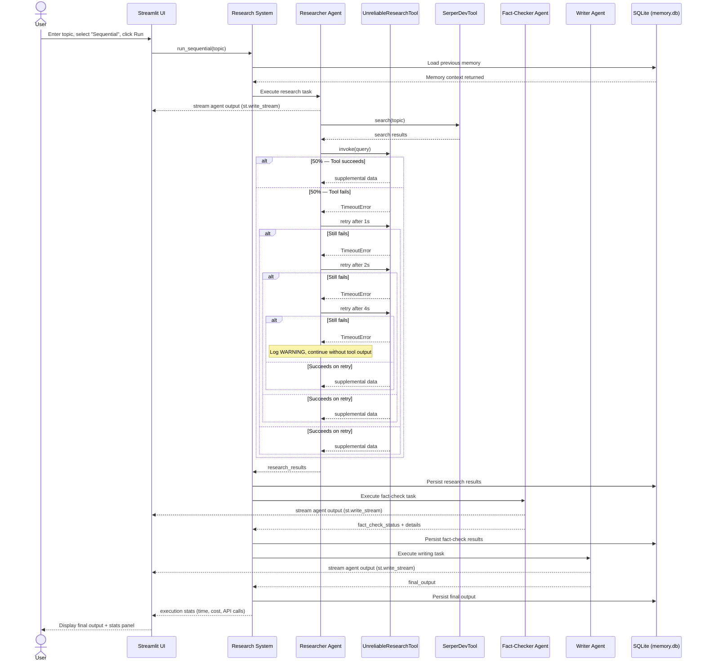
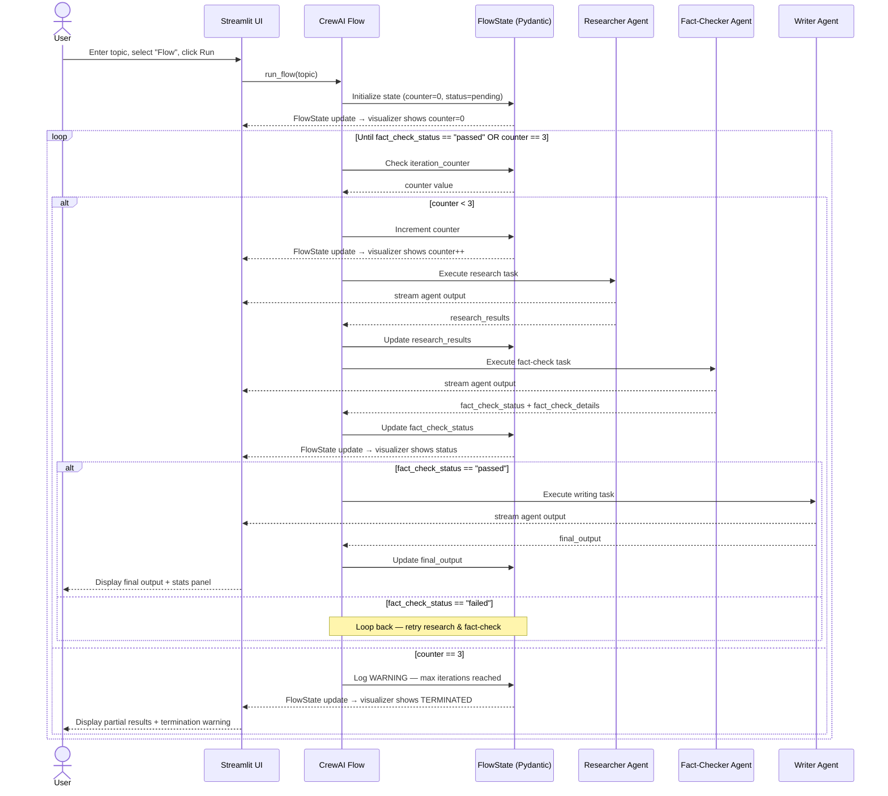

# Design Document: CrewAI Multi-Agent Research System

---

## 1. The "North Star" (Context & Goals)

### Abstract

The CrewAI Multi-Agent Research System is an autonomous research department that coordinates three specialized agents — Researcher, Fact-Checker, and Writer — to perform end-to-end research tasks with resilience to tool failures and persistent memory across sessions. The system demonstrates two orchestration strategies (Sequential and Hierarchical) and an event-driven workflow using CrewAI Flows with structured Pydantic state management. A Streamlit web UI provides real-time agent output streaming, FlowState visualization, execution stats, and a memory/history viewer — making the system accessible without the CLI.

### User Stories

- **As a researcher**, I want to execute research workflows using different orchestration strategies, so that I can observe behavior differences between Sequential and Hierarchical coordination and understand their cost/reliability trade-offs.
- **As a system architect**, I want all agent and task definitions in external YAML files, so that I can modify agent behaviors without touching code.
- **As a developer**, I want automatic retry logic with exponential backoff on tool failures, so that the system remains resilient to intermittent errors.
- **As a workflow designer**, I want event-driven flows where the Fact-Checker output determines the next step, so that execution is dynamic rather than static.
- **As a system administrator**, I want a hard cap of 3 iterations in the flow, so that infinite loops cannot occur and API costs stay bounded.
- **As a budget manager**, I want environment-based LLM provider selection, so that I can switch between OpenAI and OpenRouter without code changes.
- **As a user**, I want a Streamlit web UI with a topic input and mode selector, so that I can run research without using the command line.
- **As a user**, I want to see each agent's output stream in real time, so that I can follow the research process as it happens.
- **As a user**, I want an execution stats panel showing total time, cost estimate, and API call counts, so that I can understand resource usage.
- **As a user**, I want a memory/history viewer showing past executions from SQLite, so that I can review and compare previous research sessions.
- **As a user**, I want a FlowState visualizer showing the iteration counter and fact-check status updating live, so that I can observe the flow's decision-making in real time.

### Non-Goals

- **We are NOT building a production-ready research platform** — this is a learning implementation focused on CrewAI mechanics.
- **We are NOT supporting distributed or multi-machine deployment** — all agents run locally.
- **We are NOT implementing custom LLM training or fine-tuning** — standard OpenAI/OpenRouter APIs only.
- **We are NOT supporting real-time collaboration** — single-user, single-session execution only.
- **We are NOT implementing custom authentication** — API keys via environment variables only.
- **We are NOT building a mobile-responsive UI** — desktop browser only.

---

## 2. System Architecture & Flow

### Component Diagram

```mermaid
graph TB
    subgraph UI["Streamlit UI Layer"]
        SUI[app.py\nStreamlit App]
        TI[Topic Input +\nMode Selector]
        AOS[Agent Output\nStreamer]
        FSV[FlowState\nVisualizer]
        ESP[Execution Stats\nPanel]
        HV[Memory / History\nViewer]
    end

    subgraph Config["Configuration Layer"]
        AY[agents.yaml]
        TY[tasks.yaml]
        ENV[.env / Environment Variables]
    end

    subgraph Agents["Agent Layer"]
        RA[Researcher Agent]
        FCA[Fact-Checker Agent]
        WA[Writer Agent]
    end

    subgraph Tools["Tool Layer"]
        ST[SerperDevTool]
        FT[UnreliableResearchTool\n50% TimeoutError]
    end

    subgraph Orchestration["Orchestration Layer"]
        SW[Sequential Workflow\nProcess.sequential]
        HW[Hierarchical Workflow\nProcess.hierarchical + Manager LLM]
        CF[CrewAI Flow\nEvent-Driven]
    end

    subgraph State["State & Memory Layer"]
        FS[FlowState\nPydantic Model]
        IC[Iteration Counter\nmax = 3]
        GM[Global Memory\nSQLite]
    end

    subgraph External["External APIs"]
        OAI[OpenAI API\ngpt-4o-mini — primary]
        OR[OpenRouter API\ngpt-3.5-turbo — fallback]
        SP[Serper.dev API\nweb search]
    end

    SUI --> TI
    SUI --> AOS
    SUI --> FSV
    SUI --> ESP
    SUI --> HV

    TI -->|topic + mode| SW
    TI -->|topic + mode| HW
    TI -->|topic + flow flag| CF

    AOS -->|st.write_stream callback| SW
    AOS -->|st.write_stream callback| HW
    AOS -->|st.write_stream callback| CF

    FSV -->|polls FlowState| FS
    ESP -->|reads execution stats| GM
    HV -->|queries execution_history| GM

    AY -->|role, goal, backstory| RA
    AY -->|role, goal, backstory| FCA
    AY -->|role, goal, backstory| WA
    TY -->|description, expected_output| SW
    TY -->|description, expected_output| HW
    TY -->|description, expected_output| CF
    ENV -->|API keys, model names| OAI
    ENV -->|API keys, model names| OR
    ENV -->|SERPER_API_KEY| SP

    RA -->|uses| ST
    RA -->|uses| FT
    ST -->|search queries| SP

    SW -->|coordinates| RA
    SW -->|coordinates| FCA
    SW -->|coordinates| WA
    HW -->|Manager LLM delegates to| RA
    HW -->|Manager LLM delegates to| FCA
    HW -->|Manager LLM delegates to| WA
    CF -->|triggers| RA
    CF -->|triggers| FCA
    CF -->|triggers based on state| WA

    CF -->|reads/writes| FS
    FS -->|contains| IC
    SW -->|persists to| GM
    HW -->|persists to| GM
    CF -->|persists to| GM
    GM -->|stored in| SQLite[(SQLite\nmemory.db)]

    RA -->|LLM calls| OAI
    FCA -->|LLM calls| OAI
    WA -->|LLM calls| OAI
    OAI -->|fallback if unavailable| OR
```



### Sequence Diagram — Sequential Workflow (via Streamlit UI)



### Sequence Diagram — CrewAI Flow with Iteration Guard (via Streamlit UI)



---

## 3. The Technical "Source of Truth"

### A. Data Schema

#### Flow State (Pydantic Model)

| Field Name | Type | Constraints | Description |
| :--- | :--- | :--- | :--- |
| research_results | Optional[str] | Max 10,000 chars, Default: None | Raw output from Researcher Agent |
| fact_check_status | Optional[str] | Enum: pending/passed/failed, Default: pending | Verification result from Fact-Checker |
| fact_check_details | Optional[str] | Max 5,000 chars, Default: None | Detailed fact-check analysis |
| iteration_counter | int | Min: 0, Max: 3, Default: 0 | Current loop cycle count |
| final_output | Optional[str] | Max 15,000 chars, Default: None | Final document from Writer Agent |
| execution_start_time | datetime | ISO 8601, Not Null | Flow start timestamp |
| last_updated | datetime | ISO 8601, Auto-update | Last state modification time |

#### SQLite — Table: `agent_memory`

| Field Name | Type | Constraints | Description |
| :--- | :--- | :--- | :--- |
| id | INTEGER | Primary Key, Auto-increment | Unique memory entry ID |
| agent_role | VARCHAR(50) | Not Null, Indexed | researcher / fact_checker / writer |
| task_id | VARCHAR(100) | Not Null, Indexed | Task identifier |
| memory_type | VARCHAR(30) | Not Null | interaction / decision / output |
| content | TEXT | Not Null | JSON-serialized memory content |
| execution_id | VARCHAR(36) | Not Null, Indexed | UUID for the execution session |
| created_at | TIMESTAMP | Default: CURRENT_TIMESTAMP | Memory creation time |

#### SQLite — Table: `execution_history`

| Field Name | Type | Constraints | Description |
| :--- | :--- | :--- | :--- |
| execution_id | VARCHAR(36) | Primary Key | UUID for the execution session |
| orchestration_mode | VARCHAR(20) | Not Null | sequential / hierarchical / flow |
| total_duration_sec | INTEGER | Not Null | Total wall-clock time in seconds |
| iterations_used | INTEGER | Default: 1 | Number of flow cycles used |
| final_status | VARCHAR(20) | Not Null | completed / failed / terminated |
| cost_estimate_usd | DECIMAL(10,4) | Nullable | Estimated API cost |
| created_at | TIMESTAMP | Default: CURRENT_TIMESTAMP | Execution start time |

#### YAML Configuration Schemas

**config/agents.yaml**
```yaml
researcher:
  role: "Senior Research Analyst"
  goal: "Gather comprehensive, accurate information on the assigned topic using all available tools"
  backstory: "You are a veteran researcher with 10+ years of experience. You always cite sources."
  tools:
    - serper_tool
    - failing_tool

fact_checker:
  role: "Fact Verification Specialist"
  goal: "Verify the accuracy and credibility of all research findings"
  backstory: "You are a meticulous fact-checker who trusts no claim without a source."
  tools: []

writer:
  role: "Technical Writer"
  goal: "Synthesize verified research into a clear, well-structured document"
  backstory: "You are a skilled writer who specializes in turning complex research into readable reports."
  tools: []
```

**config/tasks.yaml**
```yaml
research_task:
  description: "Research the following topic thoroughly: {topic}. Use all available tools."
  expected_output: "A structured list of findings with sources, max 800 words."
  agent: researcher

fact_check_task:
  description: "Verify the accuracy of the following research findings: {research_results}"
  expected_output: "A verification report with status (passed/failed) and credibility notes."
  agent: fact_checker

writing_task:
  description: "Write a comprehensive research document based on: {fact_check_details}"
  expected_output: "A polished research document with executive summary, max 1200 words."
  agent: writer
```

### B. API Contracts

#### LLM Provider Selection (Internal)

```
Function: get_llm_provider() -> LLM

Logic:
  IF env OPENAI_API_KEY is set and non-empty:
    RETURN ChatOpenAI(model=OPENAI_MODEL, api_key=OPENAI_API_KEY)
  ELIF env OPENROUTER_API_KEY is set and non-empty:
    RETURN ChatOpenAI(model=OPENROUTER_MODEL, base_url="https://openrouter.ai/api/v1", api_key=OPENROUTER_API_KEY)
  ELSE:
    RAISE EnvironmentError("No LLM provider configured")

Environment Variables:
  OPENAI_API_KEY       — OpenAI API key (primary)
  OPENAI_MODEL         — Default: "gpt-4o-mini"
  OPENROUTER_API_KEY   — OpenRouter API key (fallback)
  OPENROUTER_MODEL     — Default: "openai/gpt-3.5-turbo"
```

#### Failing Tool Contract

```
Tool Name: UnreliableResearchTool
Input:     query: str  (1–500 characters)
Output:    str         (supplemental research data)

Behavior:
  - 50% probability: raises TimeoutError("Simulated tool timeout")
  - 50% probability: returns f"Supplemental data for: {query}"

Retry Policy (applied by caller):
  Attempt 1: immediate
  Attempt 2: wait 1s
  Attempt 3: wait 2s
  Attempt 4: wait 4s  (max 3 retries = 4 total attempts)
  On exhaustion: log WARNING, continue without tool output
```

#### Streamlit Interface Contract

```
Entry point: streamlit run app.py

Arguments:
  --topic TEXT        Research topic (required, 1–500 chars)
  --mode [sequential|hierarchical]
                      Orchestration mode (default: sequential)
  --flow              Use CrewAI Flow instead of direct Crew execution

Examples:
  streamlit run app.py

Exit Codes:
  0  — Successful completion
  1  — Configuration or environment error
  2  — Execution failed after all retries
  3  — Terminated due to max iteration limit

Output:
  - Final research document displayed in the UI
  - Execution stats: total time, agent times, API call count, cost estimate
  - Download button for the final research document
```

---

## 4. Application "Bootstrap" Guide

### Tech Stack

| Component | Technology | Version |
| :--- | :--- | :--- |
| Language | Python | 3.11+ |
| Agent Framework | CrewAI | 0.70.0+ |
| State Validation | Pydantic | 2.0+ |
| LLM Client | LangChain / OpenAI SDK | 0.2+ |
| Memory Storage | SQLite | 3.35+ (built-in) |
| Web Search | SerperDevTool (crewai-tools) | latest |
| **Frontend** | **Streamlit** | **1.35.0+** |
| Testing | pytest + pytest-cov | 7.0+ |
| Linting | flake8 | 6.0+ |
| Formatting | black | 23.0+ |
| Type Checking | mypy | 1.0+ |
| Env Management | python-dotenv | 1.0+ |

### Folder Structure

```
crewai-research-system/
├── app.py                       # Streamlit entry point (streamlit run app.py)
├── config/
│   ├── agents.yaml              # Agent role, goal, backstory, tools
│   └── tasks.yaml               # Task descriptions and expected outputs
├── src/
│   ├── __init__.py
│   ├── agents/
│   │   ├── __init__.py
│   │   └── factory.py           # Builds Agent objects from YAML config
│   ├── tools/
│   │   ├── __init__.py
│   │   ├── failing_tool.py      # UnreliableResearchTool (50% TimeoutError)
│   │   └── retry.py             # Exponential backoff decorator
│   ├── workflows/
│   │   ├── __init__.py
│   │   ├── sequential.py        # process=Process.sequential crew
│   │   ├── hierarchical.py      # process=Process.hierarchical crew
│   │   └── flow.py              # CrewAI Flow with FlowState
│   ├── state/
│   │   ├── __init__.py
│   │   └── flow_state.py        # Pydantic FlowState model
│   ├── memory/
│   │   ├── __init__.py
│   │   └── manager.py           # SQLite read/write for global memory
│   ├── config/
│   │   ├── __init__.py
│   │   └── loader.py            # YAML loader + schema validator + LLM selector
│   ├── ui/
│   │   ├── __init__.py
│   │   ├── components.py        # Reusable Streamlit components
│   │   ├── flow_state_view.py   # FlowState visualizer widget
│   │   ├── history_view.py      # Memory/history viewer (reads SQLite)
│   │   └── stats_panel.py       # Execution stats panel
│   └── utils/
│       ├── __init__.py
│       ├── logger.py            # Structured logging setup
│       └── cost_tracker.py      # Token usage and cost estimation
├── tests/
│   ├── unit/
│   │   ├── test_failing_tool.py
│   │   ├── test_retry.py
│   │   ├── test_flow_state.py
│   │   ├── test_config_loader.py
│   │   └── test_memory_manager.py
│   ├── integration/
│   │   ├── test_sequential_workflow.py
│   │   ├── test_hierarchical_workflow.py
│   │   ├── test_flow_execution.py
│   │   └── test_memory_persistence.py
│   └── fixtures/
│       ├── mock_llm.py
│       └── sample_configs.py
├── data/
│   ├── memory.db                # SQLite DB (created at runtime)
│   └── logs/                    # Rotating log files
├── .env.example                 # Template for required env vars
├── requirements.txt             # Runtime dependencies (includes streamlit>=1.35.0)
├── requirements-dev.txt         # Dev/test dependencies
├── pyproject.toml               # black, mypy, pytest config
├── Makefile                     # Developer shortcuts
└── README.md                    # Setup and usage guide
```

### Boilerplate / Tooling

**pyproject.toml**
```toml
[tool.black]
line-length = 88
target-version = ["py311"]

[tool.mypy]
python_version = "3.11"
disallow_untyped_defs = true
warn_return_any = true

[tool.pytest.ini_options]
testpaths = ["tests"]
addopts = "-v --cov=src --cov-report=term-missing"
markers = [
    "unit: fast isolated tests",
    "integration: tests requiring external mocks"
]
```

**Makefile**
```makefile
install:
	pip install -r requirements.txt -r requirements-dev.txt

test:
	pytest tests/ -v

lint:
	flake8 src/ tests/

format:
	black src/ tests/

typecheck:
	mypy src/

ui:
	streamlit run app.py

```

**.env.example**
```
# Primary LLM Provider
OPENAI_API_KEY=sk-...
OPENAI_MODEL=gpt-4o-mini

# Fallback LLM Provider
OPENROUTER_API_KEY=sk-or-...
OPENROUTER_MODEL=openai/gpt-3.5-turbo

# Search Tool
SERPER_API_KEY=...
```

---

## 5. Implementation Requirements & Constraints

### Security

- All API keys MUST be loaded from environment variables — never hardcoded or committed to source control.
- The `.env` file MUST be listed in `.gitignore`.
- Log files MUST NOT contain API key values — reference keys by name only.
- Research topic input MUST be sanitized: max 500 characters, alphanumeric + common punctuation only.

### Performance

- Sequential workflow MUST complete within 5 minutes for a typical research topic.
- Hierarchical workflow MUST complete within 10 minutes (Manager LLM overhead expected).
- CrewAI Flow MUST complete within 15 minutes across all iterations.
- Individual agent task execution MUST NOT exceed 2 minutes per task.
- Total API cost per execution MUST NOT exceed $0.50 using GPT-4o-mini.
- Context passed to each LLM call MUST be trimmed to essential content only — no full history dumps.

### Error Handling

- `TimeoutError` from `UnreliableResearchTool` MUST be caught and retried with exponential backoff: delays of 1s, 2s, 4s.
- After 3 failed retries, the system MUST log a WARNING and continue execution without that tool's output.
- If OpenAI API is unavailable, the system MUST automatically fall back to OpenRouter without user intervention.
- If both LLM providers fail, the system MUST save any partial results to disk and exit with code 2.
- All errors MUST be logged in structured format: `timestamp | level | agent | task | message | stack_trace`.
- YAML validation errors MUST include the exact field name and expected format in the error message.

### Data Consistency

- All writes to `agent_memory` SQLite table MUST use database transactions.
- `FlowState` updates MUST be atomic — partial updates are not permitted.
- The SQLite database file MUST be created automatically on first run if it does not exist.

---

## 6. Definition of Done

### Testing Requirements

- Unit test coverage MUST exceed 85% across all `src/` modules.
- The `UnreliableResearchTool` MUST have tests covering both success and failure paths.
- Retry logic MUST have tests verifying correct delay intervals and max attempt enforcement.
- `FlowState` MUST have tests for valid data, invalid data (ValidationError), and boundary values.
- Memory persistence MUST be verified by an integration test that writes in session N and reads in session N+1.
- Configuration conflict behavior (backstory vs. expected_output) MUST be documented with a test that captures actual output.

### Correctness Properties (Property-Based Tests)

| # | Property | Validates |
| :--- | :--- | :--- |
| 1 | For any Sequential execution, agent order is always Researcher → Fact-Checker → Writer | Req 3.3 |
| 2 | For n ≥ 100 Failing Tool invocations, failure rate is 45%–55% | Req 4.2 |
| 3 | For any valid YAML modification, next execution reflects the change without code restart | Req 5.5 |
| 4 | For any data written to memory in execution N, it is readable in execution N+1 | Req 7.3 |
| 5 | For any fact_check_status == "passed", Writer Agent is invoked next | Req 8.4 |
| 6 | For any invalid FlowState field, Pydantic raises ValidationError | Req 9.5 |
| 7 | For any flow that would exceed 3 iterations, execution terminates and returns partial results | Req 10.3 |
| 8 | For any TimeoutError from Failing Tool, a structured log entry is written with timestamp | Req 12.1 |

### Documentation Requirements

- `README.md` MUST include: prerequisites, installation steps, `.env` setup, and all CLI usage examples.
- All public functions and classes MUST have docstrings (Google style).
- `agents.yaml` and `tasks.yaml` MUST include inline comments explaining each field.
- The contradiction experiment (backstory vs. expected_output) MUST be documented with observed behavior and explanation.

### Deployment Checklist

- [ ] `pip install -r requirements.txt` completes without errors on Python 3.11+
- [ ] All required environment variables validated on startup with clear error messages
- [ ] SQLite database initializes automatically on first run
- [ ] Sequential workflow executes end-to-end with a sample topic
- [ ] Hierarchical workflow executes end-to-end with cost comparison logged
- [ ] CrewAI Flow executes with state transitions logged at each step
- [ ] Memory persists correctly across two consecutive executions
- [ ] Failing Tool retry logic triggers and logs correctly
- [ ] Max iteration guard terminates flow at iteration 3 and logs warning
- [ ] No API keys appear in any log file or output file
- [ ] Streamlit app launches with `streamlit run app.py` without errors
- [ ] Topic input, mode selector, and Run button function correctly in the UI
- [ ] Agent output streams in real time in the UI during execution
- [ ] FlowState visualizer updates live (iteration counter + fact-check status)
- [ ] Execution stats panel displays time, cost, and API call counts after completion
- [ ] Memory/history viewer loads and displays past executions from SQLite
