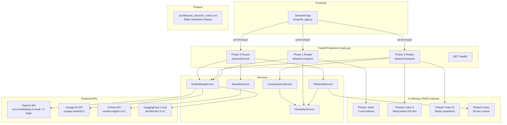
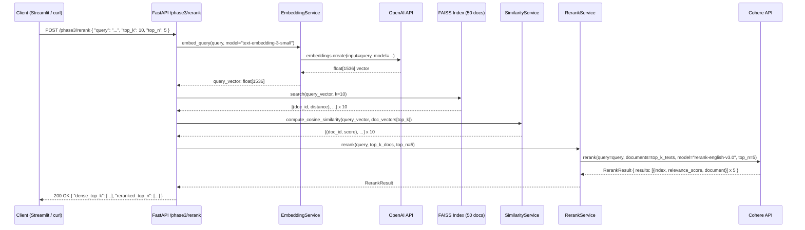

# Design Document: Embedding Retrieval System

---

## 1. The "North Star" (Context & Goals)

### Abstract

This system is a production-grade, multi-phase embedding retrieval lab that evaluates and compares multiple embedding providers (OpenAI, Cohere, Voyage AI, HuggingFace) using raw SDKs and in-memory FAISS indexes — no high-level frameworks. It demonstrates the real-world trade-offs between general-purpose and domain-specific models, vector compression strategies (Matryoshka truncation vs. binary quantization), and single-stage vs. two-stage dense retrieval with cross-encoder reranking. The deliverable is a FastAPI backend with a Streamlit frontend, exposing each phase as a REST endpoint, backed by a static architecture decision matrix for five real-world deployment scenarios.

### User Stories

- As a **ML engineer**, I want to compare cosine similarity scores from OpenAI, Voyage AI, and HuggingFace models on the same query so that I can understand which model best handles domain-specific vocabulary.
- As a **researcher**, I want to submit a text query and receive similarity scores under both Matryoshka truncation and binary quantization strategies so that I can evaluate the accuracy/memory trade-off of each compression technique.
- As a **developer**, I want to submit a query against a 50-document corpus and receive a reranked Top-5 result list so that I can see how cross-encoder reranking improves over raw dense retrieval.
- As a **solutions architect**, I want to read a static decision matrix covering five deployment scenarios so that I can justify embedding model choices for different production constraints.
- As a **developer**, I want a Streamlit UI that calls each phase endpoint so that I can interactively explore results without writing curl commands.

### Non-Goals

- **No persistent storage**: All FAISS indexes are in-memory only; no database, no disk persistence between restarts.
- **No authentication/authorization**: No API keys, JWT tokens, or user management for the FastAPI service itself.
- **No LangChain, LlamaIndex, or any high-level vector DB abstraction**: All similarity math is done manually with NumPy.
- **No multimodal embedding implementation**: Phase 4 covers multimodal architectures in the decision matrix only — no CLIP or image embedding code is written.
- **No Cohere embedding models**: Cohere is used exclusively for cross-encoder reranking (`rerank-english-v3.0`), not for generating embeddings.
- **No production deployment pipeline**: No Docker Compose, Kubernetes, or CI/CD configuration is in scope.
- **No streaming responses**: All endpoints return complete JSON responses synchronously.
- **No caching layer**: No Redis or in-process cache for embedding results.

---

## 2. System Architecture & Flow

### Component Diagram



### Sequence Diagram — Phase 3: Dense Retrieval + Cross-Encoder Reranking



---

## 3. The Technical "Source of Truth"

### A. Data Schema

#### `EmbeddingRecord`

| Field Name | Type | Constraints |
| :--- | :--- | :--- |
| `text` | `str` | Not null, max 8192 chars |
| `model` | `str` | Not null; one of: `text-embedding-3-small`, `text-embedding-3-large`, `voyage-medical-2`, `all-MiniLM-L6-v2` |
| `provider` | `str` | Not null; one of: `openai`, `voyageai`, `huggingface` |
| `vector` | `list[float]` | Not null; length matches model output dims |
| `dimensions` | `int` | Not null, positive integer |
| `created_at` | `datetime` | UTC, auto-set on creation |

#### `DocumentRecord`

| Field Name | Type | Constraints |
| :--- | :--- | :--- |
| `doc_id` | `int` | Not null, unique, auto-incremented index |
| `text` | `str` | Not null, max 2048 chars |
| `vector` | `list[float]` | Not null; length = 1536 (Phase 3 uses `text-embedding-3-small`) |
| `metadata` | `dict[str, Any]` | Optional, default `{}` |

#### `QueryRequest`

| Field Name | Type | Constraints |
| :--- | :--- | :--- |
| `query` | `str` | Not null, min 1 char, max 2048 chars |
| `top_k` | `int` | Optional, default 10, range 1–50 |
| `top_n` | `int` | Optional, default 5, range 1–`top_k` |

#### `ComparisonResult`

| Field Name | Type | Constraints |
| :--- | :--- | :--- |
| `query` | `str` | Not null |
| `reference_text` | `str` | Not null |
| `scores` | `list[ModelScore]` | Not null, min 1 item |
| `winner` | `str` | Model name with highest cosine similarity score |

#### `ModelScore`

| Field Name | Type | Constraints |
| :--- | :--- | :--- |
| `model` | `str` | Not null |
| `provider` | `str` | Not null |
| `cosine_similarity` | `float` | Range [-1.0, 1.0] |
| `dimensions` | `int` | Positive integer |

#### `CompressionComparisonResult` (Phase 2)

| Field Name | Type | Constraints |
| :--- | :--- | :--- |
| `text_a` | `str` | Not null |
| `text_b` | `str` | Not null |
| `matryoshka` | `MatryoshkaResult` | Not null |
| `binary` | `BinaryResult` | Not null |

#### `MatryoshkaResult`

| Field Name | Type | Constraints |
| :--- | :--- | :--- |
| `original_dims` | `int` | 3072 |
| `truncated_dims` | `int` | 256 |
| `cosine_similarity` | `float` | Range [-1.0, 1.0] |
| `memory_bytes_original` | `int` | 3072 x 4 = 12288 |
| `memory_bytes_compressed` | `int` | 256 x 4 = 1024 |
| `compression_ratio` | `float` | 12.0 |

#### `BinaryResult`

| Field Name | Type | Constraints |
| :--- | :--- | :--- |
| `original_dims` | `int` | 3072 |
| `hamming_distance` | `int` | Range [0, 3072] |
| `memory_bytes_original` | `int` | 3072 x 4 = 12288 |
| `memory_bytes_compressed` | `int` | 3072 / 8 = 384 |
| `compression_ratio` | `float` | 32.0 |

#### `RerankResult`

| Field Name | Type | Constraints |
| :--- | :--- | :--- |
| `query` | `str` | Not null |
| `dense_top_k` | `list[RetrievedDoc]` | Length = `top_k` |
| `reranked_top_n` | `list[RankedDoc]` | Length = `top_n` |
| `retrieval_latency_ms` | `float` | Non-negative |
| `rerank_latency_ms` | `float` | Non-negative |

#### `RetrievedDoc`

| Field Name | Type | Constraints |
| :--- | :--- | :--- |
| `doc_id` | `int` | Not null |
| `text` | `str` | Not null |
| `cosine_similarity` | `float` | Range [-1.0, 1.0] |
| `faiss_distance` | `float` | Non-negative (L2) |

#### `RankedDoc`

| Field Name | Type | Constraints |
| :--- | :--- | :--- |
| `doc_id` | `int` | Not null |
| `text` | `str` | Not null |
| `relevance_score` | `float` | Range [0.0, 1.0] (Cohere score) |
| `original_dense_rank` | `int` | 1-indexed rank before reranking |

#### `ErrorResponse`

| Field Name | Type | Constraints |
| :--- | :--- | :--- |
| `error` | `str` | Not null, human-readable message |
| `provider` | `str` | Not null; which provider failed |
| `status_code` | `int` | HTTP status code from provider |
| `detail` | `str` | Optional; raw provider error message |

---

### B. API Contracts

#### `POST /phase1/compare`

**Purpose**: Compare cosine similarity scores from three embedding models (OpenAI general, Voyage AI domain-specific, HuggingFace local) for a fixed medical reference sentence vs. a layman query.

**Request Payload**:
```json
{
  "query": "The person was sweating heavily with a fast heart rate"
}
```

| Field | Type | Required | Default |
| :--- | :--- | :--- | :--- |
| `query` | `string` | Yes | — |

**Success Response — `200 OK`**:
```json
{
  "query": "The person was sweating heavily with a fast heart rate",
  "reference_text": "The patient exhibited severe diaphoresis and tachycardia",
  "scores": [
    {
      "model": "text-embedding-3-small",
      "provider": "openai",
      "cosine_similarity": 0.72,
      "dimensions": 1536
    },
    {
      "model": "voyage-medical-2",
      "provider": "voyageai",
      "cosine_similarity": 0.91,
      "dimensions": 1024
    },
    {
      "model": "all-MiniLM-L6-v2",
      "provider": "huggingface",
      "cosine_similarity": 0.68,
      "dimensions": 384
    }
  ],
  "winner": "voyage-medical-2"
}
```

**Error Cases**:

| Status | Condition | Response Body |
| :--- | :--- | :--- |
| `422 Unprocessable Entity` | Missing or empty `query` field | FastAPI validation error |
| `500 Internal Server Error` | OpenAI API failure | `{"error": "Embedding failed", "provider": "openai", "status_code": 500, "detail": "..."}` |
| `500 Internal Server Error` | Voyage AI API failure | `{"error": "Embedding failed", "provider": "voyageai", "status_code": 500, "detail": "..."}` |
| `500 Internal Server Error` | HuggingFace model load failure | `{"error": "Embedding failed", "provider": "huggingface", "status_code": 500, "detail": "..."}` |

---

#### `POST /phase2/compare`

**Purpose**: Accept two text inputs, generate full 3072-dim OpenAI embeddings, then compare Matryoshka truncation (256 dims, L2-normalized, cosine similarity) vs. binary quantization (sign-based, Hamming distance).

**Request Payload**:
```json
{
  "text_a": "The quick brown fox jumps over the lazy dog",
  "text_b": "A fast auburn fox leaps above a sleepy hound"
}
```

| Field | Type | Required | Default |
| :--- | :--- | :--- | :--- |
| `text_a` | `string` | Yes | — |
| `text_b` | `string` | Yes | — |

**Success Response — `200 OK`**:
```json
{
  "text_a": "The quick brown fox jumps over the lazy dog",
  "text_b": "A fast auburn fox leaps above a sleepy hound",
  "matryoshka": {
    "original_dims": 3072,
    "truncated_dims": 256,
    "cosine_similarity": 0.88,
    "memory_bytes_original": 12288,
    "memory_bytes_compressed": 1024,
    "compression_ratio": 12.0
  },
  "binary": {
    "original_dims": 3072,
    "hamming_distance": 412,
    "memory_bytes_original": 12288,
    "memory_bytes_compressed": 384,
    "compression_ratio": 32.0
  }
}
```

**Error Cases**:

| Status | Condition | Response Body |
| :--- | :--- | :--- |
| `422 Unprocessable Entity` | Missing `text_a` or `text_b` | FastAPI validation error |
| `500 Internal Server Error` | OpenAI API failure | `{"error": "Embedding failed", "provider": "openai", "status_code": 500, "detail": "..."}` |

---

#### `POST /phase3/rerank`

**Purpose**: Dense retrieval over a 50-document in-memory corpus using FAISS, followed by Cohere cross-encoder reranking.

**Request Payload**:
```json
{
  "query": "treatments that do not involve surgery",
  "top_k": 10,
  "top_n": 5
}
```

| Field | Type | Required | Default |
| :--- | :--- | :--- | :--- |
| `query` | `string` | Yes | — |
| `top_k` | `integer` | No | `10` |
| `top_n` | `integer` | No | `5` |

**Constraints**: `1 <= top_n <= top_k <= 50`

**Success Response — `200 OK`**:
```json
{
  "query": "treatments that do not involve surgery",
  "dense_top_k": [
    {
      "doc_id": 12,
      "text": "Surgical intervention is the primary treatment...",
      "cosine_similarity": 0.81,
      "faiss_distance": 0.19
    }
  ],
  "reranked_top_n": [
    {
      "doc_id": 7,
      "text": "Non-surgical options include physical therapy...",
      "relevance_score": 0.94,
      "original_dense_rank": 4
    }
  ],
  "retrieval_latency_ms": 12.4,
  "rerank_latency_ms": 340.1
}
```

**Error Cases**:

| Status | Condition | Response Body |
| :--- | :--- | :--- |
| `400 Bad Request` | `top_n > top_k` | `{"error": "top_n must be <= top_k", "provider": "internal", "status_code": 400, "detail": "..."}` |
| `422 Unprocessable Entity` | Missing `query` | FastAPI validation error |
| `500 Internal Server Error` | OpenAI embedding failure | `{"error": "Embedding failed", "provider": "openai", "status_code": 500, "detail": "..."}` |
| `500 Internal Server Error` | Cohere rerank failure | `{"error": "Rerank failed", "provider": "cohere", "status_code": 500, "detail": "..."}` |

---

#### `GET /health`

**Purpose**: Liveness check — confirms the API is running and all required environment variables are set.

**Request**: No body.

**Success Response — `200 OK`**:
```json
{
  "status": "ok",
  "providers": {
    "openai": "configured",
    "voyageai": "configured",
    "cohere": "configured",
    "huggingface": "local"
  }
}
```

**Error Cases**:

| Status | Condition | Response Body |
| :--- | :--- | :--- |
| `503 Service Unavailable` | One or more required API keys missing | `{"status": "degraded", "missing_keys": ["VOYAGE_API_KEY"]}` |

---

## 4. Application Bootstrap Guide

### Tech Stack — Exact Versions

| Component | Package | Version |
| :--- | :--- | :--- |
| Runtime | Python | 3.11.x |
| Web Framework | FastAPI | 0.111.x |
| ASGI Server | uvicorn[standard] | 0.29.x |
| Data Validation | pydantic | 2.x |
| Vector Store | faiss-cpu | 1.8.x |
| Local Embeddings | sentence-transformers | 3.x |
| OpenAI SDK | openai | 1.x |
| Cohere SDK | cohere | 5.x |
| Voyage AI SDK | voyageai | 0.2.x |
| Numerical Computing | numpy | 1.26.x |
| Frontend | streamlit | 1.x |
| HTTP Client (UI) | httpx | 0.27.x |
| Env Management | python-dotenv | 1.x |
| Linting | ruff | 0.4.x |
| Testing | pytest | 8.x |
| Async Test Support | pytest-asyncio | 0.23.x |

### Folder Structure

```
embedding-retrieval-system/
├── .env                          # API keys (never committed)
├── .env.example                  # Template with placeholder values
├── .gitignore
├── README.md
├── requirements.txt
├── ruff.toml                     # Linting configuration
│
├── app/
│   ├── __init__.py
│   ├── main.py                   # FastAPI app factory, router registration
│   ├── config.py                 # Settings via pydantic-settings / dotenv
│   │
│   ├── routers/
│   │   ├── __init__.py
│   │   ├── phase1.py             # POST /phase1/compare
│   │   ├── phase2.py             # POST /phase2/compare
│   │   ├── phase3.py             # POST /phase3/rerank
│   │   └── health.py             # GET /health
│   │
│   ├── services/
│   │   ├── __init__.py
│   │   ├── embedding_service.py  # Calls OpenAI, Voyage AI, HuggingFace
│   │   ├── similarity_service.py # Cosine similarity, dot product (NumPy only)
│   │   ├── compression_service.py# Matryoshka truncation, binary quantization
│   │   ├── retrieval_service.py  # FAISS index build + search
│   │   └── rerank_service.py     # Cohere cross-encoder reranking
│   │
│   ├── models/
│   │   ├── __init__.py
│   │   └── schemas.py            # All Pydantic models (request/response)
│   │
│   └── data/
│       └── corpus.py             # 50-document in-memory corpus definition
│
├── frontend/
│   └── streamlit_app.py          # Streamlit UI calling FastAPI endpoints
│
├── reports/
│   └── architecture_decision_matrix.md  # Phase 4 static report
│
└── tests/
    ├── __init__.py
    ├── conftest.py               # Shared fixtures (test client, mock embeddings)
    ├── test_phase1.py
    ├── test_phase2.py
    ├── test_phase3.py
    ├── test_similarity_service.py
    └── test_compression_service.py
```

### Environment Variables (`.env.example`)

```bash
# OpenAI
OPENAI_API_KEY=sk-...

# Voyage AI
VOYAGE_API_KEY=pa-...

# Cohere
COHERE_API_KEY=...

# App settings
APP_HOST=0.0.0.0
APP_PORT=8000
LOG_LEVEL=info
```

### Tooling

**Linting** (`ruff.toml`):
```toml
[tool.ruff]
line-length = 100
target-version = "py311"
select = ["E", "F", "I", "UP"]
```

**Running tests** (single pass, no watch mode):
```bash
pytest tests/ -v --tb=short
```

**Starting the API**:
```bash
uvicorn app.main:app --host 0.0.0.0 --port 8000 --reload
```

**Starting the Streamlit UI**:
```bash
streamlit run frontend/streamlit_app.py
```

---

## 5. Implementation Requirements & Constraints

### Security

- All API keys (`OPENAI_API_KEY`, `VOYAGE_API_KEY`, `COHERE_API_KEY`) **must** be loaded exclusively from environment variables via `python-dotenv`. They must never appear in source code, logs, or API responses.
- The `/health` endpoint must only report whether keys are *configured* (present and non-empty), never their values.
- The `.env` file must be listed in `.gitignore`.

### Performance

- All external embedding API calls (OpenAI, Voyage AI) **must** use `async`/`await` via the async client interfaces provided by each SDK (`AsyncOpenAI`, `voyageai.AsyncClient`).
- FAISS in-memory search **must** complete in < 50ms for indexes of up to 50 documents.
- The HuggingFace `sentence-transformers` model must be loaded **once at application startup** (via FastAPI `lifespan` context manager), not per-request.
- Phase 2 FAISS indexes (Matryoshka and Binary) are built lazily on first request and cached in application state.

### Error Handling

- All provider API failures (OpenAI, Voyage AI, Cohere) **must** be caught and returned as structured `ErrorResponse` JSON with `provider`, `status_code`, and `detail` fields.
- HTTP 422 validation errors are handled automatically by FastAPI/Pydantic — no custom handling required.
- FAISS index errors (e.g., dimension mismatch) must be caught and returned as 500 with `provider: "faiss"`.
- No raw Python tracebacks must ever be returned to the client.

### Rules of Engagement

- **No LangChain, no LlamaIndex, no high-level vector DB abstractions** (Pinecone client, Weaviate client, Chroma, etc.).
- All cosine similarity computations must use NumPy directly:
  ```python
  # Correct
  similarity = float(np.dot(a, b) / (np.linalg.norm(a) * np.linalg.norm(b)))

  # Forbidden
  from sklearn.metrics.pairwise import cosine_similarity
  ```
- Binary quantization must be implemented manually using NumPy sign operations and bitwise Hamming distance — no library helpers.
- Matryoshka truncation must be implemented as a slice + L2 normalization — no library helpers.
- FAISS is used only for approximate nearest-neighbor indexing; final similarity scores are recomputed with NumPy cosine similarity for transparency.

### Key Algorithmic Specifications

#### Cosine Similarity (SimilarityService)

```python
def cosine_similarity(a: np.ndarray, b: np.ndarray) -> float:
    """
    Preconditions:
      - a and b are 1-D numpy arrays of equal length
      - Neither a nor b is a zero vector
    Postconditions:
      - Returns float in [-1.0, 1.0]
      - Result is symmetric: cosine_similarity(a, b) == cosine_similarity(b, a)
    """
    return float(np.dot(a, b) / (np.linalg.norm(a) * np.linalg.norm(b)))
```

#### Matryoshka Truncation (CompressionService)

```python
def matryoshka_truncate(vector: np.ndarray, target_dims: int = 256) -> np.ndarray:
    """
    Preconditions:
      - vector has shape (3072,)
      - 1 <= target_dims <= 3072
    Postconditions:
      - Returns L2-normalized vector of shape (target_dims,)
      - np.linalg.norm(result) == 1.0 (within floating-point tolerance)
    """
    truncated = vector[:target_dims]
    norm = np.linalg.norm(truncated)
    return truncated / norm if norm > 0 else truncated
```

#### Binary Quantization (CompressionService)

```python
def binary_quantize(vector: np.ndarray) -> np.ndarray:
    """
    Preconditions:
      - vector is a 1-D numpy array of float32
    Postconditions:
      - Returns uint8 array of shape (len(vector) // 8,)
      - Each bit represents the sign of the original float (1 if >= 0, 0 if < 0)
      - Memory footprint: original / 32
    """
    bits = (vector >= 0).astype(np.uint8)
    return np.packbits(bits)

def hamming_distance(a: np.ndarray, b: np.ndarray) -> int:
    """
    Preconditions:
      - a and b are uint8 arrays of equal length (output of binary_quantize)
    Postconditions:
      - Returns integer in [0, len(a) * 8]
    """
    return int(np.unpackbits(a ^ b).sum())
```

---

## 6. Definition of Done

A phase or feature is considered complete when ALL of the following criteria are met:

### Functional Completeness

- [ ] `POST /phase1/compare` returns correct `ComparisonResult` with scores from all three models (OpenAI, Voyage AI, HuggingFace) and correctly identifies the winner.
- [ ] `POST /phase2/compare` returns correct `CompressionComparisonResult` with accurate Matryoshka cosine similarity and binary Hamming distance, plus correct memory footprint calculations.
- [ ] `POST /phase3/rerank` returns correct `RerankResult` with `dense_top_k` from FAISS and `reranked_top_n` from Cohere, including latency measurements.
- [ ] `GET /health` returns `200 OK` when all API keys are configured, `503` when any are missing.
- [ ] `reports/architecture_decision_matrix.md` exists and covers all five scenarios: Offline mobile, Large-scale e-commerce (500M docs), Legal discovery, Multilingual SaaS, Multimodal (text+image).

### Technical Correctness

- [ ] All cosine similarity computations use NumPy directly — no `sklearn`, `scipy`, or other library helpers.
- [ ] Binary quantization uses sign-based bit packing and Hamming distance — no library helpers.
- [ ] Matryoshka truncation uses slice + L2 normalization — no library helpers.
- [ ] No LangChain, LlamaIndex, or high-level vector DB client is imported anywhere in the codebase.
- [ ] FAISS search completes in < 50ms for the 50-document Phase 3 corpus (verified in tests).

### Quality & Coverage

- [ ] Unit test coverage >= 70% (measured via `pytest --cov`).
- [ ] All similarity and compression functions have dedicated unit tests with known input/output pairs.
- [ ] All API endpoints have integration tests using `httpx.AsyncClient` against the FastAPI test client.
- [ ] All provider API calls are mocked in tests — no real API calls during `pytest`.

### Developer Experience

- [ ] Swagger UI is accessible at `http://localhost:8000/docs` with all endpoints documented.
- [ ] `README.md` documents: how to install dependencies, configure `.env`, run the API, run the Streamlit UI, and run tests.
- [ ] `ruff` linting passes with zero errors (`ruff check .`).
- [ ] No API keys, secrets, or PII appear in source code or committed files.

---

## Phase 4: Architecture Decision Matrix

> This section is the design specification for `reports/architecture_decision_matrix.md`. The actual report is a standalone markdown file.

The report must cover the following five scenarios with a consistent structure for each: **Recommended Model/Provider**, **Rationale**, and **Key Trade-offs**.

### Scenario A — Offline Mobile Application

| Dimension | Decision |
| :--- | :--- |
| **Model** | `sentence-transformers/all-MiniLM-L6-v2` (HuggingFace, local) |
| **Rationale** | No internet access required; model runs on-device via ONNX or CoreML export; 384-dim vectors fit in mobile memory |
| **Trade-offs** | Lower accuracy than cloud models; no domain specialization; model update requires app release |

### Scenario B — Large-Scale E-Commerce (500M Documents)

| Dimension | Decision |
| :--- | :--- |
| **Model** | OpenAI `text-embedding-3-small` + Binary Quantization |
| **Rationale** | 1536-dim vectors quantized to 192 bytes each; 500M docs = ~96GB vs. ~3TB for float32; Hamming distance enables fast bitwise search |
| **Trade-offs** | ~5–10% accuracy loss from quantization; requires periodic re-indexing; OpenAI API cost at scale |

### Scenario C — Legal Discovery Platform

| Dimension | Decision |
| :--- | :--- |
| **Model** | Voyage AI `voyage-law-2` + Cohere `rerank-english-v3.0` |
| **Rationale** | Domain-tuned legal embeddings capture precise legal terminology; cross-encoder reranking maximizes precision for high-stakes retrieval |
| **Trade-offs** | Higher latency (two-stage pipeline); Voyage AI specialized token costs; not suitable for real-time use cases |

### Scenario D — Multilingual SaaS Platform

| Dimension | Decision |
| :--- | :--- |
| **Model** | OpenAI `text-embedding-3-large` (multilingual by design) |
| **Rationale** | Supports 100+ languages in a single embedding space; no per-language model management; consistent semantic alignment across languages |
| **Trade-offs** | 3072-dim vectors are expensive to store at scale; higher API cost than `text-embedding-3-small`; slight accuracy loss on low-resource languages |

### Scenario E — Multimodal System (Text + Image)

| Dimension | Decision |
| :--- | :--- |
| **Model** | OpenAI CLIP (`clip-vit-large-patch14`) or `text-embedding-3-small` for text + CLIP image encoder |
| **Rationale** | CLIP projects text and images into a shared embedding space; enables cross-modal retrieval (text query -> image results and vice versa) |
| **Trade-offs** | Multimodal embedding spaces sacrifice depth in either modality; CLIP is not domain-specialized; image preprocessing pipeline adds infrastructure complexity |

### Cross-Scenario Summary Table

| Scenario | Provider | Model | Dims | Compression | Reranking |
| :--- | :--- | :--- | :--- | :--- | :--- |
| Offline Mobile | HuggingFace | all-MiniLM-L6-v2 | 384 | None | None |
| E-Commerce 500M | OpenAI | text-embedding-3-small | 1536 -> 192B | Binary | None |
| Legal Discovery | Voyage AI | voyage-law-2 | 1024 | None | Cohere cross-encoder |
| Multilingual SaaS | OpenAI | text-embedding-3-large | 3072 | Matryoshka 256 | Optional |
| Multimodal | OpenAI/CLIP | CLIP ViT-L/14 | 768 | None | None |
