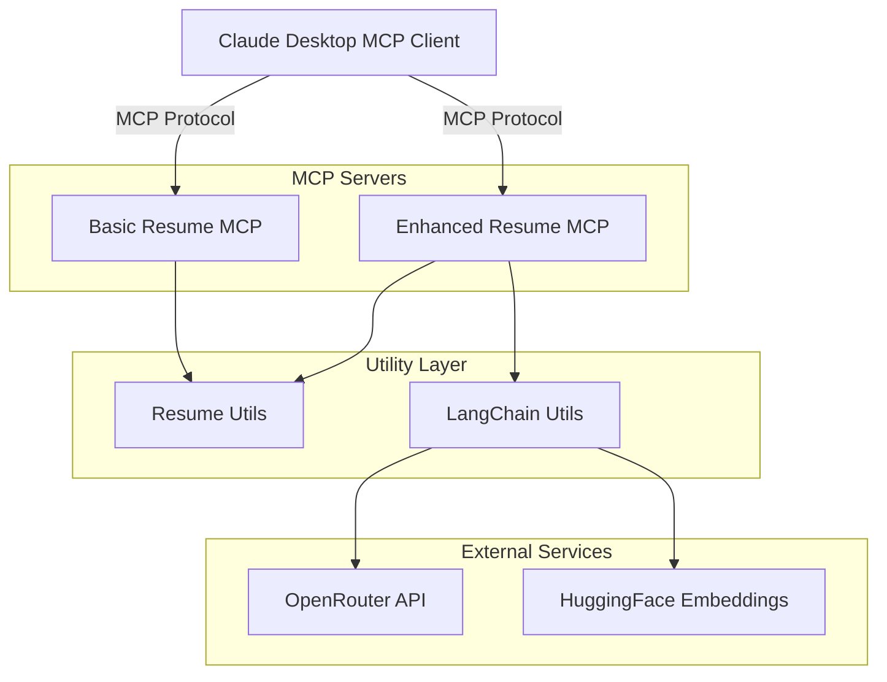
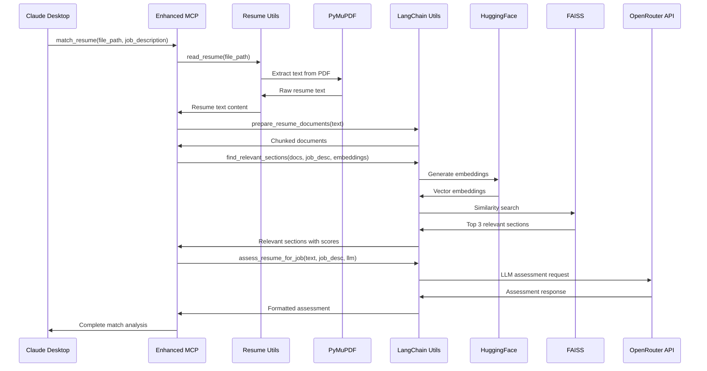

# MCP Resume Shortlister - Design Document

## 1. The "North Star" (Context & Goals)

### Abstract
The MCP Resume Shortlister is an AI-powered recruitment tool that leverages Model Context Protocol (MCP) to provide intelligent resume analysis capabilities. The system consists of two MCP servers: a basic resume reader and an enhanced LangChain-powered analyzer that performs advanced resume evaluation, skill extraction, job matching, and candidate assessment with AI-driven insights.

### User Stories
- **As a recruiter**, I want to quickly extract and read resume content from PDF files so that I can efficiently review candidate information.
- **As a hiring manager**, I want to match resumes against job descriptions with AI-powered analysis so that I can identify the best candidates faster.
- **As a talent acquisition specialist**, I want to detect resume red flags, keyword stuffing, and duplicate candidates so that I can maintain hiring quality and avoid fraudulent applications.
- **As an interview coordinator**, I want to generate personalized interview questions based on candidate resumes so that I can conduct more targeted and effective interviews.

### Non-Goals
- We are NOT building a full applicant tracking system (ATS) with candidate management workflows.
- We are NOT supporting real-time resume parsing from job boards or external APIs.
- We are NOT implementing user authentication or multi-tenant capabilities in this version.
- We are NOT providing resume editing or formatting capabilities.

## Unique Selling Points (USPs)

The MCP Resume Shortlister delivers 6 distinctive AI-powered capabilities that set it apart from traditional resume screening tools:

### 1. **ATS Score Resume** (`ats_score_resume`)
**Advanced Applicant Tracking System Simulation**
- Provides comprehensive 0-100 scoring with weighted component analysis
- Evaluates Skills Match, Experience Relevance, Project Relevance, Clarity & Structure, and ATS Formatting Risk
- Delivers actionable recommendations with evidence-based scoring rationale
- Simulates real ATS behavior to predict resume success rates

### 2. **Keyword Stuffing Detection** (`detect_keyword_stuffing`)
**Intelligent Resume Quality Assessment**
- Detects artificial keyword inflation and low-evidence buzzword repetition
- Analyzes keyword balance, context quality, and evidence strength
- Prevents gaming of ATS systems by identifying inauthentic optimization
- Ensures resume authenticity and genuine skill representation

### 3. **Project Quality Evaluation** (`evaluate_project_quality`)
**Deep Project Impact Analysis**
- Scores projects on Impact, Ownership, Complexity, and Outcome Clarity
- Evaluates real-world contribution and technical depth
- Identifies high-impact candidates through project assessment
- Provides insights into candidate's actual hands-on experience

### 4. **Resume Red Flags Detection** (`detect_resume_red_flags`)
**Comprehensive Risk Assessment**
- Automatically identifies employment gaps, inconsistencies, and vague claims
- Ranks findings by severity (low/medium/high) and confidence levels
- Detects potential misrepresentations and questionable statements
- Streamlines initial screening by flagging problematic resumes

### 5. **Duplicate Candidate Detection** (`detect_duplicate_candidate`)
**Advanced Similarity Analysis**
- Uses semantic embeddings to detect near-duplicate resumes across the entire candidate pool
- Prevents duplicate applications and identifies potential fraud
- Provides similarity scores with configurable thresholds
- Maintains candidate database integrity and reduces processing overhead

### 6. **Personalized Interview Questions** (`generate_interview_questions`)
**AI-Driven Interview Preparation**
- Generates both technical and behavioral questions tailored to each candidate
- Analyzes resume content and job requirements to create relevant questions
- Provides reasoning for each question to guide interviewer preparation
- Customizable question count (4-20) based on interview depth requirements

**Competitive Advantage**: These USPs combine to create a comprehensive, AI-powered recruitment pipeline that goes beyond simple keyword matching to provide deep, contextual analysis of candidate quality and fit.

## 2. System Architecture & Flow

### Component Diagram



**Component Details:**
- **Claude Desktop**: MCP client interface
- **Basic Resume MCP**: read_resume, list_resumes
- **Enhanced Resume MCP**: match_resume, extract_skills, ats_score_resume, detect_keyword_stuffing, evaluate_project_quality, detect_resume_red_flags, detect_duplicate_candidate, generate_interview_questions
- **Resume Utils**: read_resume(), ensure_dir_exists()
- **LangChain Utils**: init_langchain_components(), prepare_resume_documents(), find_relevant_sections(), extract_skills_with_langchain, assess_resume_for_job(), various scoring functions
- **OpenRouter API**: GPT-4o-mini, chat completions
- **HuggingFace Embeddings**: all-MiniLM-L6-v2, semantic similarity

### Sequence Diagram: Resume-Job Matching Flow



## 3. The Technical "Source of Truth"

### A. Data Schema (The "What")

#### Resume Document Structure
| Field Name | Type | Description | Constraints |
|:---|:---|:---|:---|
| file_path | String | Relative path to PDF file | Required, .pdf extension |
| content | String | Extracted text content | Max 50KB processed text |
| chunks | List[Document] | LangChain document chunks | 1000 chars/chunk, 200 overlap |
| metadata | Dict | File metadata | source, chunk_index |

#### Assessment Result Schema
| Field Name | Type | Description | Constraints |
|:---|:---|:---|:---|
| title | String | Assessment type | Required |
| total_score | Integer | Overall score | 0-100 range |
| summary | String | Brief assessment summary | Max 500 chars |
| components | List[Component] | Scored components | Variable length |
| evidence | List[String] | Supporting evidence | Max 10 items |
| recommendations | List[String] | Improvement suggestions | Max 10 items |

#### Component Schema
| Field Name | Type | Description | Constraints |
|:---|:---|:---|:---|
| name | String | Component name | Required |
| score | Integer | Component score | 0-100 range |
| weight | Integer | Weight percentage | 0-100 range |
| reason | String | Scoring rationale | Max 200 chars |

### B. API Contracts (The "How")

#### Basic MCP Server Tools

**Tool: read_resume**
```json
{
  "name": "read_resume",
  "description": "Read and extract text from a resume PDF file",
  "inputSchema": {
    "type": "object",
    "properties": {
      "file_path": {
        "type": "string",
        "description": "Path to the resume PDF file"
      }
    },
    "required": ["file_path"]
  }
}
```

**Tool: list_resumes**
```json
{
  "name": "list_resumes",
  "description": "List all available resume files",
  "inputSchema": {
    "type": "object",
    "properties": {}
  }
}
```

#### Enhanced MCP Server Tools

**Tool: match_resume**
```json
{
  "name": "match_resume",
  "description": "Match a resume against a job description",
  "inputSchema": {
    "type": "object",
    "properties": {
      "file_path": {
        "type": "string",
        "description": "Path to the resume PDF file"
      },
      "job_description": {
        "type": "string",
        "description": "Job description to match against"
      }
    },
    "required": ["file_path", "job_description"]
  }
}
```

**Tool: ats_score_resume**
```json
{
  "name": "ats_score_resume",
  "description": "Generate ATS-style scoring of a resume",
  "inputSchema": {
    "type": "object",
    "properties": {
      "file_path": {
        "type": "string",
        "description": "Path to the resume PDF file"
      },
      "job_description": {
        "type": "string",
        "description": "Job description to score against"
      }
    },
    "required": ["file_path", "job_description"]
  }
}
```

**Success Response Format:**
```json
{
  "type": "text",
  "text": "Formatted analysis with scores, evidence, and recommendations"
}
```

**Error Cases:**
- **400 Invalid Parameters**: Missing required fields or invalid file paths
- **404 File Not Found**: Resume file doesn't exist in assets directory
- **500 Processing Error**: PDF parsing failure, LLM API errors, or embedding generation issues

## 4. Application "Bootstrap" Guide (The Scratch Setup)

### Tech Stack
- **Python**: 3.11+ (for async/await and modern type hints)
- **MCP Framework**: 0.1.0+ (Model Context Protocol implementation)
- **LangChain**: 0.1.0+ with OpenAI integration
- **Document Processing**: PyMuPDF 1.21.1+ (PDF text extraction)
- **Embeddings**: HuggingFace Transformers with sentence-transformers/all-MiniLM-L6-v2
- **Vector Store**: FAISS-CPU 1.10.0+ (similarity search)
- **LLM Provider**: OpenRouter API with GPT-4o-mini model

### Folder Structure
```
MCP/mcp-handson/
├── .env                           # Environment variables (API keys)
├── requirements.txt               # Python dependencies
├── basic_resume_mcp.py           # Basic MCP server implementation
├── langchain_resume_mcp.py       # Enhanced MCP server with LangChain
├── assets/                       # Resume PDF storage
│   ├── new-grad-software-engineer-resume-example.pdf
│   ├── software-developer-resume-example.pdf
│   ├── software-engineer-resume-example.pdf
│   └── software-engineer-student-resume-example.pdf
└── utils/                        # Shared utility modules
    ├── __init__.py
    ├── resume_utils.py           # PDF processing utilities
    └── langchain_utils.py        # LangChain integration utilities
```

### Boilerplate/Tooling
- **Linting**: Python built-in linting with type hints enforcement
- **Testing Framework**: Not implemented (future enhancement)
- **Environment Management**: python-dotenv for configuration
- **Logging**: Python standard logging module
- **Error Handling**: MCP exception handling with graceful fallbacks

### Environment Setup
```bash
# Install dependencies
pip install -r requirements.txt

# Set up environment variables
cp .env.example .env
# Edit .env with your OpenRouter API key

# Run basic MCP server
python basic_resume_mcp.py

# Run enhanced MCP server
python langchain_resume_mcp.py
```

## 5. Implementation Requirements & Constraints

### Security
- **API Key Management**: All API keys must be stored in environment variables, never hardcoded.
- **File Access**: Resume access is restricted to the designated assets directory only.
- **Input Validation**: All file paths must be validated to prevent directory traversal attacks.
- **Error Handling**: Sensitive error details must not be exposed to the client.

### Performance
- **Response Time**: Basic resume reading must complete within <2 seconds for files up to 10MB.
- **LLM Calls**: Enhanced analysis must complete within <30 seconds per resume.
- **Memory Usage**: Document chunking must limit memory usage to <100MB per resume.
- **Concurrent Processing**: System must handle up to 5 concurrent resume analyses.

### Error Handling
- **PDF Processing Errors**: Log detailed errors to console, return user-friendly messages.
- **LLM API Failures**: Implement graceful fallbacks with error context preservation.
- **Embedding Failures**: Continue processing without semantic search when embeddings fail.
- **File System Errors**: Validate file existence and permissions before processing.

### Data Quality
- **Text Extraction**: Preserve formatting context and handle multi-column layouts.
- **Chunking Strategy**: Use 1000-character chunks with 200-character overlap for optimal context.
- **Score Normalization**: All scores must be integers in the 0-100 range.
- **JSON Validation**: All structured outputs must be valid JSON with error recovery.

## 6. The "Definition of Done" (DoD)

### Functional Requirements
- ✅ Basic MCP server can read and list PDF resumes from assets directory
- ✅ Enhanced MCP server provides all 8 analysis tools with proper error handling
- ✅ Resume-job matching includes both semantic similarity and LLM assessment
- ✅ All scoring functions return normalized 0-100 scores with component breakdowns
- ✅ Duplicate detection works across all resumes in the assets directory
- ✅ Interview question generation produces both technical and behavioral questions

### Technical Requirements
- ✅ Both MCP servers start successfully and respond to tool calls
- ✅ All utility functions handle edge cases (missing files, API failures, malformed PDFs)
- ✅ LangChain integration works with OpenRouter API and HuggingFace embeddings
- ✅ Error messages are informative but don't expose sensitive system details
- ✅ Environment variables are properly loaded and validated

### Quality Assurance
- ✅ All functions include proper type hints and docstrings
- ✅ Error handling covers all major failure modes with graceful degradation
- ✅ JSON parsing includes fallback mechanisms for malformed LLM responses
- ✅ File operations are safe and prevent directory traversal
- ✅ API rate limiting is handled appropriately

### Documentation
- ✅ README.md includes setup instructions and usage examples
- ✅ All MCP tools have clear descriptions and input schemas
- ✅ Environment variable requirements are documented
- ✅ Code includes inline comments explaining complex logic
- ✅ This design document serves as the technical specification

### Deployment Readiness
- ✅ Requirements.txt includes all necessary dependencies with version constraints
- ✅ Environment configuration supports both development and production setups
- ✅ MCP servers can be launched independently for testing
- ✅ Asset directory structure is properly initialized
- ✅ All external API dependencies are clearly documented

---

*This design document serves as the authoritative technical specification for the MCP Resume Shortlister project, ensuring consistent implementation and maintainability.*