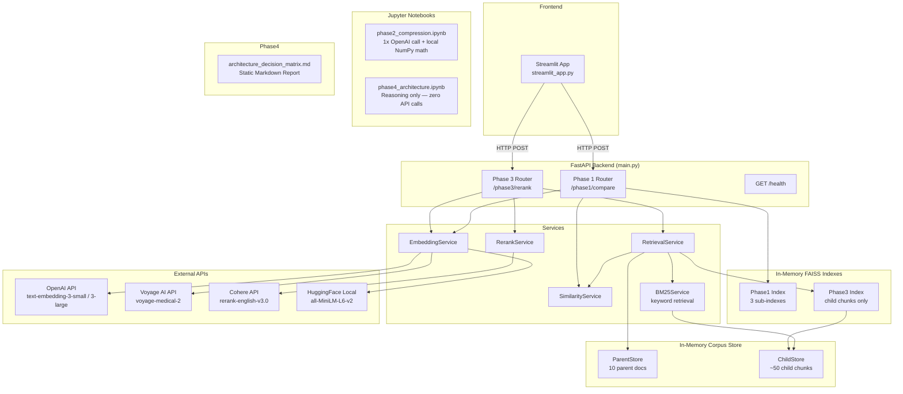
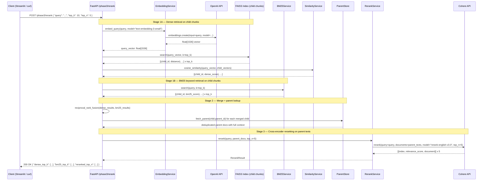

# Design Document: Embedding Retrieval System

---

## 1. The "North Star" (Context & Goals)

### Abstract

This system is a production-grade, multi-phase embedding retrieval lab that evaluates and compares multiple embedding providers (OpenAI, Cohere, Voyage AI, HuggingFace) using raw SDKs and in-memory FAISS indexes — no high-level frameworks. Phase 1 and Phase 3 are implemented as a FastAPI backend with a Streamlit frontend. Phase 2 (vector compression analysis) and Phase 4 (architecture decision matrix) are delivered as Jupyter notebooks — reasoning-focused artifacts with no live API endpoints. All similarity math is done manually with NumPy.

### User Stories

- As a **ML engineer**, I want to compare cosine similarity scores from OpenAI, Voyage AI, and HuggingFace models on the same query so that I can understand which model best handles domain-specific vocabulary.
- As a **researcher**, I want to run a Jupyter notebook that generates real embeddings and compares all three compression strategies side-by-side so that I can see the accuracy/memory trade-offs with actual numbers.
- As a **developer**, I want to submit a query against a 50-document corpus and receive a reranked Top-5 result list so that I can see how cross-encoder reranking improves over raw dense retrieval.
- As a **solutions architect**, I want to read a Jupyter notebook covering five deployment scenarios so that I can justify embedding model choices for different production constraints.
- As a **developer**, I want a Streamlit UI that calls Phase 1 and Phase 3 endpoints so that I can interactively explore results without writing curl commands.

### Non-Goals

- **No persistent storage**: All FAISS indexes are in-memory only; no disk persistence between restarts.
- **No authentication/authorization**: No API keys, JWT tokens, or user management for the FastAPI service itself.
- **No LangChain, LlamaIndex, or high-level vector DB abstractions**: All similarity math is done manually with NumPy.
- **No multimodal embedding implementation**: Phase 4 covers multimodal architectures in the decision matrix only — no CLIP code is written.
- **No Cohere embedding models**: Cohere is used exclusively for cross-encoder reranking (`rerank-english-v3.0`).
- **No production deployment pipeline**: No Docker Compose, Kubernetes, or CI/CD in scope.
- **No Phase 2 FastAPI endpoint**: Phase 2 is a Jupyter notebook using a single OpenAI API call — no `POST /phase2/compare`.
- **No Phase 4 API endpoint**: Phase 4 is a reasoning-only Jupyter notebook — zero API calls.

---

## 2. System Architecture & Flow

### Component Diagram



### Sequence Diagram — Phase 3: Hybrid Retrieval + Parent-Child + Cross-Encoder Reranking



---

## 3. The Technical "Source of Truth"

### A. Data Schema

#### `ParentDocument`

| Field Name | Type | Constraints |
| :--- | :--- | :--- |
| `parent_id` | `int` | Not null, unique, auto-incremented |
| `text` | `str` | Not null, max 4096 chars |
| `metadata` | `dict[str, Any]` | Optional, default `{}` |

#### `ChildChunk`

| Field Name | Type | Constraints |
| :--- | :--- | :--- |
| `child_id` | `int` | Not null, unique, auto-incremented |
| `parent_id` | `int` | Not null; FK → `ParentDocument.parent_id` |
| `chunk_index` | `int` | Not null, 0-indexed |
| `text` | `str` | Not null, max 512 chars |
| `vector` | `list[float]` | Not null; length = 1536 |

#### `QueryRequest`

| Field Name | Type | Constraints |
| :--- | :--- | :--- |
| `query` | `str` | Not null, min 1 char, max 2048 chars |
| `top_k` | `int` | Optional, default 10, range 1–50 |
| `top_n` | `int` | Optional, default 5, range 1–`top_k` |

#### `ComparisonResult` (Phase 1 response)

| Field Name | Type | Constraints |
| :--- | :--- | :--- |
| `query` | `str` | Not null |
| `reference_text` | `str` | Not null |
| `scores` | `list[ModelScore]` | Not null, exactly 3 items |
| `winner` | `str` | Model name with highest cosine similarity |

#### `ModelScore`

| Field Name | Type | Constraints |
| :--- | :--- | :--- |
| `model` | `str` | Not null |
| `provider` | `str` | Not null |
| `cosine_similarity` | `float` | Range [-1.0, 1.0] |
| `dimensions` | `int` | Positive integer |

#### `RerankResult` (Phase 3 response)

| Field Name | Type | Constraints |
| :--- | :--- | :--- |
| `query` | `str` | Not null |
| `dense_top_k` | `list[RetrievedChunk]` | Child chunks from FAISS |
| `bm25_top_k` | `list[RetrievedChunk]` | Child chunks from BM25 |
| `merged_parents` | `list[ParentContext]` | Deduplicated parents after RRF + lookup |
| `reranked_top_n` | `list[RankedDoc]` | Length = `top_n` |
| `retrieval_latency_ms` | `float` | Non-negative |
| `rerank_latency_ms` | `float` | Non-negative |

#### `RetrievedChunk`

| Field Name | Type | Constraints |
| :--- | :--- | :--- |
| `child_id` | `int` | Not null |
| `parent_id` | `int` | Not null |
| `chunk_index` | `int` | Not null |
| `text` | `str` | Not null |
| `score` | `float` | Cosine similarity or BM25 score |

#### `ParentContext`

| Field Name | Type | Constraints |
| :--- | :--- | :--- |
| `parent_id` | `int` | Not null |
| `text` | `str` | Not null — full parent text |
| `matched_chunks` | `list[int]` | child_ids that triggered inclusion |
| `rrf_score` | `float` | Reciprocal rank fusion score |

#### `RankedDoc`

| Field Name | Type | Constraints |
| :--- | :--- | :--- |
| `doc_id` | `int` | Not null |
| `text` | `str` | Not null |
| `relevance_score` | `float` | Range [0.0, 1.0] |
| `original_dense_rank` | `int` | 1-indexed rank before reranking |

#### `ErrorResponse`

| Field Name | Type | Constraints |
| :--- | :--- | :--- |
| `error` | `str` | Not null |
| `provider` | `str` | Not null |
| `status_code` | `int` | HTTP status code |
| `detail` | `str` | Optional |

---

### B. API Contracts

#### `POST /phase1/compare`

**Purpose**: Compare cosine similarity from three models (OpenAI general, Voyage AI domain-specific, HuggingFace local) against a fixed medical reference sentence.

**Request**: `{ "query": "string" }`

**Response `200`**:
```json
{
  "query": "The person was sweating heavily with a fast heart rate",
  "reference_text": "The patient exhibited severe diaphoresis and tachycardia",
  "scores": [
    { "model": "text-embedding-3-small", "provider": "openai", "cosine_similarity": 0.72, "dimensions": 1536 },
    { "model": "voyage-medical-2", "provider": "voyageai", "cosine_similarity": 0.91, "dimensions": 1024 },
    { "model": "all-MiniLM-L6-v2", "provider": "huggingface", "cosine_similarity": 0.68, "dimensions": 384 }
  ],
  "winner": "voyage-medical-2"
}
```

| Status | Condition |
| :--- | :--- |
| `422` | Missing/empty `query` |
| `500` | Provider API failure — returns `ErrorResponse` with `provider` field |

---

#### `POST /phase3/rerank`

**Purpose**: Three-stage hybrid retrieval — FAISS dense + BM25 keyword → RRF merge → parent lookup → Cohere cross-encoder reranking.

**Request**: `{ "query": "string", "top_k": 10, "top_n": 5 }` — constraint: `1 <= top_n <= top_k <= 50`

**Response `200`**:
```json
{
  "query": "treatments that do not involve surgery",
  "dense_top_k": [{ "child_id": 22, "parent_id": 5, "chunk_index": 1, "text": "...", "score": 0.81 }],
  "bm25_top_k":  [{ "child_id": 14, "parent_id": 3, "chunk_index": 2, "text": "...", "score": 7.42 }],
  "merged_parents": [{ "parent_id": 3, "text": "...", "matched_chunks": [14, 15], "rrf_score": 0.043 }],
  "reranked_top_n": [{ "doc_id": 3, "text": "...", "relevance_score": 0.94, "original_dense_rank": 4 }],
  "retrieval_latency_ms": 12.4,
  "rerank_latency_ms": 340.1
}
```

| Status | Condition |
| :--- | :--- |
| `400` | `top_n > top_k` |
| `422` | Missing `query` |
| `500` | OpenAI or Cohere failure — returns `ErrorResponse` with `provider` field |

---

#### `GET /health`

**Response `200`**: `{ "status": "ok", "providers": { "openai": "configured", "voyageai": "configured", "cohere": "configured", "huggingface": "local" } }`

**Response `503`**: `{ "status": "degraded", "missing_keys": ["VOYAGE_API_KEY"] }`

---

### Phase 2 Notebook

**File**: `notebooks/phase2_compression.ipynb` — 1x `text-embedding-3-large` API call, then local NumPy math only.

Three strategies compared: Matryoshka truncation (3072→256 dims, L2-normalized, cosine similarity) · Direct binary quantization (sign-based, Hamming distance — the broken pipeline) · Chained pipeline: truncate → L2 normalize → binary quantize (the correct fix from the session).

Answers the 4 assignment questions in a written analysis cell.

---

## 4. Application Bootstrap Guide

### Tech Stack

| Component | Package | Version |
| :--- | :--- | :--- |
| Runtime | Python | 3.11.x |
| Web Framework | FastAPI | 0.111.x |
| ASGI Server | uvicorn[standard] | 0.29.x |
| Data Validation | pydantic | 2.x |
| Vector Store | faiss-cpu | 1.8.x |
| Local Embeddings | sentence-transformers | 3.x |
| OpenAI SDK | openai | 1.x |
| Cohere SDK | cohere | 5.x |
| Voyage AI SDK | voyageai | 0.2.x |
| Numerical Computing | numpy | 1.26.x |
| Frontend | streamlit | 1.x |
| HTTP Client (UI) | httpx | 0.27.x |
| Env Management | python-dotenv | 1.x |
| BM25 Retrieval | rank-bm25 | 0.2.x |
| Linting | ruff | 0.4.x |
| Testing | pytest + pytest-asyncio | 8.x / 0.23.x |

### Folder Structure

```
embedding-retrieval-system/
├── .env.example
├── .gitignore
├── README.md
├── requirements.txt
├── ruff.toml
├── app/
│   ├── main.py                   # FastAPI app factory + lifespan
│   ├── config.py                 # pydantic-settings + dotenv
│   ├── routers/
│   │   ├── phase1.py             # POST /phase1/compare
│   │   ├── phase3.py             # POST /phase3/rerank
│   │   └── health.py             # GET /health
│   ├── services/
│   │   ├── embedding_service.py  # OpenAI, Voyage AI, HuggingFace
│   │   ├── similarity_service.py # NumPy cosine similarity only
│   │   ├── compression_service.py# Matryoshka, binary, chained pipeline (used by notebook)
│   │   ├── retrieval_service.py  # FAISS + RRF
│   │   ├── bm25_service.py       # BM25Okapi keyword retrieval
│   │   └── rerank_service.py     # Cohere cross-encoder
│   ├── models/schemas.py         # All Pydantic models
│   └── data/corpus.py            # 10 parents, ~50 child chunks
├── notebooks/
│   ├── phase2_compression.ipynb
│   └── phase4_architecture.ipynb
├── frontend/streamlit_app.py     # Phase 1 + Phase 3 UI only
└── tests/
    ├── conftest.py
    ├── test_phase1.py
    ├── test_phase3.py
    ├── test_similarity_service.py
    ├── test_compression_service.py
    └── test_bm25_service.py
```

---

## 5. Implementation Requirements & Constraints

### Security
- API keys loaded exclusively from environment variables via `python-dotenv` — never in source code, logs, or responses.
- `.env` listed in `.gitignore`.

### Performance
- OpenAI and Voyage AI calls use async clients (`AsyncOpenAI`, `voyageai.AsyncClient`).
- FAISS search < 50ms for in-memory indexes up to 50 documents.
- HuggingFace model loaded once at startup via FastAPI `lifespan` — never per-request.

### Error Handling
- All provider failures return structured `ErrorResponse` JSON — no raw tracebacks to clients.
- FAISS dimension mismatch → 500 with `provider: "faiss"`.

### Rules of Engagement
- No LangChain, LlamaIndex, Pinecone, Weaviate, Chroma, or any high-level vector DB client.
- Cosine similarity: `np.dot(a, b) / (np.linalg.norm(a) * np.linalg.norm(b))` — no sklearn/scipy.
- Binary quantization: NumPy sign + `np.packbits` — no library helpers.
- Matryoshka truncation: array slice + L2 normalization — no library helpers.
- RRF: manual implementation `score(d) = Σ 1/(k + rank)` with `k=60`.
- FAISS indexes child chunk vectors only — parent docs never directly indexed.
- BM25: `rank_bm25.BM25Okapi` directly — no wrappers.

---

## 6. Definition of Done

### Functional
- [ ] `POST /phase1/compare` returns scores from all 3 models and correct winner.
- [ ] `notebooks/phase2_compression.ipynb` runs end-to-end with 1 OpenAI call, produces results table, answers all 4 assignment questions.
- [ ] `POST /phase3/rerank` returns `dense_top_k`, `bm25_top_k`, `merged_parents`, `reranked_top_n`.
- [ ] `GET /health` returns `200` / `503` correctly.
- [ ] `notebooks/phase4_architecture.ipynb` covers all 5 scenarios — zero API calls.

### Technical Correctness
- [ ] All cosine similarity via NumPy only.
- [ ] Binary quantization and Matryoshka truncation implemented manually.
- [ ] Chained pipeline applies L2 normalization before binarization.
- [ ] FAISS index contains child chunk vectors only.
- [ ] BM25 uses `BM25Okapi` directly.
- [ ] RRF implemented manually with `k=60`.
- [ ] No LangChain/LlamaIndex/high-level vector DB imports anywhere.
- [ ] FAISS search < 50ms (verified in tests).

### Quality
- [ ] Unit test coverage ≥ 70%.
- [ ] All provider API calls mocked in tests — no real calls during `pytest`.
- [ ] Test verifies chained pipeline produces lower Hamming distance than direct binary (normalization bug regression).
- [ ] `ruff check .` passes with zero errors.
- [ ] Swagger UI accessible at `http://localhost:8000/docs`.
- [ ] `README.md` documents install, `.env` setup, run API, run Streamlit, run tests.
