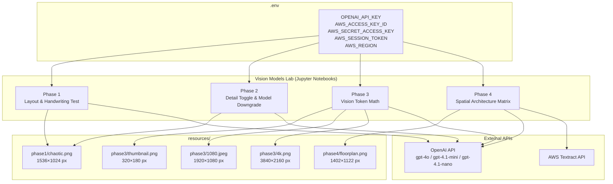
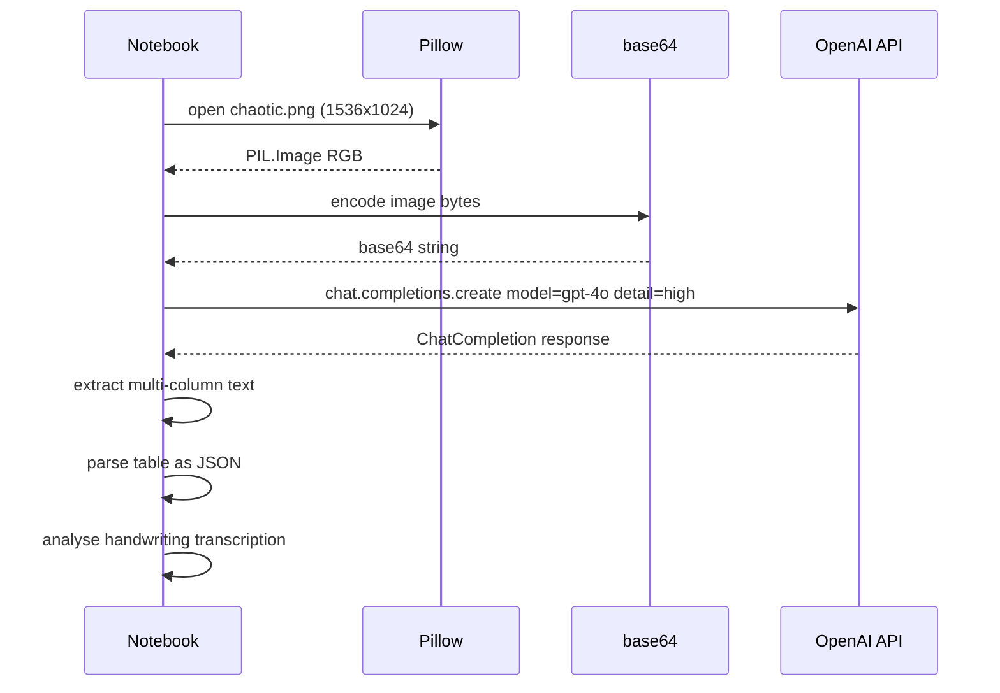
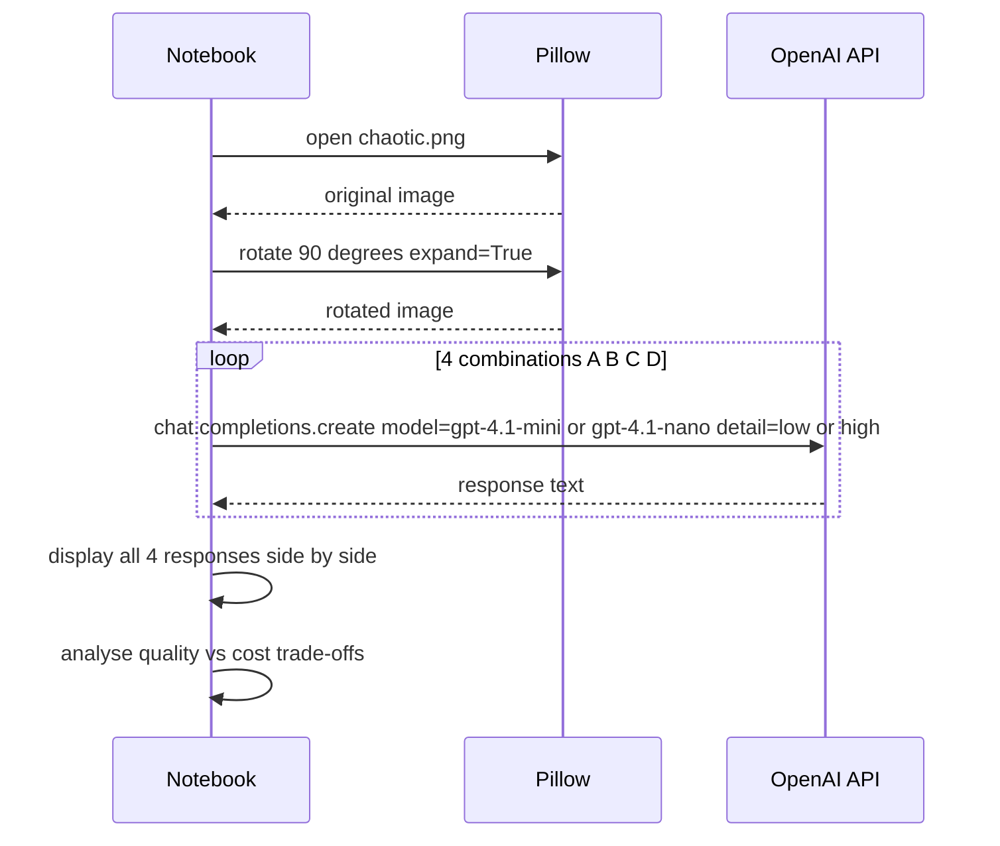
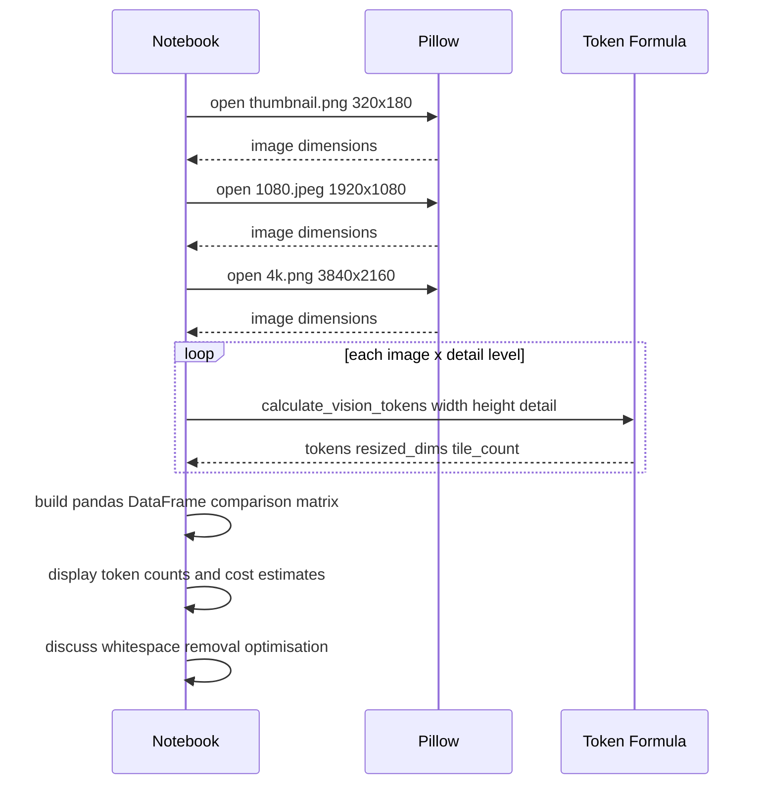
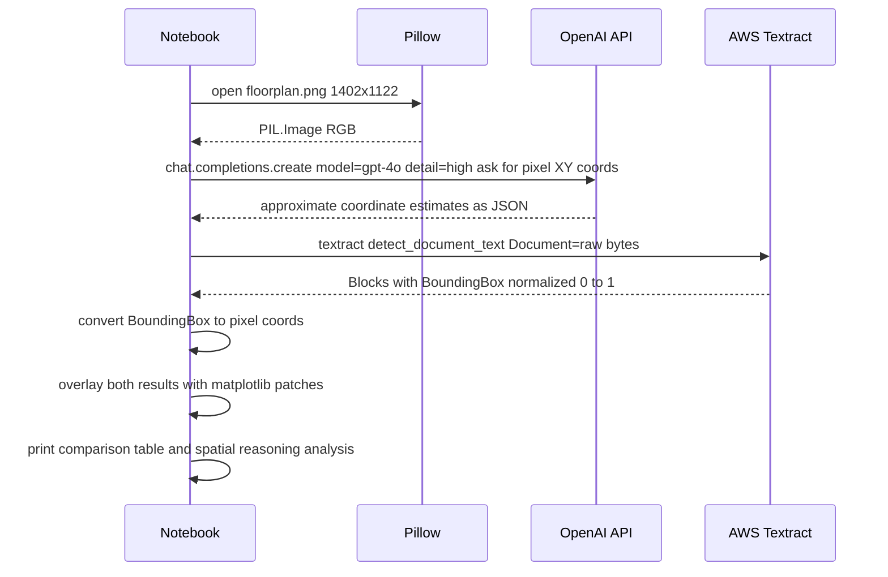

# Design Document: Vision Models Lab

## 1. North Star

### Abstract

This lab replaces a legacy OCR pipeline (e.g., Tesseract) with a modern multimodal LLM system built on the raw OpenAI SDK. Across four progressive phases, it demonstrates zero-shot document extraction from chaotic layouts, cost-quality trade-off analysis via model and detail-level toggling, exact vision token math for cost optimization at scale, and a spatial reasoning evaluation that exposes where LLMs fall short compared to purpose-built tools like AWS Textract.

### Non-Goals

- No abstraction libraries (e.g., `unstructured.io`, LangChain, LlamaIndex) — raw SDK only.
- No fine-tuning or model training of any kind.
- No production deployment, API gateway, or serving infrastructure.
- No offline/edge inference; all calls go to the OpenAI and AWS APIs.
- No support for video, audio, or non-image document formats.
- No evaluation of models outside the OpenAI GPT-4.1 family and AWS Textract.

---

## 2. System Architecture & Flow

### Component Diagram



### Sequence Diagram — Phase 1: Layout & Handwriting Test



### Sequence Diagram — Phase 2: Detail Toggle & Model Downgrade



### Sequence Diagram — Phase 3: Vision Token Math



### Sequence Diagram — Phase 4: Spatial Architecture Matrix



---

## 3. Technical Source of Truth

### OpenAI Vision API Contract

| Parameter | Phase 1 | Phase 2 | Phase 3 | Phase 4 |
|---|---|---|---|---|
| Endpoint | `chat.completions.create` | `chat.completions.create` | `chat.completions.create` | `chat.completions.create` |
| Model | `gpt-4o` | `gpt-4.1-mini` / `gpt-4.1-nano` | `gpt-4.1-mini` (cost check only) | `gpt-4o` |
| `detail` | `high` | `low` / `high` | `low` / `high` (formula only) | `high` |
| Image encoding | `data:image/<ext>;base64,<b64>` | same | same | same |
| Response format | plain text + JSON block | plain text | plain text | JSON `{objects:[{name,x,y}]}` |

### Vision Token Formula (OpenAI — exact implementation)

```
detail:low  → 85 tokens (always, regardless of image size)

detail:high →
  Step 1: if max(W, H) > 2048 → scale down to fit 2048×2048 (preserve aspect ratio)
  Step 2: if min(W, H) > 768  → scale down so shortest side = 768 px
  Step 3: tiles_w = ceil(W / 512),  tiles_h = ceil(H / 512)
  Step 4: tokens  = 170 × (tiles_w × tiles_h) + 85
```

Reference implementation (`phase3_vision_token_math.ipynb`, cell `ph3-token-fn`):

```python
def calculate_vision_tokens(width, height, detail):
    if detail == 'low':
        return 85, width, height, 0, 0
    w, h = width, height
    if w > 2048 or h > 2048:
        scale = min(2048 / w, 2048 / h)
        w, h = int(w * scale), int(h * scale)
    shortest = min(w, h)
    if shortest > 768:
        scale = 768 / shortest
        w, h = int(w * scale), int(h * scale)
    tiles_w = math.ceil(w / 512)
    tiles_h = math.ceil(h / 512)
    tokens  = 170 * tiles_w * tiles_h + 85
    return tokens, w, h, tiles_w, tiles_h
```

### AWS Textract Contract

- API: `textract_client.detect_document_text(Document={"Bytes": <raw_bytes>})`
- Returns: list of `Block` objects; `BlockType == "WORD"` blocks carry a `Geometry.BoundingBox` dict with keys `Left`, `Top`, `Width`, `Height` (all normalized 0–1 relative to image dimensions).
- Pixel conversion: `pixel_x = Left × IMG_W`, `pixel_y = Top × IMG_H`.

### Image Rotation (Phase 2)

```python
img_rotated = img_original.rotate(90, expand=True)   # PIL ROTATE_90
# expand=True ensures canvas resizes to fit rotated content
```

### Image Discovery Helper (all phases)

```python
def find_image(folder):
    for ext in ['*.png', '*.jpg', '*.jpeg']:
        matches = list(Path(folder).glob(ext))
        if matches:
            return matches[0]
    raise FileNotFoundError(f'No PNG or JPEG image found in {folder}')
```

Phase 3 uses a keyword-based variant (`find_by_keyword`) that matches `thumbnail`, `1080`, or `4k` in the filename stem (case-insensitive).

---

## 4. Bootstrap Guide

### Tech Stack

| Library | Version (tested) | Purpose |
|---|---|---|
| Python | 3.11+ | Runtime |
| `openai` | ≥ 1.x (raw SDK) | OpenAI API client |
| `boto3` | ≥ 1.34 | AWS Textract client (Phase 4) |
| `Pillow` (PIL) | ≥ 10.x | Image load, rotate, encode |
| `matplotlib` | ≥ 3.8 | Visualization & bounding-box overlays |
| `pandas` | ≥ 2.x | Token comparison matrix (Phase 3) |
| `python-dotenv` | ≥ 1.x | Load `.env` credentials |
| Jupyter | ≥ 7.x | Notebook runtime |

Install all dependencies:

```bash
pip install openai boto3 pillow matplotlib pandas python-dotenv jupyter -q
```

### Environment Variables (`.env`)

```
OPENAI_API_KEY=sk-...
AWS_ACCESS_KEY_ID=AKIA...
AWS_SECRET_ACCESS_KEY=...
AWS_SESSION_TOKEN=...          # optional; required for temporary credentials
AWS_REGION=ap-south-1          # or your preferred region
```

### Folder Structure

```
/
├── .env                                    # API credentials (git-ignored)
├── phase1_layout_handwriting_test.ipynb
├── phase2_detail_toggle_model_downgrade.ipynb
├── phase3_vision_token_math.ipynb
├── phase4_spatial_architecture_matrix.ipynb
└── resources/
    ├── phase1/
    │   └── chaotic.png                     # 1536×1024 px — multi-column + table + handwriting
    ├── phase3/
    │   ├── thumbnail.png                   # 320×180 px
    │   ├── 1080.jpeg                       # 1920×1080 px
    │   └── 4k.png                          # 3840×2160 px
    └── phase4/
        └── floorplan.png                   # 1402×1122 px
```

---

## 5. Implementation Requirements & Constraints

### Rules of Engagement

1. **Raw SDK only** — use `openai.OpenAI` directly; no wrapper libraries.
2. **Image encoding** — all images must be sent as `data:image/<mime>;base64,<b64>` URLs inside the `image_url` content block.
3. **Credential hygiene** — all secrets live in `.env`; the notebooks call `load_dotenv()` at startup and raise `ValueError` if a required key is missing.
4. **Model selection** — prefer the cheapest model that satisfies the phase objective:
   - Phase 1: `gpt-4o` (or equivalent high-capability model) — needed for layout fidelity.
   - Phase 2: `gpt-4.1-mini` and `gpt-4.1-nano` — deliberate downgrade for cost comparison.
   - Phase 3: token math is computed locally; no model call required for the matrix.
   - Phase 4: `gpt-4o` for spatial reasoning; AWS Textract for geometric ground truth.
5. **No retry loops** — each notebook cell makes exactly one API call per combination; no automatic retries that inflate cost.
6. **Context minimization** — prompts are kept short; no large system prompts or conversation history.

### Cost Guidelines

| Phase | Estimated token budget per run |
|---|---|
| Phase 1 | ~1 000 input tokens (detail:high on 1536×1024) + ~300 output |
| Phase 2 | ~4 × (85–1 000) input tokens + ~4 × 200 output |
| Phase 3 | 0 API tokens (pure local math) |
| Phase 4 | ~1 000 input tokens (detail:high on 1402×1122) + ~200 output + Textract per-page fee |

Always prefer `detail:low` or smaller models during iterative development; switch to `detail:high` / `gpt-4o` only for the final demonstration run.

### Security

- Never commit `.env` to version control (add to `.gitignore`).
- AWS session tokens expire; refresh before running Phase 4.
- Do not log or print raw API keys in notebook output cells.

---

## 6. Definition of Done

### Phase 1 — Layout & Handwriting Test

- [ ] `chaotic.png` (1536×1024) is loaded and displayed in the notebook.
- [ ] Image is base64-encoded and sent to `gpt-4o` with `detail:high`.
- [ ] The model returns a response that preserves multi-column layout structure.
- [ ] A JSON object representing the structured table is extracted and printed.
- [ ] The notebook includes a written analysis answering:
  - What prompt was used to extract the table as valid JSON?
  - Did the model transcribe exactly or autocorrect handwriting errors?
  - How did the model handle multi-column layouts?

### Phase 2 — Detail Toggle & Model Downgrade

- [ ] The same `chaotic.png` is run through all four combinations (A–D).
- [ ] Combinations C and D use a PIL-rotated (90°) version of the image.
- [ ] All four responses are displayed side-by-side for comparison.
- [ ] The notebook includes a written analysis answering:
  - What information was lost with `detail:low`?
  - How did `gpt-4.1-nano` compare to `gpt-4.1-mini` in layout understanding?
  - How did both models handle the rotated image?

### Phase 3 — Vision Token Math

- [ ] `calculate_vision_tokens()` correctly implements the OpenAI formula (sanity-checked against the 4000×3000 example: expected 765 tokens).
- [ ] All three images (thumbnail, 1080p, 4K) are loaded and their dimensions printed.
- [ ] A comparison matrix (pandas DataFrame) is produced showing tokens and estimated cost for each image × detail-level combination.
- [ ] The notebook discusses whitespace removal as a preprocessing optimization.
- [ ] The notebook answers:
  - How are tokens calculated for a large image (e.g., 4000×3000)?
  - What preprocessing steps can reduce unnecessary token usage?

### Phase 4 — Spatial Architecture Matrix

- [ ] `floorplan.png` (1402×1122) is loaded and displayed.
- [ ] `gpt-4o` is asked to return pixel (X, Y) coordinates for specific objects; response is parsed.
- [ ] AWS Textract `detect_document_text` is called; bounding boxes are converted to pixel coordinates.
- [ ] Both sets of coordinates are overlaid on the image using `matplotlib.patches`.
- [ ] The notebook includes a written analysis answering:
  - Do the LLM-predicted coordinates align precisely with the image?
  - Why do LLMs struggle with exact pixel-level geometry?
  - Why is GPT-4o not suitable for precise redaction tasks?
  - Why is Textract not suitable for semantic understanding?
