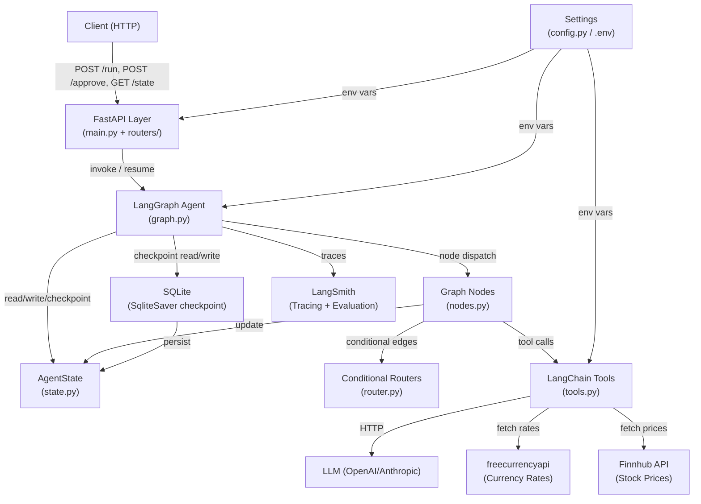
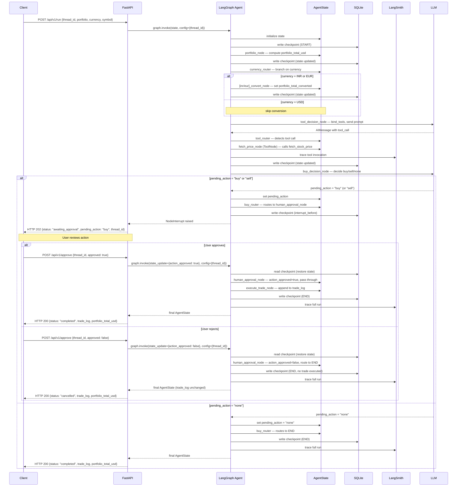

# Design Document — Stock Trading Agent

## 1. The "North Star" (Context & Goals)

### Abstract

A stateful, multi-step AI agent built with LangGraph that manages stock trading workflows end-to-end. The agent maintains portfolio state, routes through optional currency conversion, fetches real-time stock prices via an LLM-bound tool, and requires explicit human approval before executing any trade — all persisted across API calls via SQLite checkpointing. Every execution is traced and evaluated through LangSmith, and the entire system is exposed via a FastAPI REST layer.

### User Stories

- As a trader, I want the agent to track my portfolio holdings and compute their total value, so that I have an accurate financial baseline before making trading decisions.
- As a trader, I want to view my portfolio value in my preferred currency (USD, INR, or EUR), so that I can make decisions in a familiar financial context.
- As a trader, I want the agent to fetch the current price of a stock symbol, so that trading decisions are based on up-to-date market data.
- As a trader, I want the agent to pause and require my explicit approval before executing any buy or sell action, so that no trade is performed without my consent.
- As a trader, I want my agent session to persist across API calls and be resumable by thread ID, so that multi-step workflows like HITL approval are not lost between requests.
- As a client application, I want a REST API to interact with the trading agent, so that I can start runs, poll state, and submit approvals over HTTP.
- As an operator, I want all agent executions traced in LangSmith, so that I can debug, monitor token usage, and evaluate agent quality.

### Non-Goals

- No real brokerage integration (Alpaca, Robinhood, etc.) — trades are simulated and logged only.
- No real-time market data subscription or WebSocket streaming.
- No user authentication or multi-tenant access control.
- No frontend UI — this is a backend-only service.
- No portfolio rebalancing, limit orders, or advanced order types.
- No historical backtesting or performance analytics.
- No production-grade database (Postgres, etc.) — SQLite only for this version.

---

## 2. System Architecture & Flow

### Component Diagram



### Sequence Diagram — Full Run with HITL Approval (Buy + Sell + Rejection Paths)



---

## 3. The Technical "Source of Truth"

### A. Data Schema (The "What")

#### AgentState

| Field Name | Type | Constraints |
|---|---|---|
| `messages` | `Annotated[list[BaseMessage], add_messages]` | Uses `add_messages` reducer; never None |
| `portfolio` | `list[Holding]` | List of holdings; may be empty |
| `portfolio_total_usd` | `float` | Computed by `portfolio_node`; >= 0.0 |
| `currency` | `Literal["USD", "INR", "EUR"]` | Required; defaults to `"USD"` |
| `portfolio_total_converted` | `float \| None` | Set by conversion nodes; None if USD |
| `exchange_rate` | `float \| None` | Set by conversion nodes; None if USD |
| `pending_action` | `Literal["buy", "sell", "none"]` | Set by `buy_decision_node`; defaults to `"none"` |
| `action_approved` | `bool` | Set by human on resume; defaults to `False` |
| `trade_log` | `list[str]` | Appended by `execute_trade_node`; never None |
| `error` | `str \| None` | Set on tool/API errors; None on success |

#### Holding (nested model)

| Field Name | Type | Constraints |
|---|---|---|
| `symbol` | `str` | Uppercase ticker, e.g. `"AAPL"` |
| `quantity` | `float` | > 0 |
| `avg_buy_price` | `float` | > 0 |

#### API Request/Response Models

**RunRequest**

| Field Name | Type | Constraints |
|---|---|---|
| `thread_id` | `str` | UUID or user-defined; required |
| `portfolio` | `list[Holding]` | At least one holding |
| `currency` | `Literal["USD", "INR", "EUR"]` | Required |
| `symbol` | `str` | Stock symbol to evaluate; required |
| `prompt` | `str \| None` | Optional override prompt for LLM |

**RunResponse (200)**

| Field Name | Type | Constraints |
|---|---|---|
| `status` | `Literal["completed"]` | Always `"completed"` on 200 |
| `thread_id` | `str` | Echo of input |
| `portfolio_total_usd` | `float` | Final computed value |
| `portfolio_total_converted` | `float \| None` | Null if currency is USD |
| `currency` | `str` | Echo of input |
| `trade_log` | `list[str]` | May be empty |

**RunResponse (202 — HITL interrupt)**

| Field Name | Type | Constraints |
|---|---|---|
| `status` | `Literal["awaiting_approval"]` | Always on 202 |
| `thread_id` | `str` | Echo of input |
| `pending_action` | `Literal["buy", "sell"]` | The action awaiting approval |

**ApproveRequest**

| Field Name | Type | Constraints |
|---|---|---|
| `thread_id` | `str` | Must match an interrupted thread |
| `approved` | `bool` | `true` to execute, `false` to cancel |

**ApproveResponse (200)**

| Field Name | Type | Constraints |
|---|---|---|
| `status` | `Literal["completed", "cancelled"]` | `"cancelled"` when approved=false |
| `thread_id` | `str` | Echo of input |
| `trade_log` | `list[str]` | Updated log after execution |

**StateResponse (200)**

| Field Name | Type | Constraints |
|---|---|---|
| `thread_id` | `str` | Echo of path param |
| `status` | `str` | Derived from checkpoint state |
| `state` | `AgentState` | Full current state snapshot |

**HealthResponse (200)**

| Field Name | Type | Constraints |
|---|---|---|
| `status` | `Literal["ok"]` | Always `"ok"` |
| `version` | `str` | Semver string, e.g. `"1.0.0"` |

**ErrorResponse (4xx/5xx)**

| Field Name | Type | Constraints |
|---|---|---|
| `code` | `str` | Machine-readable error code |
| `message` | `str` | Human-readable description |

---

### B. API Contracts (The "How")

#### `POST /api/v1/run`

- **Method:** POST
- **Payload:** `RunRequest` (JSON body)
- **Success Response (200):** `RunResponse` — run completed, no trade pending
- **Success Response (202):** `RunResponse` — run interrupted, awaiting HITL approval
- **Error Cases:**
  - `400 INVALID_REQUEST` — missing/invalid fields in body
  - `500 AGENT_ERROR` — unhandled exception during graph execution
  - `500 CHECKPOINT_ERROR` — SQLite database corrupted or locked

#### `POST /api/v1/approve`

- **Method:** POST
- **Payload:** `ApproveRequest` (JSON body)
- **Success Response (200):** `ApproveResponse`
- **Error Cases:**
  - `404 THREAD_NOT_FOUND` — no checkpoint exists for `thread_id`
  - `400 THREAD_ALREADY_COMPLETED` — thread has already reached END state
  - `400 INVALID_REQUEST` — missing fields
  - `500 AGENT_ERROR` — unhandled exception on resume
  - `500 CHECKPOINT_ERROR` — SQLite database corrupted or locked

#### `GET /api/v1/state/{thread_id}`

- **Method:** GET
- **Path Param:** `thread_id: str`
- **Success Response (200):** `StateResponse`
- **Error Cases:**
  - `404 THREAD_NOT_FOUND` — no checkpoint exists for `thread_id`
  - `500 CHECKPOINT_ERROR` — SQLite database corrupted or locked

#### `GET /api/v1/health`

- **Method:** GET
- **Payload:** None
- **Success Response (200):** `HealthResponse`
- **Error Cases:** None expected; always returns 200 if service is up

---

## 4. Application "Bootstrap" Guide (The Scratch Setup)

### Tech Stack

| Component | Library / Version |
|---|---|
| Language | Python 3.11 |
| Agent framework | LangGraph 0.2.x |
| LLM orchestration | LangChain 0.3.x |
| Web framework | FastAPI 0.111.x |
| ASGI server | Uvicorn 0.30.x |
| Checkpointing | `langgraph-checkpoint-sqlite` (SqliteSaver) |
| Observability | LangSmith SDK 0.1.x |
| Config management | pydantic-settings 2.x |
| Linting | Ruff 0.4.x |
| Formatting | Black 24.x |
| Testing | pytest 8.x + pytest-asyncio |
| Property testing | Hypothesis 6.x |
| HTTP client (tests) | httpx 0.27.x |

### Folder Structure

```
backend/
├── app/
│   ├── __init__.py
│   ├── main.py               # FastAPI app factory, global exception handlers
│   ├── config.py             # pydantic-settings Settings class
│   ├── models.py             # Pydantic request/response models
│   ├── agent/
│   │   ├── __init__.py
│   │   ├── state.py          # AgentState TypedDict + Holding model
│   │   ├── graph.py          # StateGraph construction + compilation
│   │   ├── nodes.py          # All node functions (portfolio, convert, buy, trade, etc.)
│   │   ├── router.py         # Currency_Router, Tool_Router, Buy_Router
│   │   └── tools.py          # @tool fetch_stock_price
│   └── routers/
│       ├── __init__.py
│       ├── run.py            # POST /api/v1/run
│       ├── approve.py        # POST /api/v1/approve
│       ├── state.py          # GET /api/v1/state/{thread_id}
│       └── health.py         # GET /api/v1/health
├── tests/
│   ├── conftest.py           # Fixtures: test app, MemorySaver, mock LLM
│   ├── test_nodes.py         # Unit tests for individual node functions
│   ├── test_router.py        # Unit tests for router functions
│   ├── test_tools.py         # Unit + property tests for fetch_stock_price
│   ├── test_graph.py         # Integration tests for full graph runs
│   ├── test_api.py           # FastAPI endpoint tests (httpx)
│   └── test_properties.py    # Hypothesis property-based tests
├── .env.example
├── pyproject.toml            # Ruff, Black, pytest config
└── requirements.txt
```

### Boilerplate / Tooling

**`pyproject.toml` (key sections)**
```toml
[tool.ruff]
line-length = 88
select = ["E", "F", "I"]

[tool.black]
line-length = 88
target-version = ["py311"]

[tool.pytest.ini_options]
asyncio_mode = "auto"
testpaths = ["tests"]
```

**`.env.example`**
```
OPENAI_API_KEY=sk-...
LANGCHAIN_API_KEY=ls__...
LANGCHAIN_TRACING_V2=true
LANGCHAIN_PROJECT=stock-trading-agent
CHECKPOINT_DB_PATH=./data/checkpoints.db
RATE_INR=83.5
RATE_EUR=0.92
FREECURRENCY_API_KEY=fca_live_...
FINNHUB_API_KEY=...
STOCK_API_TIMEOUT_SECONDS=10
APP_VERSION=1.0.0
```

**`config.py` (pydantic-settings)**
```python
from pydantic_settings import BaseSettings

class Settings(BaseSettings):
    openai_api_key: str
    langchain_api_key: str
    langchain_tracing_v2: bool = True
    langchain_project: str = "stock-trading-agent"
    checkpoint_db_path: str = "./data/checkpoints.db"
    rate_inr: float = 83.5
    rate_eur: float = 0.92
    freecurrency_api_key: str
    finnhub_api_key: str
    stock_api_timeout_seconds: int = 10
    app_version: str = "1.0.0"

    class Config:
        env_file = ".env"

settings = Settings()
```

---

## 5. Implementation Requirements & Constraints

### Security

- All API keys (`OPENAI_API_KEY`, `LANGCHAIN_API_KEY`, `FREECURRENCY_API_KEY`, `FINNHUB_API_KEY`) are read exclusively from environment variables via `pydantic-settings`. No secrets are hardcoded or committed to source control.
- `.env` is listed in `.gitignore`. Only `.env.example` (with placeholder values) is committed.
- The SQLite checkpoint file path is configurable and should be placed outside the source tree in production.
- No authentication is implemented in this version (non-goal), but the API should be deployed behind a gateway or VPN in any real environment.

### AI Security & Guardrails

- **Prompt Injection Prevention**: All user-provided inputs (`portfolio`, `symbol`, `prompt`) must be sanitized before being passed to the LLM. Special tokens (e.g., `<|endoftext|>`, `<|im_start|>`, `<|im_end|>`) must be stripped or escaped. The `tool_decision_node` and `buy_decision_node` must validate that user input does not contain system-level instructions or role-switching attempts.
- **LLM Output Validation**: All LLM responses must be validated against expected schemas. If the LLM returns malformed JSON, missing required fields, or unexpected tool calls, the node must set `state["error"]` and route to `END` rather than propagating invalid data downstream.
- **Rate Limiting**: The FastAPI layer must implement per-`thread_id` or per-IP rate limiting (e.g., max 10 requests per minute per thread) to prevent abuse and runaway LLM costs. Use a middleware or decorator (e.g., `slowapi`) to enforce limits on `/run` and `/approve` endpoints.
- **Token Budget Limits**: Each LLM call must specify a `max_tokens` parameter (e.g., 500 tokens for `tool_decision_node`, 300 tokens for `buy_decision_node`) to prevent runaway generation costs. If the LLM exceeds the token budget, the response must be truncated and logged as a warning.
- **Guardrail Implementation**: Input sanitization and rate limiting occur at the API layer (in `routers/run.py` and `routers/approve.py`). LLM output validation and token budget enforcement occur at the agent layer (in `nodes.py`). All guardrail violations must be logged to LangSmith for audit and analysis.

### External API Specifications

#### Currency Conversion (freecurrencyapi)

- **Service**: freecurrencyapi (https://freecurrencyapi.com/)
- **Purpose**: Fetch live INR and EUR exchange rates relative to USD
- **API Key**: `FREECURRENCY_API_KEY` (required in `.env`)
- **Endpoint**: `GET https://api.freecurrencyapi.com/v1/latest?apikey={key}&base_currency=USD&currencies=INR,EUR`
- **Response Format**: `{ "data": { "INR": 83.5, "EUR": 0.92 } }`
- **Timeout**: `STOCK_API_TIMEOUT_SECONDS` (default 10 seconds)
- **Error Handling**: If the API call fails (timeout, 4xx/5xx, network error), fall back to static rates from `.env` (`RATE_INR`, `RATE_EUR`). Log the fallback event to LangSmith.
- **Implementation**: The `inr_convert_node` and `eur_convert_node` must attempt to fetch live rates on each run. If the fetch succeeds, use the live rate and store it in `state["exchange_rate"]`. If the fetch fails, use the fallback rate and set `state["error"]` to a warning message (but do not route to `END` — allow the run to continue with fallback rates).

#### Stock Prices (Finnhub)

- **Service**: Finnhub API (https://finnhub.io/)
- **Purpose**: Fetch real-time stock prices for the `fetch_stock_price` tool
- **API Key**: `FINNHUB_API_KEY` (required in `.env`)
- **Endpoint**: `GET https://finnhub.io/api/v1/quote?symbol={symbol}&token={key}`
- **Response Format**: `{ "c": 150.25, "h": 152.00, "l": 149.50, ... }` (use `"c"` field for current price)
- **Timeout**: `STOCK_API_TIMEOUT_SECONDS` (default 10 seconds)
- **Rate Limits**: Finnhub free tier allows 60 calls/minute. If rate limit is exceeded (HTTP 429), set `state["error"]` to `"Rate limit exceeded. Retry after {retry_after} seconds."` and route to `END`.
- **Error Handling**: 
  - If the symbol is invalid (HTTP 404 or `"c": 0`), set `state["error"]` to `"Invalid symbol: {symbol}"` and route to `END`.
  - If the API call times out or returns a network error, set `state["error"]` to `"Stock API timeout"` and route to `END`.
  - If the price is negative or zero, set `state["error"]` to `"Invalid price returned: {price}"` and route to `END`.
- **Implementation**: The `fetch_stock_price` tool in `tools.py` must make an HTTP GET request to the Finnhub endpoint, parse the JSON response, validate the `"c"` field, and return the price as a float. All errors must be caught and converted to `state["error"]` updates.

### Edge Case Handling

- **Empty Portfolio**: If `portfolio` is an empty list, `portfolio_node` must set `portfolio_total_usd = 0.0` and allow the run to continue normally. The LLM should be prompted to handle zero-value portfolios gracefully.
- **Stock Price Returns $0 or Negative**: If `fetch_stock_price` returns a price <= 0, set `state["error"] = "Invalid price returned: {price}"` and route to `END`. Do not allow the run to proceed with invalid price data.
- **Resume on Already-Completed Thread**: If `POST /approve` is called with a `thread_id` that has already reached `END`, return HTTP 400 with error code `THREAD_ALREADY_COMPLETED` and message `"This thread has already completed. Start a new run."`.
- **SQLite Checkpoint DB Corrupted/Locked**: If the SQLite database is corrupted or locked (e.g., due to concurrent writes or filesystem issues), catch the exception in `main.py` and return HTTP 500 with error code `CHECKPOINT_ERROR` and message `"Checkpoint database error. Contact support."`. Log the full traceback to LangSmith.
- **Finnhub API Rate Limit Exceeded**: If Finnhub returns HTTP 429, parse the `Retry-After` header (if present) and set `state["error"] = "Rate limit exceeded. Retry after {retry_after} seconds."`. Route to `END` and return the error to the client.
- **freecurrencyapi Timeout/Failure**: If the currency API times out or returns an error, log a warning to LangSmith and fall back to static rates from `.env`. Set `state["exchange_rate"]` to the fallback rate and continue the run. Do not treat this as a fatal error.

### Performance

- `POST /api/v1/run` target response time: < 5 seconds for non-interrupted runs (excluding LLM latency).
- `POST /api/v1/approve` target response time: < 3 seconds (checkpoint read + node execution).
- `GET /api/v1/state/{thread_id}` target response time: < 200ms (SQLite read only).
- `GET /api/v1/health` target response time: < 50ms.
- LLM calls are the dominant latency source and are not bounded by these targets.

### Error Handling

- All domain exceptions extend `AppException(code: str, message: str, http_status: int)`.
- `main.py` registers a global `@app.exception_handler(AppException)` that serializes to `ErrorResponse`.
- Unhandled exceptions are caught by a generic 500 handler, logged via Python's `logging` module with full traceback, and returned as `{"code": "INTERNAL_ERROR", "message": "An unexpected error occurred"}`.
- Node-level errors (e.g., tool failures, API timeouts) set `state["error"]` and route to `END` — they do not raise exceptions that escape the graph.
- LangSmith traces capture all node inputs/outputs including error states for post-hoc debugging.

---

## 6. The "Definition of Done" (DoD)

- Unit test coverage >= 80% across `app/agent/` and `app/routers/`.
- All four API endpoints (`/run`, `/approve`, `/state/{thread_id}`, `/health`) are documented with OpenAPI schemas auto-generated by FastAPI and accessible at `/docs`.
- All correctness properties (see Section 7) are implemented as Hypothesis property-based tests in `tests/test_properties.py`, each running a minimum of 100 iterations.
- Feature flag / dark-launch: the agent graph is instantiated lazily (on first request) and can be disabled by setting `AGENT_ENABLED=false` in `.env`, causing all `/run` and `/approve` calls to return `503 SERVICE_UNAVAILABLE`.

---

## 7. Correctness Properties

*A property is a characteristic or behavior that should hold true across all valid executions of a system — essentially, a formal statement about what the system should do. Properties serve as the bridge between human-readable specifications and machine-verifiable correctness guarantees.*

### Property 1: Portfolio Total Computation

*For any* list of holdings with non-negative quantities and prices, `portfolio_node` must set `portfolio_total_usd` equal to the exact sum of `quantity * avg_buy_price` across all holdings.

**Validates: Requirements 1.3**

---

### Property 2: Message Reducer Merge

*For any* two lists of `BaseMessage` objects, applying the `add_messages` reducer must produce a combined list that contains all messages from both inputs without dropping or duplicating entries.

**Validates: Requirements 1.4**

---

### Property 3: Error Field Does Not Crash the Graph

*For any* `AgentState` where `error` is set to a non-None string, the graph must reach `END` without raising an unhandled exception.

**Validates: Requirements 1.6**

---

### Property 4: Currency Routing Correctness

*For any* `AgentState` with `currency` set to `"INR"`, `"EUR"`, or `"USD"`, the `Currency_Router` must return `"inr_convert_node"`, `"eur_convert_node"`, or `"tool_decision_node"` respectively — and no other value.

**Validates: Requirements 2.3, 2.4, 2.5**

---

### Property 5: Currency Conversion Math

*For any* `portfolio_total_usd` value and any configured exchange rate (`RATE_INR` or `RATE_EUR`), the conversion node must set `portfolio_total_converted` to exactly `portfolio_total_usd * rate`, with no rounding or truncation beyond standard float precision.

**Validates: Requirements 2.6, 2.7**

---

### Property 6: Stock Price Tool Returns Numeric for Valid Symbols

*For any* known valid stock symbol string, `fetch_stock_price` must return a value that is a positive finite float, and `state["error"]` must remain `None`.

**Validates: Requirements 3.2**

---

### Property 7: Invalid Symbol Sets Error Field

*For any* string that is not a recognized stock symbol, calling `fetch_stock_price` must result in `state["error"]` being set to a non-empty string, and the graph must route to `END`.

**Validates: Requirements 3.3**

---

### Property 8: Tool Router Branches Correctly

*For any* `AIMessage`, if the message contains at least one tool call then `Tool_Router` must return `"fetch_price_node"`, and if the message contains no tool calls then `Tool_Router` must return `"buy_decision_node"`.

**Validates: Requirements 3.7, 3.8**

---

### Property 9: Buy Router Branches Correctly

*For any* `AgentState`, if `pending_action` is `"buy"` or `"sell"` then `Buy_Router` must return `"human_approval_node"`, and if `pending_action` is `"none"` then `Buy_Router` must return `END`.

**Validates: Requirements 4.4, 4.5**

---

### Property 10: Trade Log Grows on Execution

*For any* `AgentState` where `execute_trade_node` runs to completion, `trade_log` must contain exactly one more entry than before execution, and that entry must include the symbol, quantity, price, and a timestamp string.

**Validates: Requirements 4.8**

---

### Property 11: Rejected Approval Does Not Execute Trade

*For any* interrupted thread where `POST /approve` is called with `approved: false`, the `trade_log` in the final state must be identical to the `trade_log` at the point of interruption — no new entries are added.

**Validates: Requirements 4.9**

---

### Property 12: Checkpoint Round-Trip and Idempotent Resume

*For any* graph run that reaches an interrupt, resuming from the SQLite checkpoint with the same `thread_id` must restore the exact `AgentState` that was present at the interrupt point, and resuming twice with the same approval input must produce the same final state both times.

**Validates: Requirements 5.3, 5.4**

---

### Property 13: Thread Isolation

*For any* two concurrent graph runs with distinct `thread_id` values, the final `AgentState` of each run must be independent — no field from one thread's state must appear in the other thread's state.

**Validates: Requirements 5.5**

---

### Property 14: Unknown Thread ID Returns 404

*For any* string that does not correspond to an existing checkpoint, calling `POST /api/v1/approve` or `GET /api/v1/state/{thread_id}` must return HTTP 404 with `code: "THREAD_NOT_FOUND"`.

**Validates: Requirements 6.5, 6.7**

---

### Property 15: Invalid Request Returns 400

*For any* `POST /api/v1/run` request body that is missing required fields or contains values outside the allowed enum set, the API must return HTTP 400 with `code: "INVALID_REQUEST"`.

**Validates: Requirements 6.9**

---

### Property 16: Consistent Error Response Shape

*For any* API response with a 4xx or 5xx status code, the response body must be a JSON object containing exactly the fields `code` (non-empty string) and `message` (non-empty string), with no other top-level fields required.

**Validates: Requirements 6.10**
