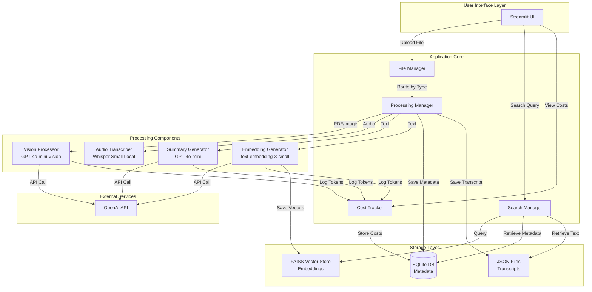
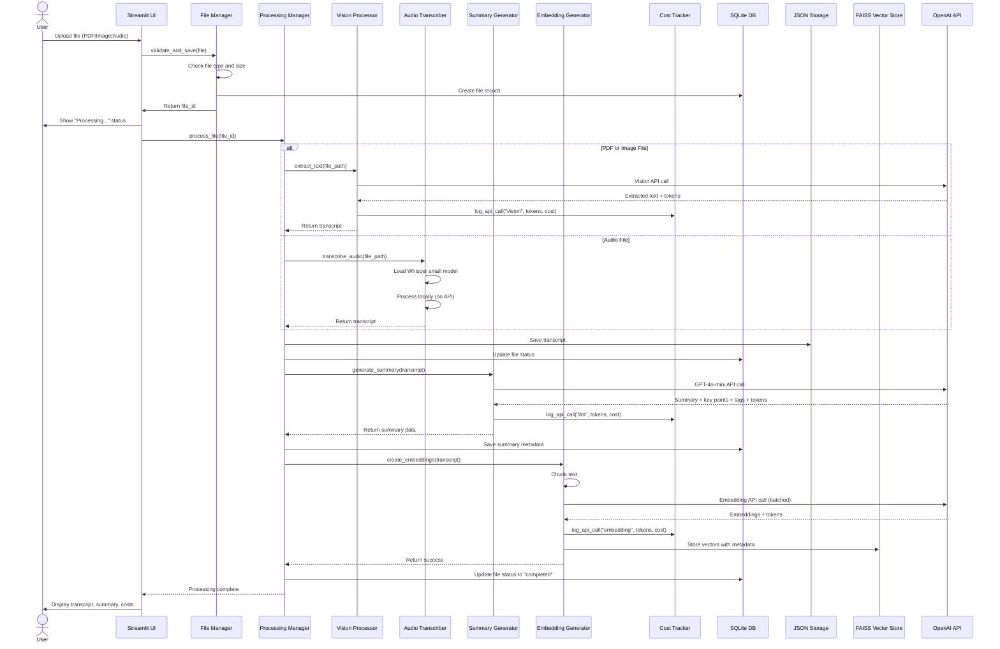
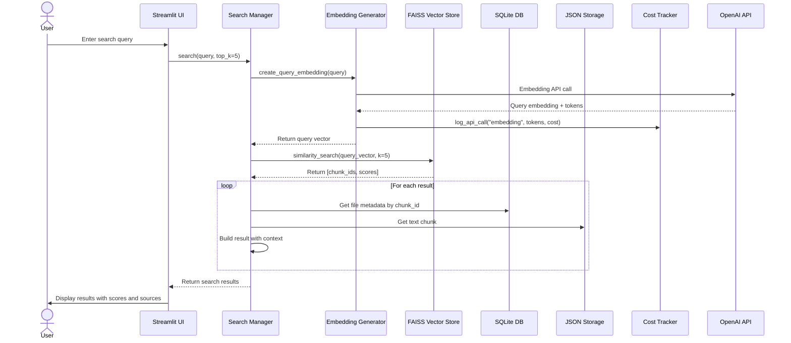

# Design Document: Multi-Modal Content Accessibility Platform

## 1. North Star (Context & Goals)

### Abstract

The Multi-Modal Content Accessibility Platform transforms PDFs, images, and audio files into accessible, searchable formats using AI-powered text extraction, transcription, and semantic search. The system prioritizes cost-effectiveness by using local Whisper models for audio transcription (free) and GPT-4o-mini for vision and summarization tasks, while tracking all API costs transparently. Users interact through a Streamlit interface to upload files, view processed content with summaries, perform semantic searches, and monitor spending.

### User Stories

1. **As a content creator**, I want to upload PDFs and images to extract text, so that I can make visual content accessible to screen readers
2. **As a researcher**, I want to transcribe audio recordings locally without API costs, so that I can process large volumes of interviews affordably
3. **As a student**, I want to search semantically across all my processed documents, so that I can find relevant information by meaning rather than keywords
4. **As a budget-conscious user**, I want to see detailed cost breakdowns for each operation, so that I can monitor and control my API spending
5. **As a knowledge worker**, I want AI-generated summaries and key points, so that I can quickly understand document contents without reading everything

### Non-Goals

- **Text-to-Speech (TTS)**: Too expensive ($15/1M characters)
- **Real-time streaming**: Batch processing only; no live audio transcription
- **Multi-user authentication**: Single-user local application
- **Cloud deployment**: Local-only; no hosted service
- **Advanced document editing**: Read-only processed content
- **Custom model training**: Using pre-trained models only
- **File format conversion**: No export to DOCX, EPUB, or other formats


## 2. System Architecture & Flow

### Component Diagram



### Sequence Diagram: File Upload and Processing Flow



### Sequence Diagram: Semantic Search Flow




## 3. Technical Source of Truth

### A. Data Schema

**Table: files**

| Field Name | Type | Constraints |
|:-----------|:-----|:------------|
| file_id | TEXT | PRIMARY KEY, NOT NULL |
| display_id | TEXT | UNIQUE (e.g. PDF1, IMG2, AUD3) |
| filename | TEXT | NOT NULL |
| file_type | TEXT | NOT NULL — `pdf`, `image`, `audio` |
| file_path | TEXT | NOT NULL |
| file_size_bytes | INTEGER | NOT NULL |
| upload_timestamp | TEXT | NOT NULL — ISO 8601 UTC |
| processing_status | TEXT | DEFAULT `pending` — `pending`, `processing`, `completed`, `failed` |
| transcript_path | TEXT | NULL |
| summary | TEXT | NULL |
| key_points | TEXT | NULL — JSON array |
| topic_tags | TEXT | NULL — JSON array |
| error_message | TEXT | NULL |
| created_at | TEXT | NOT NULL |
| updated_at | TEXT | NOT NULL |

**Table: embeddings**

| Field Name | Type | Constraints |
|:-----------|:-----|:------------|
| embedding_id | TEXT | PRIMARY KEY, NOT NULL |
| file_id | TEXT | FK → files(file_id) ON DELETE CASCADE |
| chunk_index | INTEGER | NOT NULL |
| chunk_text | TEXT | NOT NULL |
| chunk_start_char | INTEGER | NOT NULL |
| chunk_end_char | INTEGER | NOT NULL |
| faiss_index_id | INTEGER | NOT NULL |
| created_at | TEXT | NOT NULL |

**Table: api_costs**

| Field Name | Type | Constraints |
|:-----------|:-----|:------------|
| cost_id | TEXT | PRIMARY KEY, NOT NULL |
| file_id | TEXT | FK → files(file_id) ON DELETE SET NULL |
| operation_type | TEXT | NOT NULL — `vision`, `llm`, `embedding` |
| model_name | TEXT | NOT NULL |
| input_tokens | INTEGER | DEFAULT 0 |
| output_tokens | INTEGER | DEFAULT 0 |
| total_tokens | INTEGER | NOT NULL |
| cost_usd | REAL | NOT NULL |
| timestamp | TEXT | NOT NULL — ISO 8601 UTC |
| metadata | TEXT | NULL — JSON |

### B. Service Interfaces

**VisionProcessor**
- `extract_text_from_pdf(file_path) → VisionExtractionResponse` — renders each PDF page to PNG, calls GPT-4o-mini vision per page, returns concatenated text + token usage
- `extract_text_from_image(file_path) → VisionExtractionResponse` — single GPT-4o-mini vision call, returns text + token usage

**AudioTranscriber**
- `transcribe_audio(file_path) → TranscriptionResponse` — local Whisper small model, no API call, returns text + segments + duration

**SummaryGenerator**
- `generate_summary(text) → SummaryResponse` — GPT-4o-mini with `json_object` response format, returns `summary` (~150 words), `key_points` (5–7), `topic_tags` (3–5)

**EmbeddingGenerator**
- `create_embeddings(text) → EmbeddingResponse` — chunks text (500 tokens, 50 overlap), batches to text-embedding-3-small (100 chunks/request), returns vectors + token usage
- `create_query_embedding(query) → (vector, tokens)` — single embedding for search queries

**SearchManager**
- `semantic_search(query, top_k, file_ids) → SearchResponse` — embeds query, FAISS L2 search, fetches chunk text + context (50 chars before/after), converts L2 distance to 0–1 similarity score

**CostTracker**
- `log_api_call(operation_type, model_name, input_tokens, output_tokens, file_id) → CostLogResponse`
- `get_cost_summary(file_id=None) → CostSummary`
- Pricing: `gpt-4o-mini` $0.150/$0.600 per 1M tokens (in/out); `text-embedding-3-small` $0.020 per 1M tokens

### C. Error Handling

- All OpenAI API calls use exponential backoff: 3 retries, base delay 2s
- Retries on: `RateLimitError`, `APITimeoutError`, 5xx errors
- No retry on: 4xx client errors (auth, invalid request)
- Processing failures update `files.processing_status = 'failed'` with `error_message`; other files continue unaffected


## 4. Application Bootstrap Guide

### A. Tech Stack

| Component | Technology | Version |
|:----------|:-----------|:--------|
| Language | Python | 3.12.x |
| UI | Streamlit | 1.31.0+ |
| Vector DB | FAISS (faiss-cpu) | 1.7.4+ |
| Audio | Whisper via HuggingFace Transformers | openai/whisper-small |
| Database | SQLite | stdlib |
| PDF rendering | pypdfium2 | latest |
| LLM / Vision / Embeddings | OpenAI API | openai 1.12.0+ |

```txt
streamlit==1.31.0
python-dotenv==1.0.0
openai==1.12.0
transformers==4.37.0
torch==2.2.0
torchaudio==2.2.0
accelerate==0.26.0
faiss-cpu==1.7.4
pypdfium2
Pillow==10.2.0
numpy==1.26.3
pandas==2.2.0
imageio-ffmpeg
```

### B. Folder Structure

```
content-accessibility-platform/
├── .env
├── .env.example
├── .gitignore
├── README.md
├── requirements.txt
├── pyproject.toml
│
├── src/
│   ├── main.py                   # Streamlit entry point + dependency wiring
│   ├── config.py                 # Settings loaded from .env
│   │
│   ├── core/
│   │   ├── file_manager.py       # Upload validation and file record creation
│   │   ├── processing_manager.py # Orchestrates full processing pipeline
│   │   └── search_manager.py     # Semantic search logic
│   │
│   ├── services/
│   │   ├── vision_processor.py   # GPT-4o-mini vision (PDF + image)
│   │   ├── audio_transcriber.py  # Whisper local transcription
│   │   ├── summary_generator.py  # GPT-4o-mini summarization
│   │   ├── embedding_generator.py
│   │   ├── cost_tracker.py
│   │   └── openai_utils.py       # Retry wrapper
│   │
│   ├── storage/
│   │   ├── database.py           # SQLite CRUD
│   │   ├── json_storage.py       # Transcript JSON files
│   │   └── vector_store.py       # FAISS index operations
│   │
│   ├── models/
│   │   ├── file_models.py
│   │   └── search_models.py
│   │
│   ├── ui/
│   │   ├── pages/
│   │   │   ├── 1_upload.py
│   │   │   ├── 2_library.py
│   │   │   ├── 3_search.py
│   │   │   └── 4_costs.py
│   │   └── components/
│   │       ├── status_display.py
│   │       └── cost_display.py
│   │
│   └── utils/
│       ├── text_processing.py    # chunk_text()
│       ├── validators.py
│       └── logging_config.py
│
├── data/
│   ├── uploads/
│   ├── transcripts/
│   ├── vector_store/
│   └── app.db
│
├── logs/
└── tests/
    ├── unit/
    └── integration/
```

### C. Environment Configuration

```bash
OPENAI_API_KEY=sk-your-key-here
APP_ENV=development
LOG_LEVEL=INFO
MAX_FILE_SIZE_MB=100
WHISPER_MODEL=openai/whisper-small
WHISPER_DEVICE=auto
EMBEDDING_BATCH_SIZE=100
CHUNK_SIZE_TOKENS=500
CHUNK_OVERLAP_TOKENS=50
MAX_RETRIES=3
RETRY_BASE_DELAY=2
```


## 5. Implementation Constraints

**Security**
- API keys loaded from `.env` only; never hardcoded
- File uploads validated by extension + MIME type; max 100 MB
- All SQLite queries use parameterized statements

**Performance**
- FAISS `IndexFlatL2` search: < 100ms for up to 1M vectors
- Whisper model loaded lazily and cached in memory
- Embeddings batched (100 chunks/request) to minimize API round-trips
- FAISS index saved atomically (write to `.tmp`, then `os.replace`)

**Limitations**
- Single-user, sequential processing (one file at a time)
- SQLite not suitable for concurrent access
- Whisper small model requires ~2 GB RAM


## 6. Definition of Done

- [ ] All 10 requirements have passing acceptance criteria
- [ ] Unit test coverage ≥ 80% for service modules
- [ ] All public functions have docstrings
- [ ] README includes setup, usage, and troubleshooting
- [ ] No hardcoded secrets; `.env.example` is complete
- [ ] Linters pass: `black`, `isort`, `flake8`, `mypy`
- [ ] End-to-end workflow verified: upload → process → search → costs
