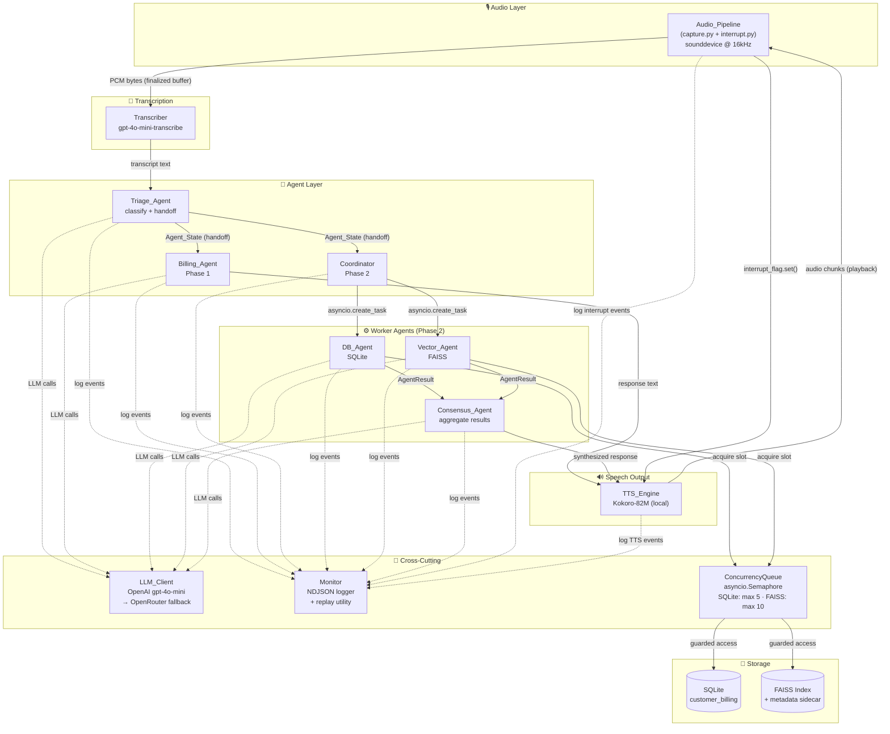
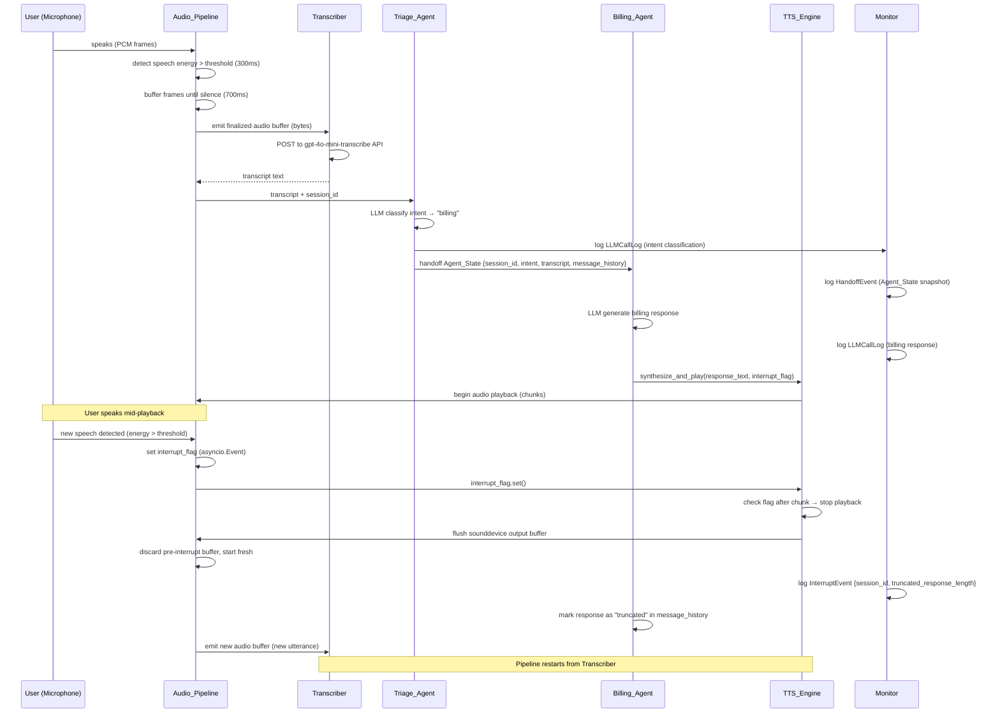
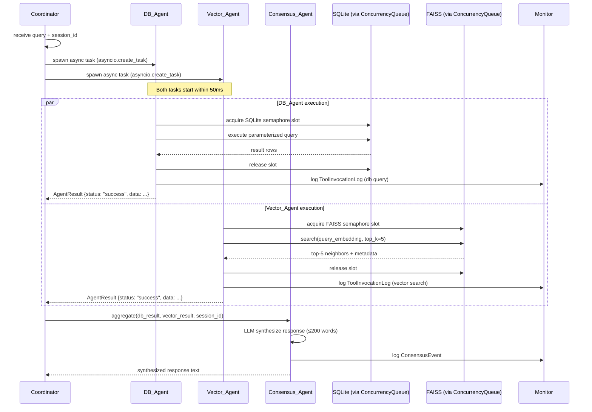
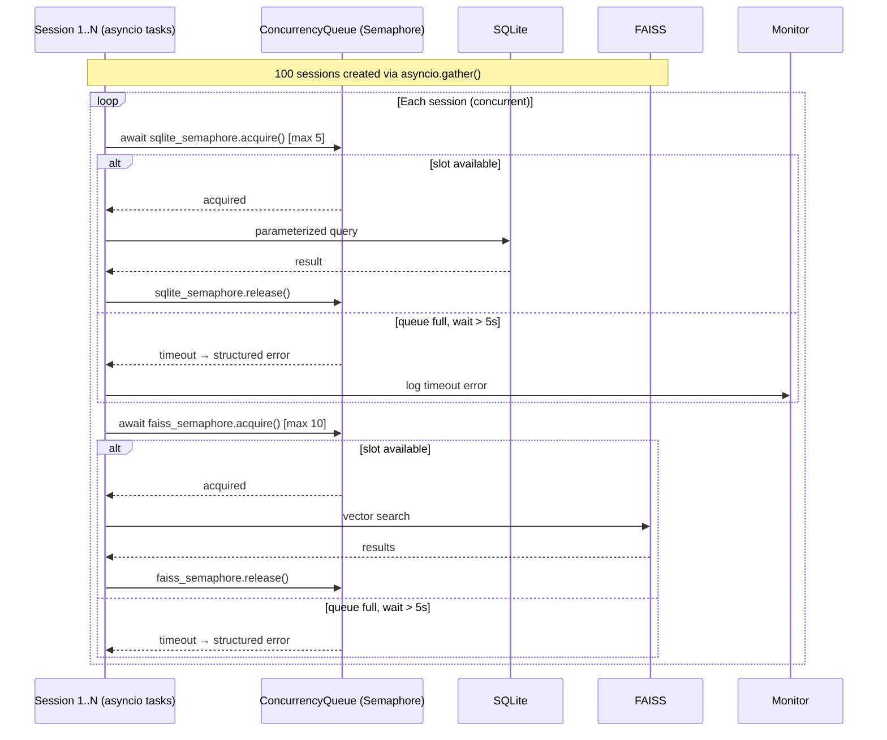

# Design Document: realtime-voice-agent-system

## Overview

### Abstract

This system is a production-grade, real-time voice-enabled customer service platform that accepts live microphone input, routes requests through a multi-agent pipeline, and responds via local text-to-speech — all running entirely on a developer's local machine. It is delivered in three phases: Phase 1 establishes a two-agent voice loop (Triage → Billing) with interruption handling; Phase 2 adds parallel agent execution (DB_Agent + Vector_Agent) with a Consensus_Agent and structured monitoring; Phase 3 scales to 100 simulated concurrent sessions with token pruning, concurrency control, and NDJSON-based session replay.

### User Stories (Summary)

- **Customer (voice interaction):** Speak into a microphone and receive spoken answers from the correct specialist agent, with the ability to interrupt mid-response.
- **Customer (routing):** Have requests automatically classified and routed to the right agent without manual selection.
- **Customer (parallel answers):** Receive a single coherent answer that combines structured database facts with semantically relevant context.
- **System operator (monitoring):** Inspect every LLM call, tool invocation, handoff, and interrupt event through a structured log file and replay utility.
- **System operator (scaling):** Run 100 concurrent simulated sessions without deadlock, data corruption, or process crash.
- **Developer (bootstrap):** Clone the repo, copy `.env.example`, install pinned dependencies, and run a working demo in under 10 minutes.

### Non-Goals

- **No cloud deployment.** The system runs locally only; no Kubernetes, Docker, or cloud-hosted infrastructure.
- **No web or GUI frontend.** All interaction is terminal-based; no React, Flask, or FastAPI web server.
- **No streaming LLM responses.** LLM calls are complete-response (non-streaming) to keep the implementation straightforward.
- **No multi-turn FAISS index updates at runtime.** The FAISS index is loaded once at startup and treated as read-only during a session.
- **No user authentication or multi-tenancy.** Sessions are identified by UUID only; there is no login, user account, or access control layer.
- **No production database migrations.** SQLite schema is created by a seed script; no Alembic or migration tooling.
- **No support for languages other than English.** Transcription and TTS are configured for English only.
- **No telephony or WebRTC integration.** Audio is captured exclusively from the local system microphone via sounddevice.

---

## Architecture

### Component Diagram



### Sequence Diagrams

#### Phase 1: Full Voice Interaction with Interruption



#### Phase 2: Parallel Execution Flow



#### Phase 3: Concurrency Queue Flow (100 Sessions)



---

## Key Design Decisions

### 1. Interrupt Mechanism

Uses a shared `asyncio.Event` flag checked between TTS audio chunks:

```python
# In TTSEngine.synthesize_and_play():
async def synthesize_and_play(self, text: str, interrupt_flag: asyncio.Event) -> None:
    audio_chunks = self._synthesize(text)
    for chunk in audio_chunks:
        if interrupt_flag.is_set():
            sd.stop()  # flush sounddevice output buffer
            return     # stop immediately
        sd.play(chunk, samplerate=self.sample_rate, blocking=False)
        await asyncio.sleep(len(chunk) / self.sample_rate)

# In AudioPipeline:
def _audio_callback(self, indata, frames, time, status):
    if self._is_playing and self._energy(indata) > self.silence_threshold:
        self.interrupt_flag.set()
```

**Worst-case latency**: One chunk duration (20–50 ms for Kokoro-82M at 24 kHz).

### 2. Agent Handoff

AgentState is a Python dataclass serialized to dict (JSON-serializable) for logging, passed by reference in-process.

```python
@dataclass
class AgentState:
    session_id: str          # UUID4
    intent: str              # "billing" | "technical_support" | "general_inquiry"
    transcript: str
    message_history: list[dict]  # max 10 turns
    timestamp_utc: str       # ISO 8601
    metadata: dict
```

### 3. Parallel Execution

Uses `asyncio.gather()` with `return_exceptions=True` for DB_Agent and Vector_Agent:

```python
results = await asyncio.gather(
    db_agent.query(question, session_id),
    vector_agent.search(question, session_id),
    return_exceptions=True
)
```

### 4. LLM Fallback

Try OpenAI first, catch `openai.APIConnectionError` or HTTP 5xx, then retry with OpenRouter using `httpx`.

### 5. Concurrency Queue

`asyncio.Semaphore` wrapping SQLite (max 5) and FAISS (max 10) access:

```python
class ConcurrencyQueue:
    def __init__(self, max_concurrent: int, timeout_seconds: float = 5.0):
        self._semaphore = asyncio.Semaphore(max_concurrent)
        self._timeout = timeout_seconds

    @asynccontextmanager
    async def acquire(self):
        try:
            await asyncio.wait_for(self._semaphore.acquire(), timeout=self._timeout)
        except asyncio.TimeoutError:
            raise ConcurrencyTimeoutError(f"Queue slot not available within {self._timeout}s")
        try:
            yield
        finally:
            self._semaphore.release()
```

### 6. Token Pruning

- **Sliding window**: Keep max 10 turns, remove oldest pairs
- **Summarization**: When cumulative tokens > 50k, summarize oldest 5 turns using LLM
- Uses `tiktoken` for accurate token counting
- System prompt (index 0) is never pruned

### 7. NDJSON Logging

Each log record: `json.dumps(record) + "\n"` appended to `logs/session.ndjson`.

**Why exact JSON payloads matter**:
- **Deterministic replay**: Re-feed exact AgentState to reproduce bugs
- **Token audit**: Offline token counting and cost analysis
- **Interrupt forensics**: `truncated_response_length` shows exactly what was cut off

---

## Data Models

### Core Data Structures

**AgentState** (see above)

**AgentResult** (worker agent responses):
```python
@dataclass
class AgentResult:
    session_id: str
    agent_name: str
    status: str          # "success" | "failure" | "timeout"
    data: dict | None
    error: str | None
    latency_ms: int
```

**LLMResponse**:
```python
@dataclass
class LLMResponse:
    content: str
    model_id: str
    prompt_tokens: int
    completion_tokens: int
    latency_ms: int
    status: str  # "success" | "error"
```

### Log Record Types

All log records include: `record_type`, `session_id`, `timestamp_utc`.

- **LLMCallLog**: `agent_name`, `model_id`, `prompt_tokens`, `completion_tokens`, `latency_ms`, `status`
- **ToolInvocationLog**: `agent_name`, `tool_name`, `input_summary`, `output_summary`, `latency_ms`, `status`
- **HandoffEvent**: `from_agent`, `to_agent`, `agent_state_snapshot` (full AgentState dict)
- **InterruptEvent**: `truncated_response_length`, `interrupt_source`
- **PruningEvent**: `pruning_type`, `turns_removed`, `tokens_before`, `tokens_after`
- **ConsensusEvent**: `db_agent_status`, `vector_agent_status`, `response_word_count`

See `requirements.md` for complete field specifications.

### Storage Schemas

**SQLite** (`customer_billing` table):
```sql
CREATE TABLE customer_billing (
    customer_id TEXT PRIMARY KEY,
    full_name TEXT NOT NULL,
    email TEXT UNIQUE NOT NULL,
    plan_name TEXT NOT NULL,
    balance_usd REAL NOT NULL DEFAULT 0.0,
    due_date TEXT NOT NULL,
    status TEXT CHECK(status IN ('current', 'overdue', 'suspended')),
    created_at TEXT NOT NULL
);
```

**FAISS**: Binary `.index` file + JSON sidecar (`faiss_metadata.json`) mapping vector IDs to document metadata.

---

## Error Handling Strategy

### LLM Client
- HTTP 429: Retry once after `Retry-After` header (default 5s)
- HTTP 5xx / connection error: Immediately retry with OpenRouter
- HTTP 4xx (not 429): Return error to caller, no retry

### Agent Fallbacks
- **Triage**: On error → `intent = "general_inquiry"`, log, continue
- **Billing**: On error → canned error message, log, continue
- **TTS**: On error → log, print text to console, continue

### Coordinator
- One agent fails → pass failure + success to Consensus
- Both fail → emit error, return CoordinatorResult with error, skip Consensus
- Timeout (>10s) → cancel task, record `status="timeout"`

### Resource Agents
- **DB_Agent**: SQLite locked → return failure within 10s timeout
- **Vector_Agent**: FAISS not loaded → disable for process lifetime
- Always release semaphore in `finally` block

### Monitor
- Log write failure → print to stderr, don't raise exception
- SIGINT/SIGTERM → flush pending logs before exit

### Session Isolation
Every session runs in `try/except Exception` block. Unhandled exceptions logged with traceback; only affected session terminates.

---

## Testing Strategy

### Approach
- **Unit tests**: Specific examples, integration points, error conditions
- **Property-based tests** (Hypothesis): Universal invariants across hundreds of generated inputs

### Coverage Targets
≥ 80% for all modules: `audio/`, `transcription/`, `tts/`, `agents/`, `concurrency/`, `monitoring/`

### Property-Based Testing
17 correctness properties defined in requirements.md, validated using Hypothesis with 100 iterations per property.

Key properties:
- VAD speech detection and buffer finalization
- Agent state structural completeness
- Message history length invariant (≤10 turns)
- Response length constraints (Billing ≤150 words, Consensus ≤200 words)
- Interrupt handling (buffer flush, detection, logging)
- Partial failure preservation in Coordinator
- Concurrency queue mutual exclusion
- Log record completeness and replay ordering
- Credential redaction

---

## Application Bootstrap

### Tech Stack (Pinned Versions)

```
# Core
openai==1.35.3, httpx==0.27.0, python-dotenv==1.0.1, tiktoken==0.7.0

# Audio
sounddevice==0.4.7, numpy==1.26.4, scipy==1.13.1

# TTS
kokoro==0.9.4, torch==2.3.1, transformers==4.41.2

# Vector store
faiss-cpu==1.8.0, sentence-transformers==3.0.1

# Testing
pytest==8.2.2, pytest-cov==5.0.0, pytest-asyncio==0.23.7, hypothesis==6.104.2

# Linting
black==24.4.2, flake8==7.1.0
```

### Folder Structure

```
realtime-voice-agent-system/
├── main.py
├── .env.example
├── .gitignore
├── requirements.txt
├── README.md
├── config/
│   └── settings.py
├── audio/
│   ├── capture.py
│   ├── playback.py
│   └── interrupt.py
├── transcription/
│   └── transcriber.py
├── tts/
│   └── kokoro_tts.py
├── agents/
│   ├── base_agent.py
│   ├── triage_agent.py
│   ├── billing_agent.py
│   ├── db_agent.py
│   ├── vector_agent.py
│   ├── consensus_agent.py
│   └── coordinator.py
├── llm/
│   └── llm_client.py
├── state/
│   └── agent_state.py
├── storage/
│   ├── sqlite_store.py
│   └── faiss_store.py
├── monitoring/
│   └── monitor.py
├── concurrency/
│   └── queue_manager.py
├── scripts/
│   ├── seed_db.py
│   ├── build_faiss_index.py
│   └── simulate_100_sessions.py
├── data/
│   ├── customer_billing.db
│   ├── faiss_index.index
│   └── faiss_metadata.json
├── logs/
│   └── session.ndjson
└── tests/
    ├── conftest.py
    ├── unit/
    │   ├── test_triage_agent.py
    │   ├── test_billing_agent.py
    │   ├── test_consensus_agent.py
    │   ├── test_coordinator.py
    │   ├── test_interrupt.py
    │   ├── test_pruning.py
    │   └── test_concurrency_queue.py
    └── integration/
        ├── test_voice_pipeline.py
        └── test_parallel_execution.py
```

### Setup Commands

```bash
# 1. Clone and setup
git clone <repo-url>
cd realtime-voice-agent-system
python3.11 -m venv .venv
source .venv/bin/activate  # Windows: .venv\Scripts\activate

# 2. Install dependencies
pip install -r requirements.txt

# 3. Configure environment
cp .env.example .env
# Edit .env: add OPENAI_API_KEY and OPENROUTER_API_KEY

# 4. Seed data
python scripts/seed_db.py
python scripts/build_faiss_index.py

# 5. Run demos
python main.py --phase 1                                    # Voice + interruption
python main.py --phase 2 --query "What is my balance?"     # Parallel execution
python scripts/simulate_100_sessions.py                     # 100 concurrent sessions

# 6. Test
pytest --cov=. --cov-report=term-missing tests/

# 7. Lint
black .
flake8 .
```

---

## Implementation Constraints

### Security
- API keys loaded via `python-dotenv` from `.env`; `ConfigurationError` if missing
- All SQLite operations use parameterized queries (`cursor.execute(sql, params)`)
- Monitor redacts `Authorization` header values from logs
- `.gitignore` validation at startup (warn if `.env` not listed)
- CI check: `grep -r "OPENAI_API_KEY" . --include="*.py"` must return zero matches

### Performance Targets

| Component | Target |
|---|---|
| Transcriber | ≤ 3s |
| Triage_Agent | ≤ 2s |
| TTS first chunk | ≤ 1s |
| End-to-end (single user, p95) | ≤ 5s |
| End-to-end (100 sessions, median) | ≤ 10s |
| Interrupt response | ≤ 100ms |
| 100 sessions complete | ≤ 120s |

---

## Definition of Done

See `requirements.md` Requirements 14, 15, 16 for complete per-phase DoD criteria.

**Phase 1**: End-to-end voice demo, interruption demo, unit tests pass, 80% coverage, NDJSON log validation, README complete

**Phase 2**: Parallel execution verified (≤50ms start difference), partial failure demo, unit tests pass, 80% coverage, tool logging, security check

**Phase 3**: 100-session simulation (≤120s), pruning demonstration, unit tests pass, 80% coverage, replay validation, README updated
