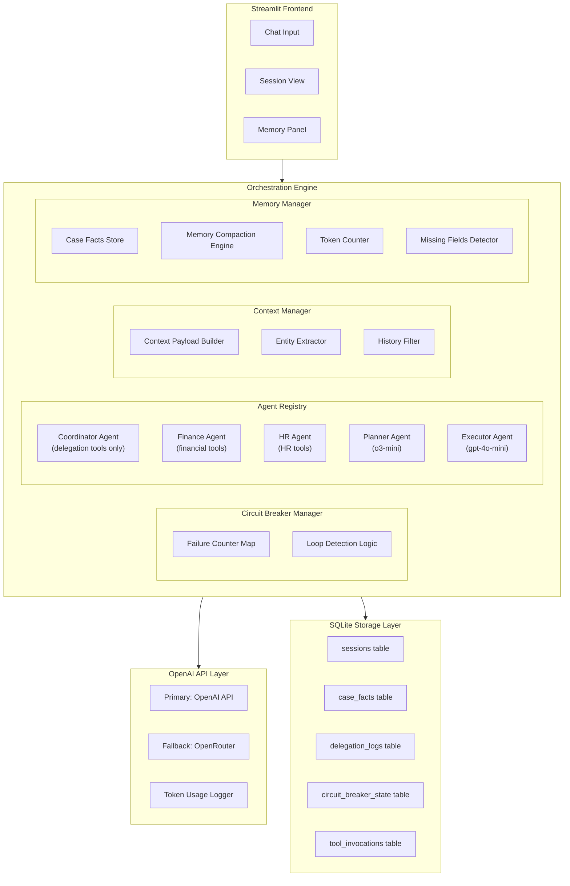
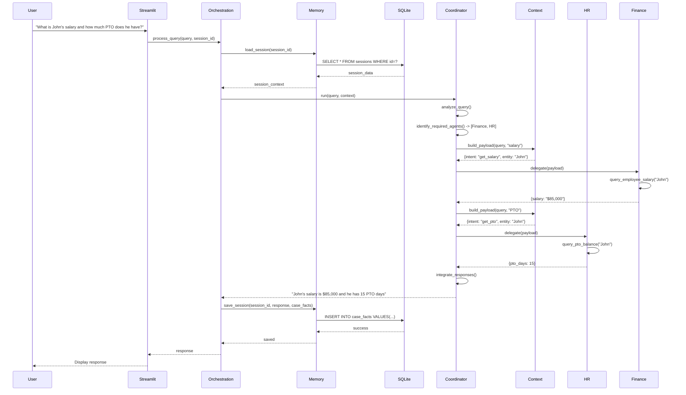
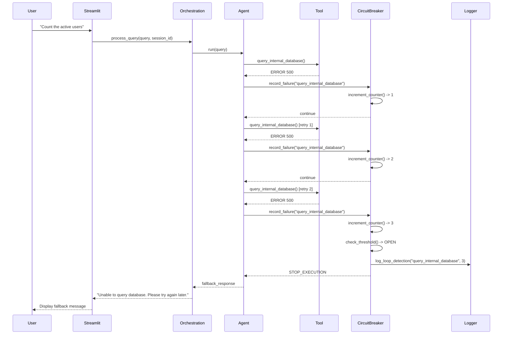
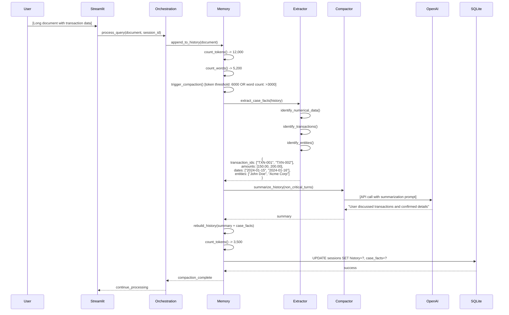

# Design Document: AgentKit Orchestration System

## 1. North Star (Context & Goals)

### Abstract

This system implements a production-grade multi-agent orchestration platform using the OpenAI Agents SDK that demonstrates resilient failure handling through circuit breakers, proper agent isolation with domain-specific tool access, and intelligent memory management with context-aware compaction. The architecture supports five distinct operational phases: loop detection, multi-agent coordination, context passing, memory compaction, and hybrid planner-executor workflows.

### User Stories

1. As a system administrator, I want the system to detect and prevent infinite execution loops, so that failed operations do not consume excessive resources.
2. As a system architect, I want a coordinator agent that delegates tasks to specialized agents, so that complex queries can be decomposed and handled by domain experts.
3. As a developer, I want to pass relevant context between agents during handoffs, so that sub-agents have the information needed without inheriting full conversation history.
4. As a user, I want my conversation history and important facts to be remembered across interactions, so that I don't have to repeat information.
5. As a developer, I want a planner agent to generate structured execution plans, so that complex tasks can be broken down into discrete steps.

### Non-Goals

- We are NOT building a distributed system with multiple servers or microservices architecture
- We are NOT implementing authentication or multi-user access control in this version
- We are NOT supporting real-time streaming responses or WebSocket connections
- We are NOT integrating with external databases beyond SQLite for session storage
- We are NOT implementing production-grade monitoring or alerting systems
- We are NOT supporting offline mode or local-only operation without API access
- We are NOT building a mobile application or responsive mobile UI

### Implementation Approach

The system uses **LLM-based orchestration** throughout - no hardcoded keyword matching. The OrchestrationEngine routes queries by analyzing intent, and the CoordinatorAgent uses the Agents SDK to intelligently decide which delegation tools to invoke based on query semantics. All agents are BaseSDKAgent instances that wrap the OpenAI Agents SDK with circuit breaker integration, retry logic, and OpenRouter fallback.

## 2. System Architecture & Flow

### Component Diagram



### Sequence Diagram: Multi-Agent Delegation Flow



### Sequence Diagram: Circuit Breaker Flow



### Sequence Diagram: Memory Compaction Flow



## 3. Key Design Decisions

### Agent Architecture

All agents extend **BaseSDKAgent**, which wraps the OpenAI Agents SDK with:
- Circuit breaker integration via ToolRuntime
- Automatic retry with exponential backoff (configurable max retries)
- OpenRouter fallback when OpenAI API fails
- Token budget validation before SDK invocation
- Structured context payload construction (query + JSON context, NOT full history)

### Domain Ownership & Tool Isolation

| Domain | Agent | Tools | Model |
|--------|-------|-------|-------|
| Salary, Payroll, Banking, Transactions | FinanceAgent | 6 finance tools only | gpt-4o-mini |
| PTO, Benefits, Personnel Records | HRAgent | 6 HR tools only | gpt-4o-mini |
| Delegation, Routing | CoordinatorAgent | 3 delegation tools only | gpt-4o-mini |
| Loop Detection Demo | LoopDetectionAgent | 1 failing database tool | o3-mini |
| Plan Generation | PlannerAgent | No tools (pure reasoning) | o3-mini |
| Plan Execution | ExecutorAgent | No tools (step execution) | gpt-4o-mini |

**Tool Isolation Benefits:**
- 80-90% token reduction by limiting tools per agent
- No cross-domain errors (Finance can't call HR tools)
- Failure isolation and independent testing
- SDK enforces tool access at agent initialization

### Routing Strategy

**OrchestrationEngine.process_query()** routes queries using:
1. **Loop Detection**: Hardcoded check for "count the active users" → LoopDetectionAgent
2. **Planner-Executor**: Hardcoded check for "/plan" prefix → PlannerAgent + ExecutorAgent
3. **Long Document Ingestion**: Token/word threshold check → extract case facts locally, skip agent
4. **Default**: All other queries → CoordinatorAgent (LLM decides delegation)

**CoordinatorAgent delegation** is fully LLM-driven:
- SDK agent receives 3 delegation tools: `delegate_to_finance`, `delegate_to_hr`, `analyze_query`
- LLM analyzes query semantics and invokes appropriate delegation tools
- No keyword matching in delegation logic

### Memory Strategy

**Compaction Triggers:**
- Token threshold: 6000 (configurable via `MEMORY_TOKEN_THRESHOLD`)
- Word threshold: 3000 (configurable via `LONG_DOCUMENT_WORD_THRESHOLD`)
- Transaction document detection: ≥2 transaction IDs OR (≥1 transaction + ≥1 amount + ≥1 date)

**Case Facts Extraction (Regex-based, local):**
- Numerical: `$12,500.00`, `150.00`
- Transactional: `TXN-001`, `ORDER-123`, `INV-456`
- Entity: Person names (capitalized), account numbers
- Date: `2024-01-15`, `1/15/2024`

**Compaction Process:**
1. Extract case facts from conversation history
2. Generate local summary (first 250 words)
3. Replace history with single system message containing summary
4. Persist case facts to `case_facts` table (survives compaction)
5. Reduce token count by ≥30%

**Context Payloads:**
- Built by ContextManager before delegation
- Include: intent, entities, parameters, relevant_facts (filtered by target agent), missing_fields
- Exclude: conversation_history, full_chat_history (validated via `validate_no_history()`)
- Logged to `delegation_logs` table with delegation order

### Circuit Breaker

**Implementation:**
- Threshold: 3 consecutive failures (configurable)
- Timeout: 60 seconds (configurable, enables half-open state)
- States: closed → open (after 3 failures) → half-open (after timeout) → closed (on success)
- Persistence: SQLite `circuit_breaker_state` table
- Integration: ToolRuntime wraps all tool invocations with `ensure_allowed()` check

**Failure Handling:**
- Tool failure → `record_failure()` → increment counter
- Counter ≥ 3 → state = "open" → log ERROR "Loop detected"
- Open circuit → `CircuitBreakerOpenError` → return `FALLBACK_RESPONSE`
- Tool success → `record_success()` → reset counter to 0

### Model Selection & Cost Optimization

- **Default**: gpt-4o-mini for all agents (cost optimization)
- **Reasoning**: o3-mini for LoopDetectionAgent and PlannerAgent only
- **Fallback**: OpenRouter (optional, requires `OPENROUTER_API_KEY`)
- **Token Budgets**: Configurable max input/output tokens, fail-fast validation
- **Rate Limits**: Exponential backoff with configurable max retries

## 4. Data Architecture

### Core Tables (SQLite)

**sessions**: Persistent conversation state
- `session_id` (PK), `conversation_history` (JSON), `token_count`, `state` (active/requires_user_input/completed)

**case_facts**: Extracted critical data (survives compaction)
- `session_id` (FK), `fact_type` (numerical/transactional/entity/date), `fact_key`, `fact_value` (JSON)

**delegation_logs**: Coordinator delegation audit trail
- `session_id` (FK), `coordinator_query`, `sub_agent_name`, `delegation_order`, `context_payload` (JSON), `sub_agent_response`

**circuit_breaker_state**: Tool failure tracking
- `tool_name` (PK), `failure_count`, `state` (closed/open/half_open), `last_failure_at`, `last_success_at`

**tool_invocations**: Tool execution audit trail
- `session_id` (FK), `agent_name`, `tool_name`, `parameters` (JSON), `response_status` (success/error/timeout), `response_data`, `error_message`

**required_fields_schema**: Operation validation rules
- `operation_type` (PK), `required_fields` (JSON array), `field_descriptions` (JSON object)

**missing_fields_tracking**: Missing field detection
- `session_id` (FK), `operation_type`, `missing_fields` (JSON array), `detected_at`, `resolved_at`

**execution_plans**: Planner-generated plans
- `plan_id` (PK), `session_id` (FK), `plan_json` (JSON), `status` (pending/executing/completed/failed)

**execution_steps**: Individual plan steps
- `step_id` (PK), `plan_id` (FK), `step_order`, `description`, `action_type`, `parameters` (JSON), `depends_on` (JSON array), `expected_output`, `actual_output`, `status`, `executed_at`

### Key Data Structures

**Case Facts Dictionary** (in-memory, persisted to case_facts table):
```python
{
  "numerical": {"amounts": ["$150.00", "$200.00"]},
  "transactional": {"transaction_ids": ["TXN-001", "ORDER-123"]},
  "entity": {"person_names": ["John Doe"], "account_numbers": ["ACCT-456"]},
  "date": {"transaction_dates": ["2024-01-15", "2024-01-16"]}
}
```

**Context Payload** (passed to sub-agents, NOT full history):
```python
{
  "intent": "get_salary",  # inferred by ContextManager
  "target_agent": "FinanceAgent",
  "entities": {"person_names": ["John"]},
  "parameters": {"routing_number": "123456789"},
  "relevant_facts": {},  # filtered by target agent domain
  "missing_fields": ["account_number"],
  "user_query_summary": "Update my banking details..."  # truncated to 500 chars
}
```

**Execution Plan** (generated by PlannerAgent):
```python
{
  "plan_id": "plan_abc123",
  "session_id": "session_xyz",
  "steps": [
    {
      "step_id": "plan_abc123_step_1",
      "step_order": 0,
      "description": "Collect case facts",
      "action_type": "data_transform",
      "parameters": {"task": "..."},
      "depends_on": [],
      "expected_output": "Transaction IDs and amounts",
      "status": "pending"
    }
  ],
  "metadata": {"planner_model": "o3-mini", "fallback_used": false}
}
```

## 5. Application Bootstrap

### Tech Stack

- **Runtime**: Python 3.11+
- **Agent Framework**: openai-agents SDK (dynamically imported via `src/agents/sdk.py`)
- **LLM Provider**: OpenAI API (primary), OpenRouter (fallback)
- **Database**: SQLite 3.x with foreign keys enabled
- **Frontend**: Streamlit 1.28+
- **Configuration**: YAML (prompts, models) + .env (secrets)
- **Logging**: Python logging with configurable levels

### Configuration Files

**config/prompts.yml**: Agent system instructions
- coordinator, finance, hr, planner, executor, loop_detection

**config/models.yml**: Model selection and budgets
- Models: coordinator, finance, hr, planner, executor, loop_detection
- Budgets: max_input_tokens, max_output_tokens, max_agent_turns
- Memory: token_threshold, long_document_word_threshold, compaction_chunk_tokens
- Rate limits: max_retries, backoff_base_seconds, backoff_max_seconds
- Circuit breaker: threshold, timeout_seconds

**.env**: Secrets (not committed)
- `OPENAI_API_KEY` (required)
- `OPENROUTER_API_KEY` (optional fallback)
- Optional overrides: `MAX_INPUT_TOKENS`, `MAX_OUTPUT_TOKENS`, etc.

### Folder Structure

```
agentkit-orchestration/
├── src/
│   ├── agents/
│   │   ├── base_agent.py          # BaseSDKAgent wrapper
│   │   ├── coordinator_agent.py   # Delegation orchestrator
│   │   ├── finance_agent.py       # Finance domain specialist
│   │   ├── hr_agent.py            # HR domain specialist
│   │   ├── planner_agent.py       # Plan generation (o3-mini)
│   │   ├── executor_agent.py      # Plan execution (gpt-4o-mini)
│   │   ├── loop_agent.py          # Loop detection demo (o3-mini)
│   │   └── sdk.py                 # Dynamic SDK import
│   ├── tools/
│   │   ├── finance_tools.py       # 6 finance tool functions
│   │   ├── hr_tools.py            # 6 HR tool functions
│   │   ├── database_tools.py      # Failing database tool (demo)
│   │   └── runtime.py             # ToolRuntime (circuit breaker integration)
│   ├── core/
│   │   ├── orchestration_engine.py  # Main entry point
│   │   ├── circuit_breaker.py       # Failure detection
│   │   ├── context_manager.py       # Context payload builder
│   │   ├── memory_manager.py        # Session memory & compaction
│   │   └── exceptions.py            # Custom exceptions
│   ├── storage/
│   │   ├── database.py            # SQLite wrapper
│   │   └── schema.sql             # 9 tables + indexes
│   ├── ui/
│   │   └── streamlit_app.py       # Web interface
│   ├── utils/
│   │   ├── logger.py              # Logging configuration
│   │   ├── token_counter.py       # tiktoken wrapper
│   │   └── config.py              # YAML + .env loader
│   └── scripts/
│       └── init_db.py             # Database initialization
├── config/
│   ├── prompts.yml
│   └── models.yml
├── tests/
│   ├── test_agents/
│   ├── test_core/
│   └── test_integration/
│       ├── test_phase1_loop_detection.py
│       ├── test_phase2_delegation.py
│       ├── test_phase3_context_passing.py
│       ├── test_phase4_memory_compaction.py
│       └── test_phase5_planner_executor.py
├── data/
│   └── sessions.db                # SQLite database
├── logs/
│   └── orchestration.log
├── .env.example
├── requirements.txt
├── pyproject.toml
└── README.md
```

## 6. Implementation Constraints

### Performance
- Circuit breaker fallback: <500ms (immediate response when open)
- Context payload construction: <100ms (regex-based extraction)
- Memory compaction: ≥30% token reduction (local summary + case facts)
- SQLite queries: <100ms (prepared statements, indexed on session_id, tool_name)

### Cost Optimization
- Default model: gpt-4o-mini for all agents except Planner and LoopDetectionAgent
- Reasoning model: o3-mini for PlannerAgent and LoopDetectionAgent only
- Context payloads: exclude full conversation history (validated)
- Token budgets: fail-fast validation before SDK invocation
- Rate limits: exponential backoff with configurable max retries
- Token logging: estimate input/output tokens for every agent run

### Security
- API keys: environment variables only (`.env` file, not committed)
- SQLite permissions: 600 (Unix) / ACLs (Windows)
- Input sanitization: prevent prompt injection (context payloads are JSON-structured)
- Session IDs: cryptographically secure (`secrets.token_urlsafe(16)`)
- Redacted fields: sensitive parameters logged as `***` in tool_invocations

### Error Handling
- Custom exceptions: `CircuitBreakerOpenError`, `AgentExecutionError`, `MissingAPIKeyError`, `ProviderConnectionError`, `TokenBudgetError`, `SDKUnavailableError`
- Retry logic: exponential backoff for retryable errors (rate limit, timeout, connection)
- Fallback: OpenRouter when OpenAI API fails (requires `OPENROUTER_API_KEY`)
- Graceful degradation: fallback responses for circuit breaker, missing SDK, connection errors
- Comprehensive logging: ERROR for circuit breaker open, WARNING for retries, INFO for token usage

### Testing Strategy
- Unit tests: circuit breaker, context manager, memory manager, token counter
- Integration tests: all 5 phases (loop detection, delegation, context passing, memory compaction, planner-executor)
- Negative tests: circuit breaker blocks, context validation, missing fields detection, invalid JSON rejection
- Coverage target: >80% (not yet implemented per README)

### Logging
- Format: timestamp, log level, module name, message
- Tool invocations: logged to `tool_invocations` table with agent_name, tool_name, parameters (sanitized), response_status
- Circuit breaker: logged at ERROR level when state changes to "open"
- Delegations: logged to `delegation_logs` table with delegation_order
- Compaction: logged at INFO level with original_token_count, compacted_token_count, facts_extracted
- Token usage: logged at INFO level for every agent run (input/output estimates)
