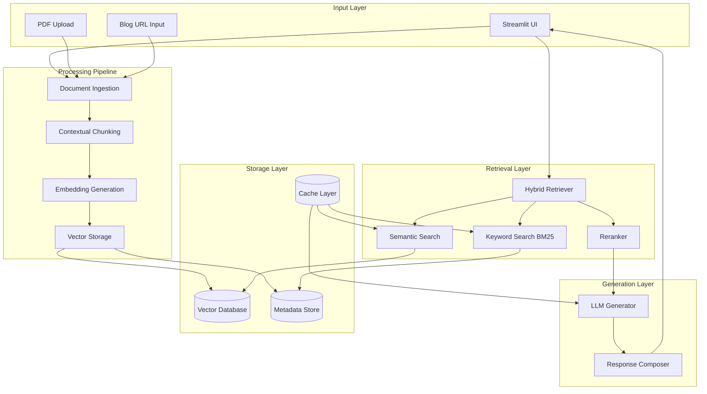
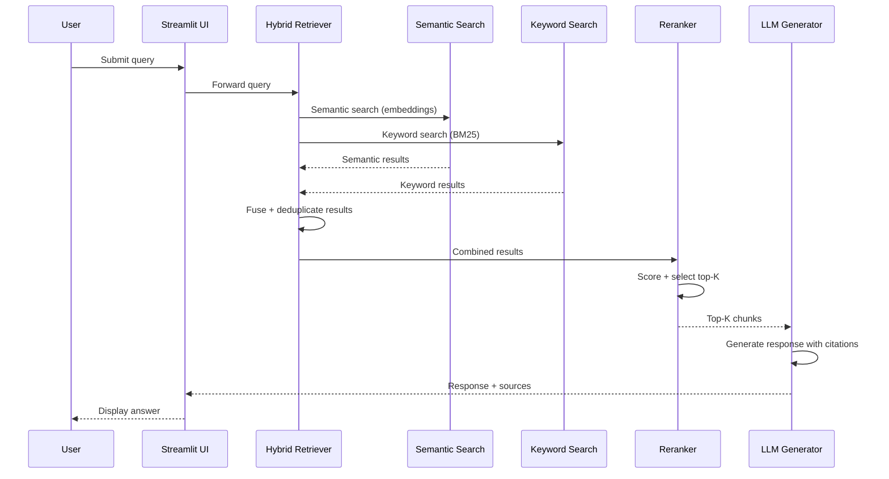
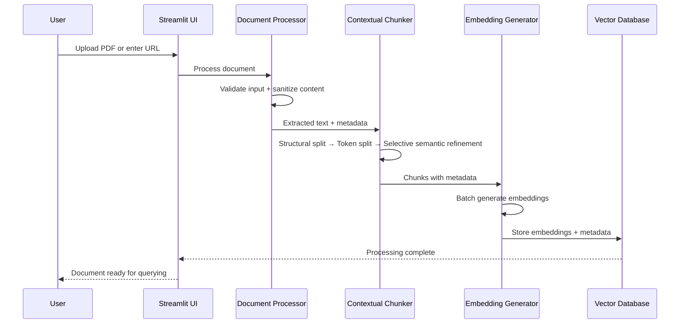

# Design Document: Hybrid-Search RAG Chatbot System

## Overview

The Hybrid-Search RAG Chatbot System is a context-aware question-answering system that combines semantic and keyword search techniques to retrieve and generate accurate answers from unstructured data sources. The system implements a 5-phase pipeline: Document Ingestion → Contextual Chunking → Vector Embeddings & Storage → Hybrid Search → LLM Integration & UI.

### Key Design Principles

1. **Context Preservation**: Maintain semantic meaning during document processing through structure-aware chunking
2. **Hybrid Retrieval**: Combine semantic similarity and exact keyword matching to ensure comprehensive information retrieval
3. **Selective Enhancement**: Apply semantic refinement only when needed to maintain efficiency
4. **Graceful Degradation**: Handle failures and edge cases without system breakdown
5. **Performance Optimization**: Achieve sub-10-second response times through caching and efficient algorithms

---

## Architecture

### System Architecture Overview



### Query Flow Sequence Diagram



### Document Ingestion Sequence Diagram



### Component Architecture

The system is organized into 8 distinct components:

1. **Document Processor**: Handles PDF and URL ingestion with content extraction
2. **Contextual Chunker**: Implements adaptive hybrid chunking strategy
3. **Embedding Generator**: Creates vector representations using pre-trained models
4. **Vector Database**: Stores embeddings and metadata with similarity search capabilities
5. **Hybrid Retriever**: Combines semantic and keyword search with result fusion
6. **Reranker**: Scores and filters retrieved chunks for optimal context selection
7. **LLM Generator**: Generates responses using retrieved context
8. **Streamlit UI**: Provides interactive web interface for user interactions

---

## Components and Interfaces

### Document Processor

**Purpose**: Extract and preprocess content from PDFs and web URLs


**Implementation Details**:
- URL processing using `requests` and `BeautifulSoup` for content extraction
- PDF processing using `PyPDF2` with fallback to `pdfplumber`
- Content sanitization to remove HTML noise and malicious scripts
- Metadata extraction including title, source, and timestamp
- Input validation with whitelist patterns and file type checking
- Size limit: 50MB; URL fetch timeout: 30 seconds

**Error Handling**:
- Invalid URL/PDF → descriptive error message
- Network timeout → retry with exponential backoff
- Malware detected → reject with security warning
- Empty document → empty content error

---

### Contextual Chunker

**Purpose**: Implement adaptive hybrid chunking strategy with selective semantic enhancement


**Chunking Algorithm (3-Step Process)**:

#### Step 1: Structure-Aware Splitting (Default)
- Parse document structure using heading hierarchy (H1–H6)
- Identify paragraph boundaries, lists, code blocks, tables
- Preserve atomic units (tables, code blocks) when possible
- Create section boundaries based on document structure

#### Step 2: Token-Based Chunking (Default)
- Split sections into 300–600 token chunks
- Maintain 10–20% overlap (50–100 tokens) between adjacent chunks
- Respect sentence boundaries using NLTK sentence tokenizer
- Handle edge cases for very short or long sentences

#### Step 3: Selective Semantic Refinement (Only When Needed)
Applied **only when**:
- A structural section exceeds 600 tokens → intelligently split using sentence similarity
- Tiny chunks under 100 tokens are detected → merge with adjacent related chunks
- Document structure is poor (OCR PDFs, unstructured content)

**Metadata Enrichment** — each chunk includes:
- Document title and source reference
- Section heading hierarchy
- Chunk index and position
- Parent-child relationships (when applicable)
- Token count and overlap information

---

### Embedding Generator

**Purpose**: Create vector representations for semantic search


**Implementation Details**:
- Model: `sentence-transformers/all-MiniLM-L6-v2`
- Batch size: 32–64 for efficient processing
- Token limit exceeded → truncate with warning log
- Empty chunks → skip with log entry
- Duplicate detection via content hashing

---

### Vector Database

**Purpose**: Store and retrieve embeddings with metadata


**Technology Stack**:
- **Primary vector store**: FAISS with IVF indexing
- **Alternative**: Chroma for simpler deployment
- **Metadata storage**: SQLite
- **Persistence**: Local file storage with backup

---

### Hybrid Retriever

**Purpose**: Combine semantic and keyword search for comprehensive retrieval


**Semantic Search**: Cosine similarity over FAISS index using query embedding

**Keyword Search**: BM25 via `rank-bm25` with query expansion for short/ambiguous queries

**Result Fusion Strategy**:
- Reciprocal Rank Fusion (RRF) to combine rankings
- Weighted scoring: Semantic (0.6) + Keyword (0.4)
- Conflict resolution: prioritize keyword matches for exact terms
- Deduplication by content similarity

**Query Handling**:
- Max query length: 500 tokens (truncate + log if exceeded)
- Short/ambiguous queries → expand search scope
- Fallback: if one method fails, use the other exclusively

---

### Reranker

**Purpose**: Score and prioritize retrieved chunks for optimal context selection


**Scoring Factors**:
- Base score: combined semantic + BM25 score
- Context coherence bonus: chunks from same document/section
- Query coverage reward: chunks covering different query aspects
- Length penalty: normalize for chunk length bias

**Selection Strategy**:
- Minimum relevance threshold: 0.3
- Default top-K: 5–8 chunks
- Total context must fit within 4000 LLM input tokens
- Maintain chunk order for context reconstruction
- Parent-child: retrieve child chunks, pass parent chunks to LLM

---

### LLM Generator

**Purpose**: Generate accurate responses using retrieved context


**Implementation Details**:
- Primary model: OpenAI GPT-3.5-turbo or GPT-4
- Alternative: local models (Llama-2, Mistral) for privacy
- Prompt structure: system instructions + retrieved context + user query
- Strict context adherence — no hallucination beyond provided chunks
- Fallback response when context is insufficient: *"I don't have enough information to answer this question"*
- Contradictions acknowledged and both perspectives presented

**Prompt Design Rules**:
1. Only use information from the provided context
2. Cite sources when making claims
3. Acknowledge contradictions if they exist
4. Return fallback if context is insufficient
5. Be concise but comprehensive

---

### Streamlit UI

**Purpose**: Provide interactive web interface for user interactions


**UI Components**:

1. **Document Upload Section**: PDF uploader (max 50MB), URL input with validation, processing status indicators, document management (view/delete)
2. **Chat Interface**: Query input, chat history, response streaming, source citations with expandable details
3. **Configuration Panel**: Chunk size/overlap, search weights, top-K, LLM temperature/max tokens

**Session Management**: Persistent document storage, chat history, user preferences, error state recovery

---

## Data Models

### Core Data Structures

| Model | Key Fields |
|---|---|
| `ProcessedDocument` | id, title, content, source, source_type (pdf/url), metadata, processed_at |
| `Chunk` | id, document_id, content, start_index, end_index, token_count, metadata, embedding |
| `ChunkMetadata` | section_title, heading_hierarchy, chunk_index, overlap_with_previous, overlap_with_next, parent_chunk_id |
| `RetrievalResult` | chunk, semantic_score, keyword_score, combined_score, search_method |
| `GeneratedResponse` | answer, sources, confidence_score, context_used, processing_time, warnings |

---

## Database Schema

### Documents Table

| Field | Type | Constraints |
|---|---|---|
| id | TEXT | Primary Key |
| title | TEXT | Not Null |
| source | TEXT | Not Null |
| source_type | TEXT | CHECK IN ('pdf', 'url') |
| content_hash | TEXT | Unique |
| processed_at | TIMESTAMP | Default: current_timestamp |
| metadata | JSON | — |

### Chunks Table

| Field | Type | Constraints |
|---|---|---|
| id | TEXT | Primary Key |
| document_id | TEXT | FK → documents(id) ON DELETE CASCADE |
| content | TEXT | Not Null |
| start_index | INTEGER | — |
| end_index | INTEGER | — |
| token_count | INTEGER | — |
| section_title | TEXT | — |
| heading_hierarchy | JSON | — |
| chunk_index | INTEGER | — |
| overlap_previous | INTEGER | — |
| overlap_next | INTEGER | — |
| parent_chunk_id | TEXT | FK → chunks(id) |
| created_at | TIMESTAMP | Default: current_timestamp |

### Embeddings Table

| Field | Type | Constraints |
|---|---|---|
| chunk_id | TEXT | PK, FK → chunks(id) ON DELETE CASCADE |
| embedding | BLOB | Not Null |
| model_name | TEXT | Not Null |
| created_at | TIMESTAMP | Default: current_timestamp |

### Query Logs Table

| Field | Type | Constraints |
|---|---|---|
| id | TEXT | Primary Key |
| query | TEXT | Not Null |
| response_time_ms | INTEGER | — |
| chunks_retrieved | INTEGER | — |
| user_session | TEXT | — |
| created_at | TIMESTAMP | Default: current_timestamp |

---

## API Contracts

### POST /api/documents/upload
**Request**: multipart/form-data with PDF file and source_type field

**Response (200)**:
```json
{
  "document_id": "doc_123",
  "status": "processing",
  "message": "Document uploaded successfully"
}
```

**Error (400)**: Invalid file type or size exceeded
**Error (500)**: Processing failure

---

### POST /api/documents/url
**Request**:
```json
{ "url": "https://example.com/article", "source_type": "url" }
```

**Response (200)**:
```json
{ "document_id": "doc_456", "status": "processing" }
```

**Error (400)**: Invalid or blocked URL
**Error (408)**: Fetch timeout

---

### POST /api/query
**Request**:
```json
{
  "query": "What is the main topic?",
  "document_ids": ["doc_123"],
  "max_chunks": 5,
  "search_method": "hybrid"
}
```

**Response (200)**:
```json
{
  "answer": "The main topic is...",
  "sources": [
    { "chunk_id": "chunk_789", "document_title": "Article Title", "section": "Introduction", "relevance_score": 0.85 }
  ],
  "processing_time_ms": 2500,
  "confidence": 0.92
}
```

**Error (400)**: Empty or invalid query
**Error (404)**: No documents found
**Error (500)**: Retrieval or generation failure

---

### GET /api/config
**Response (200)**:
```json
{
  "chunk_size": 500,
  "chunk_overlap": 50,
  "semantic_weight": 0.6,
  "keyword_weight": 0.4,
  "min_relevance_threshold": 0.3
}
```

### PUT /api/config
**Request**: Partial or full config object with updated values
**Response (200)**: Updated config object
**Error (400)**: Invalid parameter values

---

## Technical Stack

| Layer | Technology | Version |
|---|---|---|
| Language | Python | 3.9+ |
| UI | Streamlit | Latest stable |
| PDF Extraction | PyPDF2 / pdfplumber | Latest stable |
| Web Scraping | requests + BeautifulSoup4 | Latest stable |
| File Type Detection | python-magic | Latest stable |
| Text Processing | NLTK / spaCy | Latest stable |
| Embeddings | sentence-transformers | Latest stable |
| Vector Search | FAISS | Latest stable |
| Keyword Search | rank-bm25 | Latest stable |
| LLM Integration | openai + LangChain | Latest stable |
| Token Counting | tiktoken | Latest stable |
| Metadata Storage | SQLite | Built-in |
| Caching | Redis (optional) | 7.x |
| Containerization | Docker + Docker Compose | Latest stable |

---

## Configuration Structure

The system uses a YAML-based configuration with environment-specific overrides (`config.yaml`, `config.dev.yaml`, `config.prod.yaml`).

**Key configuration sections and parameters**:

| Section | Key Parameters |
|---|---|
| `system` | environment, debug, log_level |
| `document_processing` | max_file_size_mb (50), timeout_seconds (30), allowed_domains |
| `chunking` | default_chunk_size (500), chunk_overlap (50), min_chunk_size (100), max_chunk_size (600), semantic_refinement_threshold (600) |
| `embeddings` | model_name (all-MiniLM-L6-v2), batch_size (32), cache_embeddings |
| `search` | semantic_weight (0.6), keyword_weight (0.4), max_results (20), min_relevance_threshold (0.3) |
| `llm` | provider (openai), model (gpt-3.5-turbo), temperature (0.1), max_tokens (1000), timeout_seconds (30) |
| `ui` | title, max_chat_history (50), enable_file_upload, enable_url_input |
| `storage` | vector_db_path, metadata_db_path, cache_size_mb (512) |

Configuration supports runtime updates without system restart via a hot-reload mechanism that notifies registered component callbacks on change.

---

## Project Structure

```
hybrid-search-rag-chatbot/
├── src/
│   ├── components/
│   │   ├── document_processor.py
│   │   ├── contextual_chunker.py
│   │   ├── embedding_generator.py
│   │   ├── vector_database.py
│   │   ├── hybrid_retriever.py
│   │   ├── reranker.py
│   │   └── llm_generator.py
│   ├── ui/
│   │   └── streamlit_app.py
│   ├── utils/
│   │   ├── config.py
│   │   ├── logging.py
│   │   └── security.py
│   └── main.py
├── tests/
│   ├── unit/
│   ├── integration/
│   └── fixtures/
├── data/
│   ├── vector_db/
│   └── metadata.db
├── config/
│   ├── config.yaml
│   ├── config.dev.yaml
│   └── config.prod.yaml
├── docker/
│   ├── Dockerfile
│   └── docker-compose.yml
├── requirements.txt
├── setup.py
└── README.md
```

---

## Deployment

### Docker Setup

- **Dockerfile**: Python 3.9-slim base, installs dependencies, exposes port 8501, includes health check endpoint
- **docker-compose.yml**: Two services — `rag-chatbot` (Streamlit app) and `redis` (optional caching); mounts `./data` and `./config` as volumes; passes `OPENAI_API_KEY` via environment variable

### Development Setup

The system includes Docker configuration and setup scripts for development environment initialization. See project README for detailed setup instructions.

---

## Performance and Scalability Design

### Caching Strategy (Multi-Level)

| Cache Level | What's Cached | TTL |
|---|---|---|
| In-memory | Embedding model, active session embeddings | Session lifetime |
| Redis | Query results, frequent chunk lookups | 1 hour |
| Disk | FAISS index, SQLite metadata | Persistent |

### Memory Management

- Batch embedding processing (32–64 chunks per batch)
- Lazy loading of embeddings on demand
- Memory usage monitoring with automatic LRU cache eviction at 80% threshold
- Streaming for large document processing

### Response Time Targets

| Operation | Target |
|---|---|
| Document processing | < 30 seconds |
| Query response (end-to-end) | < 10 seconds |
| Embedding generation (100 chunks) | < 5 seconds |
| Vector similarity search | < 1 second |


---

## Error Handling and Resilience Design

### Error Categories

| Category | Examples |
|---|---|
| Input Validation | Invalid URLs, corrupted files, oversized documents |
| Processing | Chunking failures, embedding errors, DB errors |
| Retrieval | Search failures, empty results, ranking issues |
| Generation | LLM API failures, context overflow, response validation |
| System | Resource exhaustion, config errors, service unavailability |

### Error Handling Patterns

**Circuit Breaker** (for external services: LLM API, web scraping):
- Failure threshold: 5 consecutive failures
- Timeout period: 60 seconds
- States: CLOSED → OPEN → HALF_OPEN → CLOSED

**Retry with Exponential Backoff**:
- Initial delay: 1 second
- Max delay: 30 seconds
- Max attempts: 3

**Graceful Degradation Levels**:

| Level | Condition | Behavior |
|---|---|---|
| Full Service | All components healthy | Normal operation |
| Limited Service | 2–3 components healthy | Some features disabled |
| Basic Service | 1 component healthy | Keyword search only, cached responses |
| Emergency Mode | No components healthy | Static error messages |

### Component Fallback Strategies

| Component | Failure Scenario | Fallback Action |
|---|---|---|
| Document Processing | PDF extraction fails | Try alternative library (pdfplumber → PyPDF2) |
| Document Processing | URL fetch fails | Retry with different user agent |
| Document Processing | Content extraction fails | Return raw text with warning |
| Embedding Generation | Model loading fails | Use cached embeddings or simpler model |
| Embedding Generation | Batch processing fails | Process chunks individually |
| Embedding Generation | Token limit exceeded | Truncate with warning |
| Search & Retrieval | Vector search fails | Fall back to keyword search only |
| Search & Retrieval | BM25 fails | Fall back to semantic search only |
| Search & Retrieval | No results found | Expand search scope or suggest alternatives |
| LLM Generation | API failure | Retry with exponential backoff |
| LLM Generation | Context too long | Truncate and retry |
| LLM Generation | Rate limit exceeded | Queue request or use alternative model |

---

## Security Design

### Input Validation

**URL Validation**:
- Whitelist of allowed domain patterns (e.g., `*.wikipedia.org`, `*.medium.com`)
- Blocklist of dangerous patterns (javascript:, data:, .exe extensions)
- Redirect following limited to 3 hops
- Timeout enforcement

**File Validation**:
- File type verified via magic bytes (not just extension)
- Max size: 50MB
- Malware scanning before processing (ClamAV or VirusTotal API)
- Embedded script detection

**Content Sanitization**:
- Strip JavaScript and executable content
- Remove HTML tags and attributes
- Validate text encoding
- Remove malicious patterns

### Security Logging

All security events logged with: timestamp, event_type, severity, user_session, and details including what was blocked and why.

**Events logged**: invalid inputs, suspicious uploads, unusual query patterns, blocked URLs, configuration changes

### Malware Scanning

The system integrates malware scanning for uploaded files using configurable scanning engines (ClamAV local engine, VirusTotal API, or custom pattern-based detection).

---

## Correctness Properties

The system implements 10 correctness properties validated through property-based testing. These properties ensure algorithmic correctness for core components including chunking invariants, search result fusion, metadata preservation, and token limit compliance. See `requirements.md` for detailed property specifications.

---

## Testing Strategy

The system employs dual testing approach: unit testing for specific scenarios and integration points, plus property-based testing for core algorithmic correctness. Testing includes performance validation, security testing, and comprehensive coverage requirements. See project test specifications for detailed testing implementation.
