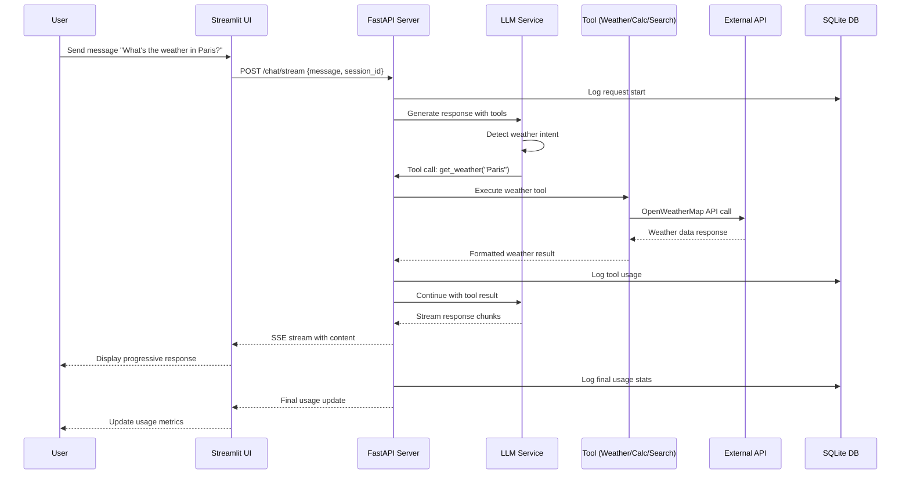
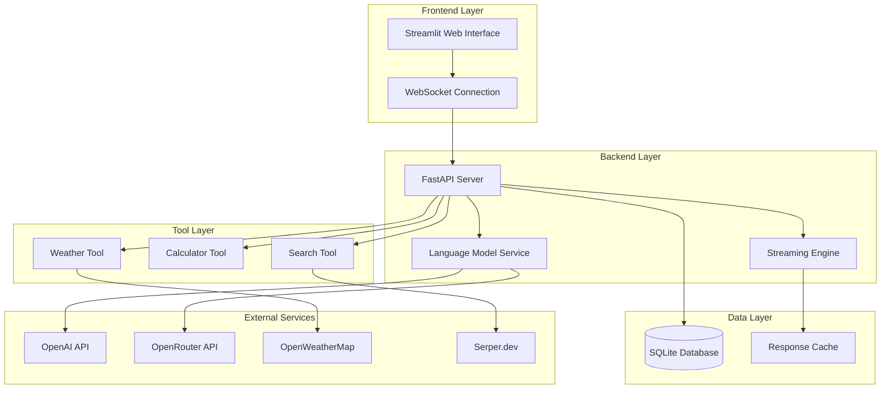

# Design Document: Multi-Function AI Assistant

## Overview

The Multi-Function AI Assistant is a production-grade conversational AI system that integrates multiple external tools through intelligent function calling, provides real-time streaming responses, and maintains comprehensive usage tracking. The system uses a Python-based stack with FastAPI backend, Streamlit frontend, and SQLite for local data persistence.

The assistant automatically detects user intent and invokes appropriate tools including weather services (OpenWeatherMap), mathematical computation (SymPy), and information search (Serper.dev). All interactions are delivered through progressive streaming responses while maintaining detailed cost and usage metrics.

## Architecture

### Sequence Diagram: Chat Request with Tool Execution



### System Architecture



### Component Responsibilities

| Component | Responsibility |
|-----------|---------------|
| Streamlit UI | User interaction, real-time chat display, usage metrics visualization |
| FastAPI Server | Request routing, tool orchestration, streaming delivery |
| LLM Service | Provider management (OpenAI primary, OpenRouter fallback) |
| Streaming Engine | SSE-based progressive response delivery, connection management |
| Weather Tool | OpenWeatherMap API integration, location parsing |
| Calculator Tool | SymPy mathematical computation, expression validation |
| Search Tool | Serper.dev API integration, result formatting |
| SQLite DB | Usage tracking, cost calculation, session persistence |
| Response Cache | Temporary storage for streaming recovery |

## API Contracts

### Endpoints

#### POST /chat/stream
**Payload**: `{ "message": "string", "session_id": "string", "stream": true }`

**Success Response**: 200 OK (Server-Sent Events)
```
data: {"type": "content", "data": "Hello! I'll check the weather for you."}
data: {"type": "tool_status", "data": {"tool": "weather", "status": "executing"}}
data: {"type": "tool_result", "data": {"temperature": 22, "condition": "sunny"}}
data: {"type": "usage_update", "data": {"tokens": 150, "cost": 0.003}}
```
**Errors**: 400 (invalid payload), 429 (rate limit), 500 (LLM unavailable)

#### GET /usage/stats
**Query Params**: `session_id` (required), `detailed` (optional)

**Success Response**: 200 OK
```json
{
  "session_id": "string",
  "total_tokens": 1250,
  "total_cost": 0.025,
  "requests_count": 8,
  "tools_used": ["weather", "calculator"],
  "current_provider": "openai",
  "detailed_breakdown": [...]
}
```
**Errors**: 404 (session not found), 500 (database unavailable)

#### GET /health
**Success Response**: 200 OK
```json
{
  "status": "healthy",
  "services": {
    "database": "connected",
    "openai_api": "available",
    "openweather_api": "available",
    "serper_api": "available"
  },
  "timestamp": "2024-01-15T10:30:00Z"
}
```
**Errors**: 503 (critical services down)

### Tool Function Schemas

#### Weather Tool
```json
{
  "type": "function",
  "function": {
    "name": "get_weather",
    "description": "Get current weather information for a location",
    "parameters": {
      "type": "object",
      "properties": {
        "location": { "type": "string", "description": "City name, coordinates, or address" }
      },
      "required": ["location"]
    }
  }
}
```

#### Calculator Tool
```json
{
  "type": "function",
  "function": {
    "name": "calculate",
    "description": "Perform mathematical calculations and symbolic math",
    "parameters": {
      "type": "object",
      "properties": {
        "expression": { "type": "string", "description": "Mathematical expression (supports SymPy syntax)" }
      },
      "required": ["expression"]
    }
  }
}
```

#### Search Tool
```json
{
  "type": "function",
  "function": {
    "name": "search",
    "description": "Search for current information on any topic",
    "parameters": {
      "type": "object",
      "properties": {
        "query": { "type": "string", "description": "Search query" },
        "num_results": { "type": "integer", "description": "Number of results (1-10)", "default": 5 }
      },
      "required": ["query"]
    }
  }
}
```

## Data Models

### Database Schema

```sql
CREATE TABLE usage_logs (
    id INTEGER PRIMARY KEY AUTOINCREMENT,
    session_id TEXT NOT NULL,
    timestamp DATETIME DEFAULT CURRENT_TIMESTAMP,
    request_type TEXT NOT NULL,
    input_tokens INTEGER NOT NULL,
    output_tokens INTEGER NOT NULL,
    tool_tokens INTEGER DEFAULT 0,
    total_tokens INTEGER NOT NULL,
    estimated_cost REAL NOT NULL,
    provider TEXT NOT NULL,
    model TEXT NOT NULL,
    tools_used TEXT,        -- JSON array of tool names
    success BOOLEAN NOT NULL DEFAULT TRUE,
    error_message TEXT
);

CREATE TABLE sessions (
    session_id TEXT PRIMARY KEY,
    created_at DATETIME DEFAULT CURRENT_TIMESTAMP,
    last_activity DATETIME DEFAULT CURRENT_TIMESTAMP,
    total_requests INTEGER DEFAULT 0,
    total_tokens INTEGER DEFAULT 0,
    total_cost REAL DEFAULT 0.0
);

CREATE TABLE tool_usage (
    id INTEGER PRIMARY KEY AUTOINCREMENT,
    session_id TEXT NOT NULL,
    tool_name TEXT NOT NULL,
    execution_time REAL NOT NULL,
    success BOOLEAN NOT NULL DEFAULT TRUE,
    error_message TEXT,
    timestamp DATETIME DEFAULT CURRENT_TIMESTAMP,
    FOREIGN KEY (session_id) REFERENCES sessions(session_id)
);
```

### Data Transfer Objects

| Class | Fields |
|-------|--------|
| `ChatRequest` | `message: str`, `session_id: str`, `stream: bool = True` |
| `ToolResult` | `success: bool`, `data: Any`, `error_message: Optional[str]`, `execution_time: float` |
| `UsageStats` | `session_tokens: int`, `session_cost: float`, `total_requests: int`, `tools_used: List[str]`, `current_provider: str` |
| `StreamingChunk` | `type: str`, `data: Any`, `is_complete: bool` |

## Development Environment

### Tech Stack

| Component | Technology | Version |
|-----------|------------|---------|
| Runtime | Python | 3.11+ |
| Backend | FastAPI | 0.104+ |
| Frontend | Streamlit | 1.28+ |
| Database | SQLite | 3.40+ |
| Math Engine | SymPy | 1.12+ |
| HTTP Client | httpx | 0.25+ |
| Testing | pytest | 7.4+ |
| Property Testing | hypothesis | 6.88+ |
| Formatting | black | 23.9+ |
| Linting | ruff | 0.1+ |

### Project Folder Structure

```
multi-function-ai-assistant/
├── backend/
│   ├── app/
│   │   ├── __init__.py
│   │   ├── main.py                 # FastAPI application entry point
│   │   ├── config.py               # Configuration management
│   │   ├── database/
│   │   │   ├── __init__.py
│   │   │   ├── connection.py       # SQLite connection management
│   │   │   ├── models.py           # Database models
│   │   │   └── migrations.py       # Database schema setup
│   │   ├── services/
│   │   │   ├── __init__.py
│   │   │   ├── llm_service.py      # Language model integration
│   │   │   ├── streaming_engine.py # Response streaming
│   │   │   └── usage_tracker.py    # Usage and cost tracking
│   │   ├── tools/
│   │   │   ├── __init__.py
│   │   │   ├── base.py             # BaseTool abstract class
│   │   │   ├── registry.py         # Tool registry
│   │   │   ├── weather_tool.py     # OpenWeatherMap integration
│   │   │   ├── calculator_tool.py  # SymPy integration
│   │   │   └── search_tool.py      # Serper.dev integration
│   │   ├── api/
│   │   │   ├── __init__.py
│   │   │   ├── chat.py             # Chat endpoints
│   │   │   ├── usage.py            # Usage endpoints
│   │   │   └── health.py           # Health check endpoints
│   │   └── utils/
│   │       ├── __init__.py
│   │       ├── errors.py           # Error handling
│   │       └── validators.py       # Input validation
│   ├── tests/
│   │   ├── __init__.py
│   │   ├── conftest.py
│   │   ├── unit/
│   │   │   ├── test_tools.py
│   │   │   ├── test_services.py
│   │   │   └── test_api.py
│   │   ├── integration/
│   │   │   ├── test_full_flow.py
│   │   │   └── test_external_apis.py
│   │   └── property/
│   │       ├── test_tool_properties.py
│   │       └── test_streaming_properties.py
│   ├── requirements.txt
│   └── pyproject.toml
├── frontend/
│   ├── app.py                     # Streamlit application entry point
│   ├── components/
│   │   ├── __init__.py
│   │   ├── chat_interface.py
│   │   ├── usage_metrics.py
│   │   └── streaming_handler.py
│   ├── utils/
│   │   ├── __init__.py
│   │   ├── api_client.py
│   │   └── session_manager.py
│   └── requirements.txt
├── data/
│   └── assistant.db
├── config/
│   ├── .env.example
│   └── logging.conf
├── scripts/
│   ├── setup.py
│   ├── run_backend.py
│   └── run_frontend.py
├── docs/
│   ├── README.md
│   ├── API.md
│   └── DEPLOYMENT.md
├── .env
├── .gitignore
├── pyproject.toml
└── README.md
```

### Environment Variables

```bash
OPENAI_API_KEY=your_openai_key_here
OPENROUTER_API_KEY=your_openrouter_key_here
OPENWEATHER_API_KEY=your_openweather_key_here
SERPER_API_KEY=your_serper_key_here

DATABASE_URL=sqlite:///data/assistant.db
LOG_LEVEL=INFO
ENVIRONMENT=development

DEFAULT_MODEL=gpt-4o-mini
FALLBACK_MODEL=gpt-3.5-turbo
MAX_TOKENS=4096
TEMPERATURE=0.7
```

## Implementation Constraints

| Category | Constraint |
|----------|-----------|
| Performance | API response < 200ms for 95% of requests (excluding external API calls) |
| Streaming | First token latency < 100ms |
| Security | API keys stored in `.env`, never logged or exposed in responses |
| Security | All tool inputs validated and sanitized against injection attacks |
| Privacy | Conversation content not persisted beyond current session |
| Privacy | Usage data anonymized — no PII stored |
| Cost | Use `gpt-4o-mini` by default; fall back to `gpt-3.5-turbo` |
| Cost | Avoid unnecessary retries and keep context windows small |
| Error Handling | All tool failures return user-friendly messages with suggestions |
| Error Handling | Rate limit responses include estimated wait times |

## Correctness Properties

| # | Property | Validates |
|---|----------|-----------|
| 1 | Weather response includes temperature, humidity, wind speed, conditions | Req 1.3 |
| 2 | Weather-related queries automatically invoke Weather_Tool | Req 1.5 |
| 3 | Valid math expressions computed accurately via SymPy | Req 2.1 |
| 4 | All math operation categories (arithmetic, calculus, algebra) supported | Req 2.2 |
| 5 | Invalid expressions return clear error messages | Req 2.3 |
| 6 | Floating-point precision maintained to ≥10 decimal places | Req 2.4 |
| 7 | Math expressions automatically invoke Calculator_Tool | Req 2.5 |
| 8 | Search results include titles, snippets, and source URLs | Req 3.2 |
| 9 | Multi-language queries handled with localized results | Req 3.4 |
| 10 | Information-seeking queries automatically invoke Search_Tool | Req 3.5 |
| 11 | All tools have valid function schemas with parameter validation | Req 4.1 |
| 12 | Correct tool selected (or none) for any user input | Req 4.2 |
| 13 | Tool results properly integrated into conversational responses | Req 4.3 |
| 14 | Multi-tool requests executed in correct order | Req 4.4 |
| 15 | Tool errors handled gracefully with meaningful feedback | Req 4.5 |
| 16 | Tokens delivered progressively, not all at once | Req 5.1 |
| 17 | Streaming responses maintain coherence throughout delivery | Req 5.3 |
| 18 | Tool execution status indicated during streaming | Req 5.4 |
| 19 | Input, output, and tool tokens accurately recorded per request | Req 6.1 |
| 20 | Cost estimates accurate based on OpenAI pricing | Req 6.2 |
| 21 | Usage data persisted to SQLite and retrievable historically | Req 6.3 |
| 22 | Per-request and cumulative session statistics accurate | Req 6.4 |
| 23 | OpenAI failure triggers automatic switch to OpenRouter | Req 8.2 |
| 24 | Most cost-effective model selected for each task | Req 8.3 |
| 25 | No unnecessary API retries or repeated calls | Req 8.4 |
| 26 | Context windows balanced between token cost and quality | Req 8.5 |
| 27 | Tool failures return clear messages with alternative suggestions | Req 9.1 |
| 28 | Rate limit responses include estimated wait times | Req 9.2 |
| 29 | Errors logged without exposing user PII | Req 9.4 |
| 30 | Partial failures return available results with failure indication | Req 9.5 |
| 31 | Conversation content not stored beyond current session | Req 10.1 |
| 32 | Tool inputs validated to prevent injection attacks | Req 10.3 |
| 33 | API keys never appear in logs or responses | Req 10.4 |
| 34 | Usage data anonymized with no PII association | Req 10.5 |

## Definition of Done

A task is complete when:
- Unit test coverage ≥ 80% for all new code
- All linting rules pass (ruff, black formatting)
- Type hints on all function signatures
- All acceptance criteria from requirements met
- Error handling implemented for all failure scenarios
- API keys secured, inputs validated
- API endpoints documented via OpenAPI `/docs`
- README updated with setup and usage instructions
