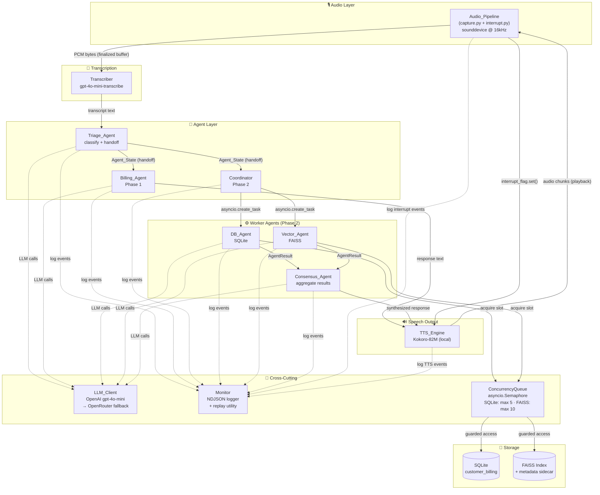
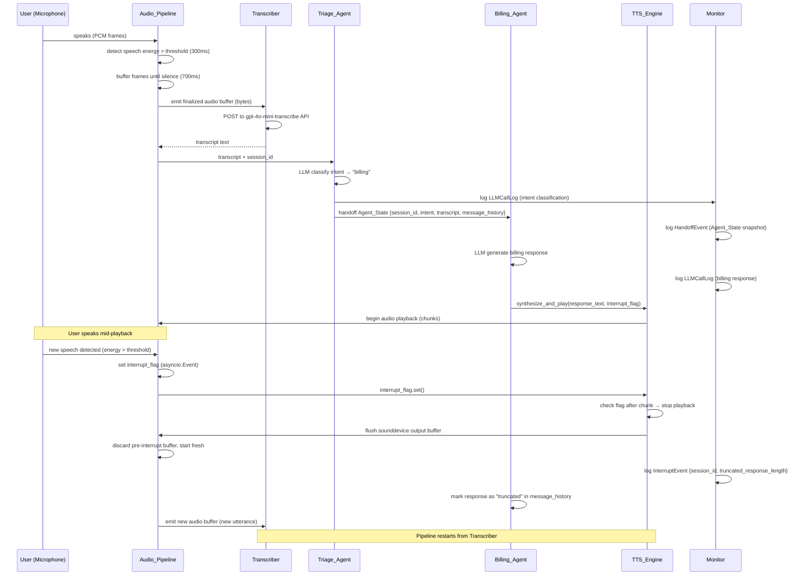
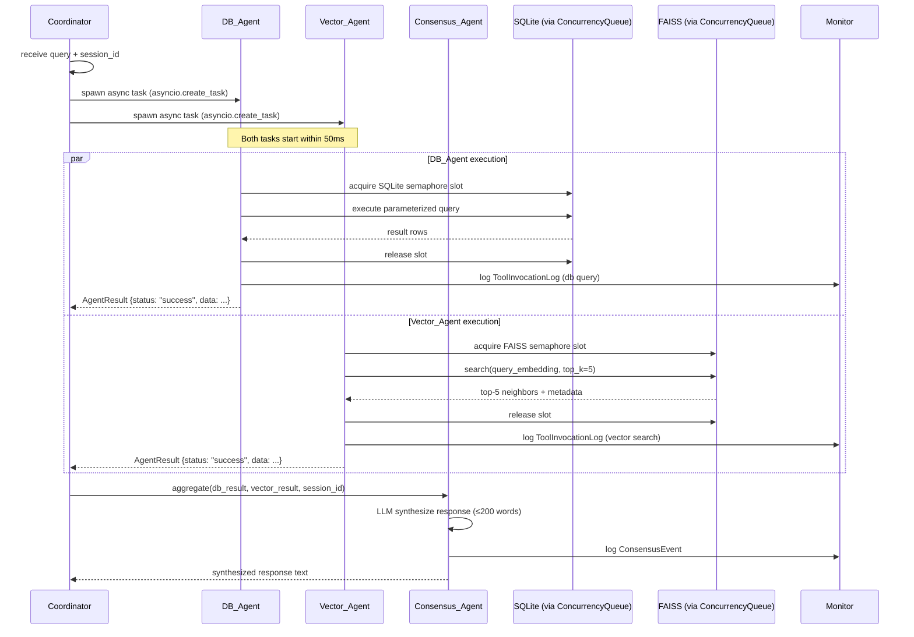
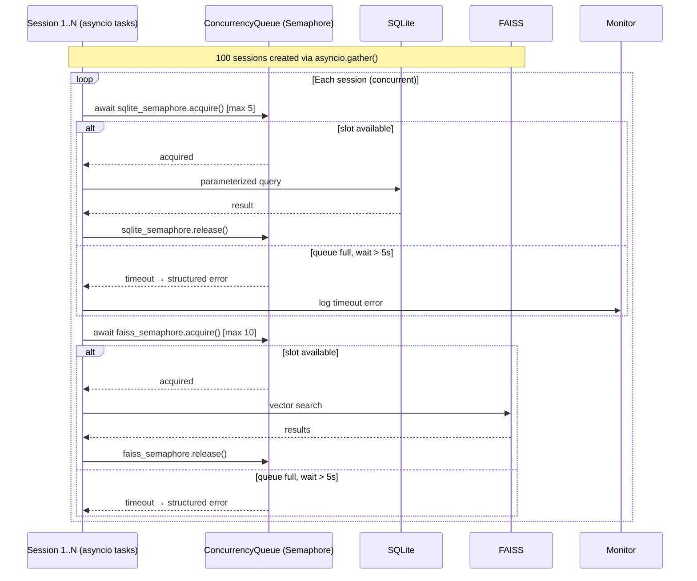

# Design Document: realtime-voice-agent-system

## Overview

### Abstract

This system is a production-grade, real-time voice-enabled customer service platform that accepts live microphone input, routes requests through a multi-agent pipeline, and responds via local text-to-speech — all running entirely on a developer's local machine. It is delivered in three phases: Phase 1 establishes a two-agent voice loop (Triage → Billing) with interruption handling; Phase 2 adds parallel agent execution (DB_Agent + Vector_Agent) with a Consensus_Agent and structured monitoring; Phase 3 scales to 100 simulated concurrent sessions with token pruning, concurrency control, and NDJSON-based session replay.

### User Stories (Summary)

- **Customer (voice interaction):** Speak into a microphone and receive spoken answers from the correct specialist agent, with the ability to interrupt mid-response.
- **Customer (routing):** Have requests automatically classified and routed to the right agent without manual selection.
- **Customer (parallel answers):** Receive a single coherent answer that combines structured database facts with semantically relevant context.
- **System operator (monitoring):** Inspect every LLM call, tool invocation, handoff, and interrupt event through a structured log file and replay utility.
- **System operator (scaling):** Run 100 concurrent simulated sessions without deadlock, data corruption, or process crash.
- **Developer (bootstrap):** Clone the repo, copy `.env.example`, install pinned dependencies, and run a working demo in under 10 minutes.

### Non-Goals

- **No cloud deployment.** The system runs locally only; no Kubernetes, Docker, or cloud-hosted infrastructure.
- **No web or GUI frontend.** All interaction is terminal-based; no React, Flask, or FastAPI web server.
- **No streaming LLM responses.** LLM calls are complete-response (non-streaming) to keep the implementation straightforward.
- **No multi-turn FAISS index updates at runtime.** The FAISS index is loaded once at startup and treated as read-only during a session.
- **No user authentication or multi-tenancy.** Sessions are identified by UUID only; there is no login, user account, or access control layer.
- **No production database migrations.** SQLite schema is created by a seed script; no Alembic or migration tooling.
- **No support for languages other than English.** Transcription and TTS are configured for English only.
- **No telephony or WebRTC integration.** Audio is captured exclusively from the local system microphone via sounddevice.

---

## Architecture

### Component Diagram



### Sequence Diagrams

#### Phase 1: Full Voice Interaction with Interruption



#### Phase 2: Parallel Execution Flow



#### Phase 3: Concurrency Queue Flow (100 Sessions)



---

## Key Design Decisions

### 1. Interrupt Mechanism

The system uses a shared `asyncio.Event` flag as an interrupt signal between the audio pipeline and TTS engine. The TTS engine checks this flag between audio chunks (not mid-chunk), allowing it to stop playback within one chunk duration when the user speaks during agent response. The AudioPipeline monitors microphone input continuously and sets the interrupt flag when speech energy exceeds the threshold while TTS is playing. Upon interruption, the sounddevice output buffer is flushed, the partial audio buffer is discarded, and the response is marked as truncated in the message history.

**Worst-case interrupt latency**: One chunk duration (20–50 ms for Kokoro-82M at 24 kHz).

**InterruptController** encapsulates the interrupt flag with methods to trigger, clear, and check interrupt state, providing a clean interface for both the audio pipeline and TTS engine.

### 2. Interactive Voice Session

The **VoiceSession** orchestrator manages continuous multi-turn voice conversations with live barge-in capability. It maintains session state across turns, coordinates the audio pipeline with agent handoffs, and handles interrupt events during TTS playback. The session runs a loop that captures speech, transcribes, routes through agents, plays responses, and monitors for interruptions—all while keeping the microphone active to detect user speech during agent responses.

Key responsibilities:
- Maintain AgentState across multiple conversation turns
- Coordinate AudioPipeline, Transcriber, TriageAgent, BillingAgent, and TTSEngine
- Handle interrupt events and mark truncated responses
- Log session start/end with total turns and latency metrics

### 3. Agent Handoff

AgentState is a dataclass containing `session_id`, `intent`, `transcript`, `message_history`, `timestamp_utc`, and `metadata`. It is serialized to dict (JSON-serializable) for NDJSON logging and passed by reference in-process between agents. The handoff mechanism preserves complete conversation context while enabling deterministic replay from logs.

### 4. Parallel Execution

The Coordinator spawns DB_Agent and Vector_Agent as concurrent async tasks using `asyncio.create_task()` and aggregates results with `asyncio.gather(return_exceptions=True)`. This ensures both agents start within 50ms of each other and execute truly in parallel. If one agent fails, the successful result is preserved and passed to the Consensus_Agent along with a structured failure record. If both fail, the coordinator returns an error without invoking consensus.

### 5. LLM Fallback Strategy

The LLM client attempts OpenAI gpt-4o-mini as primary. On HTTP 429 (rate limit), it retries once after the `Retry-After` header duration. On HTTP 5xx or connection errors, it immediately retries with OpenRouter using the same model identifier. HTTP 4xx errors (except 429) are returned to the caller without retry. This two-tier approach ensures resilience while respecting rate limits.

### 6. Concurrency Queue

Shared local resources (SQLite and FAISS) are protected by `ConcurrencyQueue`, an `asyncio.Semaphore` wrapper with timeout enforcement. SQLite allows max 5 simultaneous connections; FAISS allows max 10 concurrent reads. If a request waits longer than the configured timeout (default 5s), it raises a timeout error instead of blocking indefinitely. Agents acquire slots via async context manager, ensuring proper release in finally blocks.

### 7. Token Pruning Strategy

**Sliding window**: Message history is capped at 10 turns. When exceeded, the oldest user/assistant pairs are removed until the count is ≤10.

**Summarization**: When cumulative prompt tokens exceed 50,000, the oldest 5 turns are replaced with a single LLM-generated summary message.

Token counting uses `tiktoken` for accuracy. System prompts are never pruned. All pruning events are logged to NDJSON with before/after token counts.

### 8. NDJSON Logging and Replay

Each log record is written as newline-delimited JSON to `logs/session.ndjson`. The Monitor stores exact JSON payloads of AgentState at every handoff, enabling deterministic session replay. The `replay_session.py` script reconstructs chronological event sequences for a given session_id, supporting debugging, token auditing, and interrupt forensics.

**Why exact payloads matter**:
- **Deterministic replay**: Re-feed exact AgentState to reproduce bugs
- **Token audit**: Offline token counting and cost analysis
- **Interrupt forensics**: `truncated_response_length` shows exactly what was cut off

### 9. FAISS Fallback Strategy

When the FAISS library is unavailable or the index fails to load, the system gracefully degrades to a metadata-based text search. The fallback tokenizes the query, scores documents by term overlap in title and content preview, and returns the top-k results. This ensures Phase 2 and Phase 3 can demonstrate orchestration logic even without FAISS installed, while maintaining the same interface contract.

---

## Data Models

### Core Data Structures

**AgentState**: Contains `session_id` (UUID4), `intent` (billing/technical_support/general_inquiry), `transcript`, `message_history` (list of message dicts, max 10 turns), `timestamp_utc` (ISO 8601), and `metadata` (arbitrary key-value pairs).

**AgentResult**: Worker agent response structure with `session_id`, `agent_name`, `status` (success/failure/timeout), `data` (optional dict), `error` (optional string), and `latency_ms`.

**LLMResponse**: Contains `content`, `model_id`, `prompt_tokens`, `completion_tokens`, `latency_ms`, and `status` (success/error).

### Log Record Types

All log records include: `record_type`, `session_id`, `timestamp_utc`.

- **LLMCallLog**: `agent_name`, `model_id`, `prompt_tokens`, `completion_tokens`, `latency_ms`, `status`
- **ToolInvocationLog**: `agent_name`, `tool_name`, `input_summary`, `output_summary`, `latency_ms`, `status`
- **HandoffEvent**: `from_agent`, `to_agent`, `agent_state_snapshot` (full AgentState dict)
- **InterruptEvent**: `truncated_response_length`, `interrupt_source`
- **PruningEvent**: `pruning_type`, `turns_removed`, `tokens_before`, `tokens_after`
- **ConsensusEvent**: `db_agent_status`, `vector_agent_status`, `response_word_count`

See `requirements.md` for complete field specifications.

### Storage Schemas

**SQLite** (`customer_billing` table): Contains `customer_id` (primary key), `full_name`, `email` (unique), `plan_name`, `balance_usd`, `due_date`, `status` (current/overdue/suspended with CHECK constraint), and `created_at`. Indexed on email and status.

**FAISS**: Binary `.index` file + JSON sidecar (`faiss_metadata.json`) mapping vector IDs to document metadata (doc_id, title, content_preview, source, created_at).

---

## Error Handling Strategy

### LLM Client
- HTTP 429: Retry once after `Retry-After` header (default 5s)
- HTTP 5xx / connection error: Immediately retry with OpenRouter
- HTTP 4xx (not 429): Return error to caller, no retry

### Agent Fallbacks
- **Triage**: On error → `intent = "general_inquiry"`, log, continue
- **Billing**: On error → canned error message, log, continue
- **TTS**: On error → log, print text to console, continue

### Coordinator
- One agent fails → pass failure + success to Consensus
- Both fail → emit error, return CoordinatorResult with error, skip Consensus
- Timeout (>10s) → cancel task, record `status="timeout"`

### Resource Agents
- **DB_Agent**: SQLite locked → return failure within 10s timeout
- **Vector_Agent**: FAISS not loaded → disable for process lifetime
- Always release semaphore in `finally` block

### Monitor
- Log write failure → print to stderr, don't raise exception
- SIGINT/SIGTERM → flush pending logs before exit

### Session Isolation
Every session runs in `try/except Exception` block. Unhandled exceptions logged with traceback; only affected session terminates.

---

## Testing Strategy

### Approach
- **Unit tests**: Specific examples, integration points, error conditions
- **Property-based tests** (Hypothesis): Universal invariants across hundreds of generated inputs

### Coverage Targets
≥ 80% for all modules: `audio/`, `transcription/`, `tts/`, `agents/`, `concurrency/`, `monitoring/`

### Property-Based Testing
17 correctness properties defined in requirements.md, validated using Hypothesis with 100 iterations per property.

Key properties:
- VAD speech detection and buffer finalization
- Agent state structural completeness
- Message history length invariant (≤10 turns)
- Response length constraints (Billing ≤150 words, Consensus ≤200 words)
- Interrupt handling (buffer flush, detection, logging)
- Partial failure preservation in Coordinator
- Concurrency queue mutual exclusion
- Log record completeness and replay ordering
- Credential redaction

---

## Application Bootstrap

### Tech Stack (Pinned Versions)

```
# Core
openai==1.35.3, httpx==0.27.0, python-dotenv==1.0.1, tiktoken==0.7.0

# Audio
sounddevice==0.4.7, numpy==1.26.4, scipy==1.13.1

# TTS
kokoro==0.9.4, torch==2.3.1, transformers==4.41.2

# Vector store
faiss-cpu==1.8.0, sentence-transformers==3.0.1

# Testing
pytest==8.2.2, pytest-cov==5.0.0, pytest-asyncio==0.23.7, hypothesis==6.104.2

# Linting
black==24.4.2, flake8==7.1.0
```

### Folder Structure

```
realtime-voice-agent-system/
├── main.py
├── .env.example
├── .gitignore
├── requirements.txt
├── README.md
├── config/
│   ├── __init__.py
│   └── settings.py
├── core/
│   ├── __init__.py
│   └── voice_session.py
├── audio/
│   ├── __init__.py
│   ├── capture.py
│   ├── playback.py
│   └── interrupt.py
├── transcription/
│   ├── __init__.py
│   └── transcriber.py
├── tts/
│   ├── __init__.py
│   └── kokoro_tts.py
├── agents/
│   ├── __init__.py
│   ├── base_agent.py
│   ├── triage_agent.py
│   ├── billing_agent.py
│   ├── db_agent.py
│   ├── vector_agent.py
│   ├── consensus_agent.py
│   └── coordinator.py
├── llm/
│   ├── __init__.py
│   └── llm_client.py
├── state/
│   ├── __init__.py
│   └── agent_state.py
├── storage/
│   ├── __init__.py
│   ├── sqlite_store.py
│   └── faiss_store.py
├── monitoring/
│   ├── __init__.py
│   └── monitor.py
├── concurrency/
│   ├── __init__.py
│   └── queue_manager.py
├── scripts/
│   ├── seed_db.py
│   ├── build_faiss_index.py
│   ├── replay_session.py
│   └── simulate_100_sessions.py
├── data/
│   ├── customer_billing.db
│   ├── faiss_index.index
│   └── faiss_metadata.json
├── logs/
│   └── session.ndjson
└── tests/
    ├── conftest.py
    ├── unit/
    │   ├── test_triage_agent.py
    │   ├── test_billing_agent.py
    │   ├── test_consensus_agent.py
    │   ├── test_coordinator.py
    │   ├── test_interrupt.py
    │   ├── test_pruning.py
    │   └── test_concurrency_queue.py
    └── integration/
        ├── test_voice_pipeline.py
        └── test_parallel_execution.py
```

### Setup Commands

**Phase 1 - Voice + Interruption:**
```bash
# Basic text input
python main.py --phase 1 --text "What is my billing balance?"

# Microphone capture (single utterance)
python main.py --phase 1 --voice

# Interactive mode (continuous conversation with live barge-in)
python main.py --phase 1 --interactive --max-turns 5

# Deterministic interrupt demo
python main.py --phase 1 --interrupt-demo
```

**Phase 2 - Parallel Execution:**
```bash
python main.py --phase 2 --query "What is the balance for C-00123?"
```

**Phase 3 - 100-Session Simulation:**
```bash
python main.py --phase 3
# or directly:
python scripts/simulate_100_sessions.py
```

**Session Replay:**
```bash
python scripts/replay_session.py <session_id>
```

**Standalone Transcription:**
```bash
python main.py --transcribe-audio path/to/audio.pcm
```

---

## Implementation Constraints

### Security
- API keys loaded via `python-dotenv` from `.env`; `ConfigurationError` if missing
- All SQLite operations use parameterized queries (`cursor.execute(sql, params)`)
- Monitor redacts `Authorization` header values from logs
- `.gitignore` validation at startup (warn if `.env` not listed)
- CI check: `grep -r "OPENAI_API_KEY" . --include="*.py"` must return zero matches

### Performance Targets

| Component | Target |
|---|---|
| Transcriber | ≤ 3s |
| Triage_Agent | ≤ 2s |
| TTS first chunk | ≤ 1s |
| End-to-end (single user, p95) | ≤ 5s |
| End-to-end (100 sessions, median) | ≤ 10s |
| Interrupt response | ≤ 100ms |
| 100 sessions complete | ≤ 120s |

---

## Definition of Done

See `requirements.md` Requirements 14, 15, 16 for complete per-phase DoD criteria.

**Phase 1**: End-to-end voice demo, interruption demo, unit tests pass, 80% coverage, NDJSON log validation, README complete

**Phase 2**: Parallel execution verified (≤50ms start difference), partial failure demo, unit tests pass, 80% coverage, tool logging, security check

**Phase 3**: 100-session simulation (≤120s), pruning demonstration, unit tests pass, 80% coverage, replay validation, README updated

---

## Implementation Questions & Answers

### Phase 1: Real-Time Voice & Interruption Handling

**Q1: What exact state is passed during agent handoff?**

AgentState dataclass containing session_id, intent classification, transcript text, message_history array (max 10 turns), timestamp_utc, and metadata dict. Serialized to JSON for logging, passed by reference in-process.

**Q2: How did you handle audio buffer flushing?**

On interrupt detection, sounddevice output buffer is immediately flushed via `stream.abort()`, partial audio buffer discarded, and interrupt flag checked between TTS chunks. Pre-interrupt audio frames dropped to prevent stale playback.

**Q3: How did you handle message truncation?**

Truncated responses marked with `"truncated": true` metadata in message_history. Monitor logs InterruptEvent with truncated_response_length. Partial response preserved for context but flagged as incomplete for next turn.

**Q4: How does your system prevent overlapping audio playback and recording?**

Single sounddevice stream handles both capture and playback sequentially. During TTS playback, microphone monitoring continues but only sets interrupt flag—no new buffer created until playback stops and flag clears.

### Phase 2: Parallel Execution & Consensus Mechanism

**Q5: Did both agents execute truly in parallel?**

Yes. Coordinator spawns DB_Agent and Vector_Agent as concurrent asyncio tasks via `create_task()`, then aggregates with `gather(return_exceptions=True)`. Both start within 50ms, verified by timestamp logging in ToolInvocationLog records.

**Q6: What happens if one agent succeeds and one agent fails?**

Successful result preserved and passed to Consensus_Agent with failure record. Consensus generates response disclosing unavailable source. If both fail, coordinator returns structured error without invoking consensus, logged as CoordinatorError.

**Q7: What happens if both agents fail?**

Coordinator skips Consensus_Agent invocation, returns CoordinatorResult with error status and combined error messages. Monitor logs both failures. User receives error message indicating system unavailability without exposing internal details.

**Q8: What validation did you implement to prevent unauthorized access?**

API keys loaded only from `.env` via python-dotenv, never hardcoded. Monitor redacts Authorization headers in logs. SQLite uses parameterized queries. Startup warns if `.env` missing from `.gitignore`. CI check ensures no keys in source.

### Phase 3: Scaling, Monitoring & Cost Control

**Q9: What strategy did you use to prevent token bloat in message arrays?**

Sliding window caps message_history at 10 turns, removing oldest pairs when exceeded. When cumulative tokens exceed 50,000, oldest 5 turns replaced with LLM-generated summary. System prompts never pruned. All pruning logged to NDJSON.

**Q10: Write pseudo-code for a concurrency queue to protect databases from overload.**

ConcurrencyQueue wraps asyncio.Semaphore with timeout. SQLite max 5 slots, FAISS max 10. Agents acquire via async context manager: `async with queue.acquire(timeout=5): execute_query()`. Timeout raises error instead of blocking. Release guaranteed in finally block.

**Q11: Why is storing exact JSON payloads critical for debugging and observability?**

Enables deterministic replay by re-feeding exact AgentState to reproduce bugs. Supports offline token counting for cost analysis. Provides interrupt forensics showing exact truncation points. Chronological event reconstruction from session_id enables root-cause analysis.
