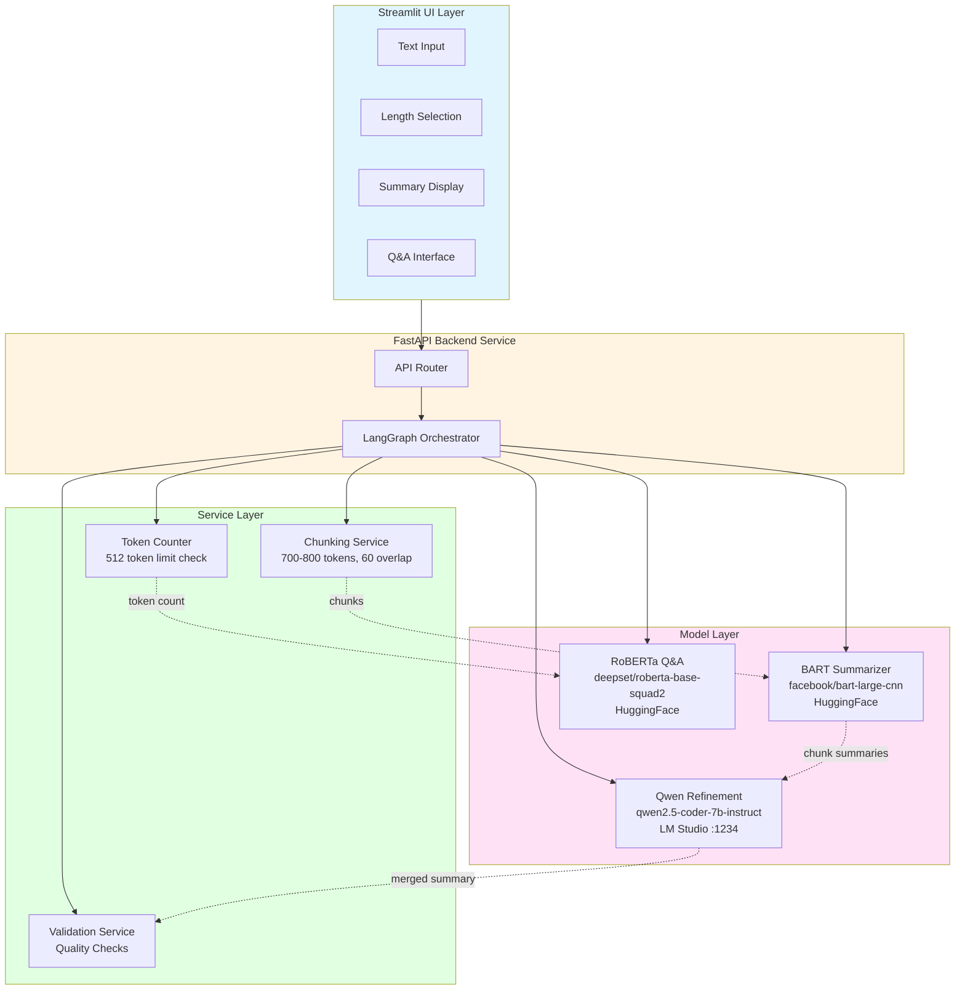
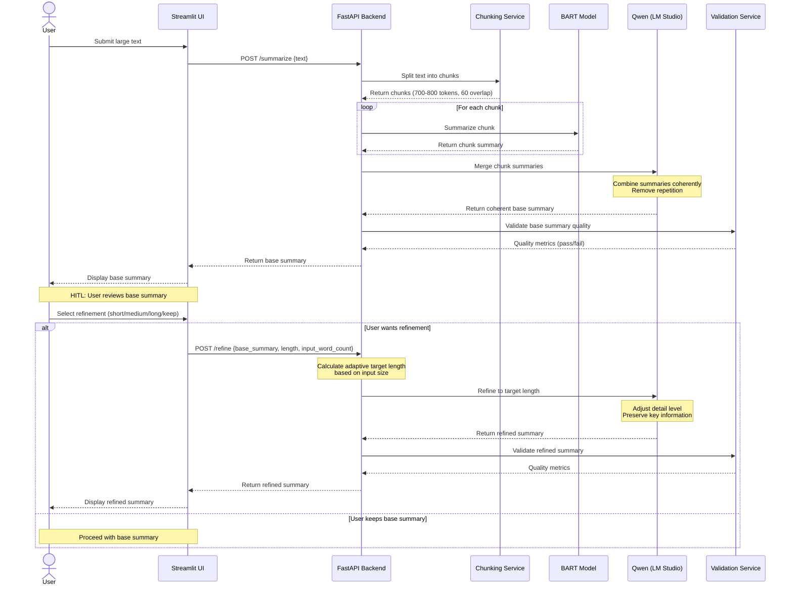
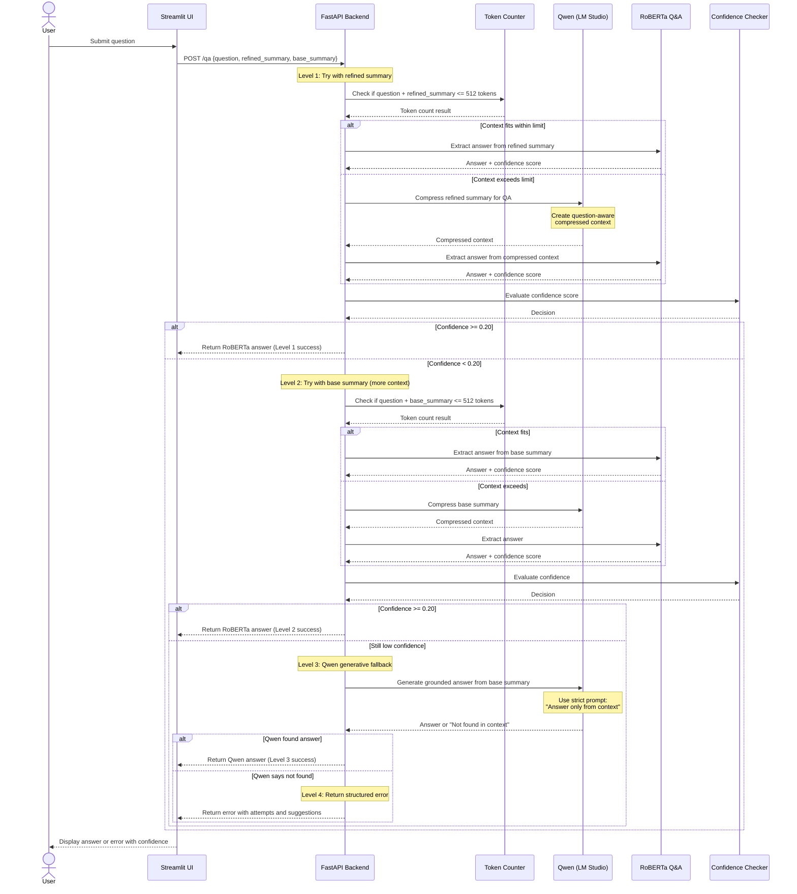

# Tri-Model AI Assistant - Design Document

## 1. The "North Star" (Context & Goals)

### Abstract
This project implements a local AI assistant that orchestrates three specialized models to provide intelligent text summarization and question answering. The system processes large text inputs through a multi-stage pipeline: BART performs chunk-level summarization, Qwen merges and refines summaries based on user preferences, and RoBERTa handles extractive question answering with adaptive fallback mechanisms. The application runs entirely locally using HuggingFace Transformers and LangGraph for orchestration.

### User Stories

**US-1: Text Summarization**
As a user, I want to input large text documents and receive concise summaries in my preferred length (short/medium/long), so that I can quickly understand the main points without reading the entire document.

**US-2: Interactive Question Answering**
As a user, I want to ask questions about the summarized content and receive accurate answers, so that I can extract specific information without searching through the text manually.

**US-3: Adaptive Quality Assurance**
As a user, I want the system to automatically handle edge cases (low confidence, context overflow) gracefully, so that I always receive reliable responses even when models face limitations.

### Non-Goals

- **NOT supporting real-time streaming**: Summaries and answers are generated in batch mode
- **NOT supporting multi-document summarization**: Single document input only
- **NOT supporting cloud-based models**: All models run locally
- **NOT supporting multi-language**: English text only
- **NOT supporting document format parsing**: Plain text input only (no PDF/DOCX parsing)
- **NOT supporting user authentication**: Single-user local application
- **NOT supporting summary editing**: Generated summaries are read-only

---

## 2. System Architecture & Flow

### Component Diagram



### Sequence Diagram: Summarization Flow (HITL)



### Sequence Diagram: Q&A Flow (3-Level Fallback)



---

## 3. The Technical "Source of Truth"

### A. Data Schema

#### SummarizationRequest
| Field Name | Type | Constraints | Description |
|:-----------|:-----|:------------|:------------|
| text | String | Not Null, Min Length: 100 chars | Input text to summarize |
| session_id | UUID | Auto-generated | Session identifier |

#### SummarizationResponse
| Field Name | Type | Constraints | Description |
|:-----------|:-----|:------------|:------------|
| base_summary | String | Not Null | Merged base summary from chunks |
| word_count | Integer | Positive | Word count of base summary |
| input_word_count | Integer | Positive | Word count of original input |
| chunk_count | Integer | Positive | Number of chunks processed |
| processing_time | Float | Positive | Time in seconds |
| session_id | UUID | Not Null | Session identifier |

#### RefinementRequest
| Field Name | Type | Constraints | Description |
|:-----------|:-----|:------------|:------------|
| base_summary | String | Not Null | Base summary to refine |
| length | Enum | One of: "short", "medium", "long" | Desired refinement level |
| input_word_count | Integer | Positive | Original input word count (for adaptive sizing) |
| session_id | UUID | Not Null | Session identifier |

#### RefinementResponse
| Field Name | Type | Constraints | Description |
|:-----------|:-----|:------------|:------------|
| refined_summary | String | Not Null | Refined summary at target length |
| word_count | Integer | Positive | Word count of refined summary |
| target_range | Object | Not Null | {"min": int, "max": int, "target": int} |
| compression_ratio | Float | Range: 0.0-1.0 | Refined/input word count ratio |
| processing_time | Float | Positive | Time in seconds |
| session_id | UUID | Not Null | Session identifier |

#### QuestionRequest
| Field Name | Type | Constraints | Description |
|:-----------|:-----|:------------|:------------|
| question | String | Not Null, Min Length: 5 chars | User question |
| refined_summary | String | Nullable | Refined summary (if available) |
| base_summary | String | Not Null | Base summary for fallback |
| session_id | UUID | Not Null | Session identifier |

#### QuestionResponse
| Field Name | Type | Constraints | Description |
|:-----------|:-----|:------------|:------------|
| answer | String | Nullable | Generated answer (null if error) |
| confidence | Float | Range: 0.0-1.0 | Confidence score |
| model_used | Enum | One of: "roberta", "qwen_fallback" | Which model answered |
| fallback_level | Integer | Range: 1-4 | Which fallback level succeeded (1=refined, 2=base, 3=qwen, 4=error) |
| processing_time | Float | Positive | Time in seconds |
| error | String | Nullable | Error message if answer not found |
| suggestion | String | Nullable | User-friendly suggestion if error |
| attempts | Array | Optional | List of attempt details (see below) |

#### QAAttempt
| Field Name | Type | Constraints | Description |
|:-----------|:-----|:------------|:------------|
| level | Integer | Range: 1-4 | Fallback level number |
| model | String | Not Null | Model used ("roberta" or "qwen") |
| context_type | String | One of: "refined", "base", "compressed" | Context used |
| confidence | Float | Range: 0.0-1.0 | Confidence score (if applicable) |
| result | String | One of: "success", "low_confidence", "not_found" | Attempt result |

#### ChunkMetadata
| Field Name | Type | Constraints | Description |
|:-----------|:-----|:------------|:------------|
| chunk_id | Integer | Positive | Chunk index |
| start_pos | Integer | Non-negative | Start character position |
| end_pos | Integer | Positive | End character position |
| token_count | Integer | Range: 700-800 | Tokens in chunk |
| summary | String | Not Null | BART summary of chunk |

### B. API Contracts

#### Endpoint: POST /api/v1/summarize

**Purpose**: Generate base summary from input text (HITL Step 1)

**Request Payload**:
```json
{
  "text": "string (min 100 chars)"
}
```

**Success Response**: `200 OK`
```json
{
  "base_summary": "string",
  "word_count": 245,
  "input_word_count": 2000,
  "chunk_count": 5,
  "processing_time": 12.34,
  "session_id": "uuid"
}
```

**Error Cases**:
- `400 Bad Request`: Invalid input (text too short)
  ```json
  {
    "error": "Text must be at least 100 characters",
    "code": "INVALID_INPUT"
  }
  ```
- `500 Internal Server Error`: Model loading failure, Qwen API unavailable
  ```json
  {
    "error": "Failed to connect to Qwen model at localhost:1234",
    "code": "MODEL_UNAVAILABLE"
  }
  ```
- `503 Service Unavailable`: Model initialization in progress
  ```json
  {
    "error": "Models are still loading, please retry in 30 seconds",
    "code": "MODELS_LOADING"
  }
  ```

#### Endpoint: POST /api/v1/refine

**Purpose**: Refine base summary to target length (HITL Step 2)

**Request Payload**:
```json
{
  "base_summary": "string",
  "length": "short | medium | long",
  "input_word_count": 2000,
  "session_id": "uuid"
}
```

**Success Response**: `200 OK`
```json
{
  "refined_summary": "string",
  "word_count": 150,
  "target_range": {
    "min": 100,
    "max": 160,
    "target": 130
  },
  "compression_ratio": 0.075,
  "processing_time": 3.45,
  "session_id": "uuid"
}
```

**Error Cases**:
- `400 Bad Request`: Invalid refinement parameters
  ```json
  {
    "error": "Invalid length parameter. Must be 'short', 'medium', or 'long'",
    "code": "INVALID_LENGTH"
  }
  ```
- `404 Not Found`: Session not found
  ```json
  {
    "error": "Session not found",
    "code": "SESSION_NOT_FOUND"
  }
  ```

#### Endpoint: POST /api/v1/qa

**Purpose**: Answer questions with 3-level fallback chain

**Request Payload**:
```json
{
  "question": "string (min 5 chars)",
  "refined_summary": "string (optional)",
  "base_summary": "string",
  "session_id": "uuid"
}
```

**Success Response**: `200 OK`
```json
{
  "answer": "string",
  "confidence": 0.85,
  "model_used": "roberta",
  "fallback_level": 1,
  "processing_time": 0.45,
  "error": null,
  "suggestion": null,
  "attempts": null
}
```

**Success Response (with fallback)**: `200 OK`
```json
{
  "answer": "string",
  "confidence": 0.22,
  "model_used": "roberta",
  "fallback_level": 2,
  "processing_time": 1.23,
  "error": null,
  "suggestion": null,
  "attempts": [
    {
      "level": 1,
      "model": "roberta",
      "context_type": "refined",
      "confidence": 0.12,
      "result": "low_confidence"
    },
    {
      "level": 2,
      "model": "roberta",
      "context_type": "base",
      "confidence": 0.22,
      "result": "success"
    }
  ]
}
```

**Error Response (all fallbacks failed)**: `200 OK`
```json
{
  "answer": null,
  "confidence": 0.0,
  "model_used": "qwen_fallback",
  "fallback_level": 4,
  "processing_time": 4.56,
  "error": "Unable to answer this question from the provided text.",
  "suggestion": "Try rephrasing your question or asking about different aspects of the text.",
  "attempts": [
    {
      "level": 1,
      "model": "roberta",
      "context_type": "refined",
      "confidence": 0.12,
      "result": "low_confidence"
    },
    {
      "level": 2,
      "model": "roberta",
      "context_type": "base",
      "confidence": 0.15,
      "result": "low_confidence"
    },
    {
      "level": 3,
      "model": "qwen",
      "context_type": "base",
      "confidence": null,
      "result": "not_found"
    }
  ]
}
```

**Error Cases**:
- `400 Bad Request`: Invalid question format
  ```json
  {
    "error": "Question must be at least 5 characters",
    "code": "INVALID_QUESTION"
  }
  ```
- `404 Not Found`: Session ID not found
  ```json
  {
    "error": "Session not found",
    "code": "SESSION_NOT_FOUND"
  }
  ```
- `500 Internal Server Error`: QA model failure
  ```json
  {
    "error": "QA model inference failed",
    "code": "QA_FAILED"
  }
  ```

#### Endpoint: GET /api/v1/health

**Purpose**: Check service health and model status

**Success Response**: `200 OK`
```json
{
  "status": "healthy",
  "models": {
    "bart": "loaded",
    "qwen": "connected",
    "roberta": "loaded"
  },
  "uptime": 3600
}
```

---

## 4. Application "Bootstrap" Guide

### Tech Stack

| Component | Technology | Version |
|:----------|:-----------|:--------|
| Language | Python | 3.12.x |
| UI Framework | Streamlit | 1.32.0+ |
| Backend Framework | FastAPI | 0.110.0+ |
| Orchestration | LangGraph | 0.0.40+ |
| ML Framework | PyTorch | 2.2.0+ |
| Transformers | HuggingFace Transformers | 4.38.0+ |
| HTTP Client | httpx | 0.27.0+ |
| Testing | pytest | 8.0.0+ |
| Logging | Python logging (built-in) | - |

### Folder Structure

```
exercise-3/
├── src/
│   ├── __init__.py
│   ├── main.py                    # Streamlit UI entry point
│   ├── api/
│   │   ├── __init__.py
│   │   ├── app.py                 # FastAPI application
│   │   └── routes.py              # API endpoints
│   ├── models/
│   │   ├── __init__.py
│   │   ├── bart_summarizer.py     # BART model wrapper
│   │   ├── qwen_client.py         # Qwen LM Studio client
│   │   └── roberta_qa.py          # RoBERTa QA wrapper
│   ├── services/
│   │   ├── __init__.py
│   │   ├── chunking.py            # Text chunking logic
│   │   ├── summarization.py       # Summarization orchestration
│   │   ├── qa_service.py          # Q&A orchestration
│   │   └── validation.py          # Quality validation
│   └── utils/
│       ├── __init__.py
│       ├── config.py              # Configuration management
│       ├── logger.py              # Logging setup
│       └── token_counter.py       # Token counting utilities
├── config/
│   ├── models.yaml                # Model configurations
│   └── prompts.yaml               # Prompt templates
├── tests/
│   ├── __init__.py
│   ├── test_chunking.py
│   ├── test_summarization.py
│   ├── test_qa.py
│   └── test_integration.py
├── data/
│   ├── sample_ai_article.txt      # Sample AI-related text
│   ├── sample_cse_paper.txt       # Sample CSE paper excerpt
│   └── sample_ml_tutorial.txt     # Sample ML tutorial
├── requirements.txt
├── README.md
└── DESIGN.md                      # This document
```

### Boilerplate/Tooling

**Linting & Formatting**:
- Use `black` for code formatting (line length: 88)
- Use `flake8` for linting (ignore E203, E501)
- Use `isort` for import sorting

**Testing Framework**:
- Use `pytest` for unit and integration tests
- Test coverage target: 70%+ (not 80% due to model loading complexity)
- Use `pytest-mock` for mocking model calls

**Development Commands**:
```bash
# Install dependencies
pip install -r requirements.txt

# Run linting
black src/ tests/
flake8 src/ tests/

# Run tests
pytest tests/ -v --cov=src

# Start FastAPI backend
uvicorn src.api.app:app --reload --port 8000

# Start Streamlit UI
streamlit run src/main.py --server.port 8501
```

---

## 5. Implementation Requirements & Constraints

### Security

- **No authentication required**: Local single-user application
- **Input sanitization**: Validate all text inputs to prevent injection attacks
- **API rate limiting**: Not required (local deployment)
- **Data privacy**: All processing happens locally, no external API calls except to local Qwen instance

### Performance

- **Summarization latency**: 
  - BART chunk processing: < 2 seconds per chunk
  - Qwen merge/refinement: < 5 seconds
  - Total summarization: < 30 seconds for 5000-word documents
- **Q&A latency**:
  - RoBERTa inference: < 1 second
  - Qwen fallback: < 3 seconds
- **Memory constraints**:
  - BART model: ~1.6 GB RAM
  - RoBERTa model: ~500 MB RAM
  - Qwen: Managed by LM Studio (external)
  - Total application memory: < 3 GB

### Error Handling

- **Model loading failures**: Log error with ERROR level, display user-friendly message in UI
- **Qwen API connection failures**: Retry 3 times with exponential backoff (1s, 2s, 4s), then fail gracefully
- **Token limit exceeded**: Automatically trigger compression or chunking, log with INFO level
- **Low confidence QA**: Automatically progress through 3-level fallback chain, log with INFO level
- **Invalid user input**: Return 400 error with clear validation message

#### Q&A Fallback Chain Error Handling

**3-Level Fallback Strategy:**

1. **Level 1 - Refined Summary**: Try RoBERTa on refined summary
   - If confidence >= 0.20: Return answer ✅
   - If confidence < 0.20: Proceed to Level 2

2. **Level 2 - Base Summary**: Try RoBERTa on base summary (more context)
   - If confidence >= 0.20: Return answer ✅
   - If confidence < 0.20: Proceed to Level 3

3. **Level 3 - Qwen Fallback**: Try Qwen generative Q&A on base summary
   - If answer found: Return answer ✅
   - If "Not found in context": Proceed to Level 4

4. **Level 4 - Structured Error**: Return error with suggestions
   - Include all attempt details
   - Provide user-friendly suggestions
   - Log complete fallback chain

**Error Response Structure:**
```json
{
  "answer": null,
  "error": "Unable to answer this question from the provided text.",
  "suggestion": "Try rephrasing your question or asking about different aspects of the text.",
  "attempts": [
    {"level": 1, "model": "roberta", "context_type": "refined", "confidence": 0.12, "result": "low_confidence"},
    {"level": 2, "model": "roberta", "context_type": "base", "confidence": 0.15, "result": "low_confidence"},
    {"level": 3, "model": "qwen", "context_type": "base", "result": "not_found"}
  ]
}
```

**User-Friendly Error Messages:**

| Scenario | Error Message | Suggestion |
|:---------|:--------------|:-----------|
| All fallbacks failed | "Unable to answer this question from the provided text." | "Try rephrasing your question or asking about different aspects of the text." |
| Question too vague | "Your question is too general to answer from the summary." | "Try asking a more specific question about particular details in the text." |
| Context insufficient | "The summary doesn't contain enough information to answer this question." | "Try asking about topics that were covered in the summary." |
| Model timeout | "The question answering service timed out." | "Please try again. If the issue persists, try a simpler question." |

### Logging Strategy

- **Console logging only**: Use Python's built-in `logging` module
- **Log levels**:
  - INFO: Model loading, chunk processing, API requests
  - WARNING: Fallback triggers, validation warnings
  - ERROR: Model failures, API errors
- **Log format**: `[%(asctime)s] %(levelname)s - %(name)s - %(message)s`

### Model-Specific Constraints

#### BART Summarizer
- **Max input tokens**: 1024
- **Chunking required**: Yes (700-800 tokens per chunk, 60 token overlap)
- **Generation parameters**:
  - `max_length`: 150
  - `min_length`: 50
  - `do_sample`: False (deterministic)

#### Qwen (LM Studio)
- **API endpoint**: `http://localhost:1234/v1/chat/completions`
- **Authentication**: None
- **Timeout**: 30 seconds
- **Retry policy**: 3 attempts with exponential backoff
- **Generation parameters**:
  - `temperature`: 0.3 (low for consistency)
  - `max_tokens`: 512
  - `top_p`: 0.9

#### RoBERTa Q&A
- **Max context tokens**: 512 (question + context combined)
- **Confidence threshold**: 0.20 (below triggers Qwen fallback)
- **Answer extraction**: Span-based (start/end positions)

### Summary Length Specifications (Adaptive)

Summary lengths are **adaptive** based on input document size to ensure appropriate compression ratios.

#### Adaptive Sizing Formula

```python
def calculate_target_length(input_word_count: int, length_type: str) -> dict:
    """
    Calculate adaptive summary length based on input size.
    
    Args:
        input_word_count: Word count of original input text
        length_type: One of "short", "medium", "long"
    
    Returns:
        {"min_words": int, "max_words": int, "target_words": int}
    """
    
    # Compression ratios for each length type
    compression_ratios = {
        "short": (0.05, 0.08),    # 5-8% of original
        "medium": (0.10, 0.15),   # 10-15% of original
        "long": (0.20, 0.30)      # 20-30% of original
    }
    
    # Absolute bounds (prevent too small or too large summaries)
    absolute_bounds = {
        "short": {"min": 80, "max": 250},
        "medium": {"min": 150, "max": 500},
        "long": {"min": 300, "max": 800}
    }
    
    min_ratio, max_ratio = compression_ratios[length_type]
    bounds = absolute_bounds[length_type]
    
    # Calculate based on compression ratio
    min_words = max(int(input_word_count * min_ratio), bounds["min"])
    max_words = min(int(input_word_count * max_ratio), bounds["max"])
    target_words = (min_words + max_words) // 2
    
    # Ensure min <= max
    if min_words > bounds["max"]:
        min_words = bounds["max"]
    if max_words < bounds["min"]:
        max_words = bounds["min"]
    
    return {
        "min_words": min_words,
        "max_words": max_words,
        "target_words": target_words
    }
```

#### Adaptive Length Examples

| Input Size | Short | Medium | Long |
|:-----------|:------|:-------|:-----|
| **1000 words** | 80-80 words | 150-150 words | 300-300 words |
| **1500 words** | 80-120 words | 150-225 words | 300-450 words |
| **2000 words** | 100-160 words | 200-300 words | 400-600 words |
| **3000 words** | 150-240 words | 300-450 words | 600-800 words |
| **5000 words** | 250-250 words (capped) | 500-500 words (capped) | 800-800 words (capped) |
| **10000 words** | 250 words (capped) | 500 words (capped) | 800 words (capped) |

#### Length Type Specifications

| Length | Compression Ratio | Absolute Bounds | Use Case | Strategy |
|:-------|:------------------|:----------------|:---------|:---------|
| **Short** | 5-8% of input | 80-250 words | Quick overview, executive summary | Extreme compression: core facts only |
| **Medium** | 10-15% of input | 150-500 words | Balanced detail, standard summary | Balanced: main points with context |
| **Long** | 20-30% of input | 300-800 words | Comprehensive, detailed overview | Comprehensive: all important info |

#### Refinement Strategy Guidelines

**Short Summary Strategy:**
- **Keep**: Core facts, key numbers, main conclusions
- **Remove**: Context, explanations, examples, supporting details
- **Style**: Bullet-point style, telegraphic, fact-dense
- **Example**: "Model uses 12-layer transformer. Trained on 8 GPUs for 3 days."

**Medium Summary Strategy:**
- **Keep**: Main points with some context, important details
- **Remove**: Minor details, redundancy, excessive examples
- **Style**: Balanced paragraphs, clear flow
- **Example**: "The model employs a 12-layer transformer architecture. Training was conducted over 3 days using 8 GPUs for parallel processing."

**Long Summary Strategy:**
- **Keep**: All important information with full context
- **Remove**: Only obvious redundancy and filler
- **Style**: Comprehensive paragraphs, detailed explanations
- **Example**: "The model employs a transformer architecture consisting of 12 layers with 768-dimensional embeddings. Training was conducted over 3 days using 8 GPUs for parallel processing, achieving state-of-the-art results on benchmark datasets."

### Validation Rules

**Summary Quality Checks**:
1. Summary is not empty
2. Summary length >= 50 words
3. Compression ratio between 0.1 and 0.5 (summary is 10-50% of original)
4. No excessive repetition (max 3 consecutive repeated words)
5. Contains at least 2 sentences

**Q&A Quality Checks**:
1. Answer is not empty
2. Answer length >= 3 words
3. Confidence score is numeric and in range [0.0, 1.0]
4. If confidence < 0.20, fallback must be triggered

---

## 6. The "Definition of Done" (DoD)

### Feature Completion Criteria

**Summarization Pipeline**:
- [ ] BART model loads successfully on application start
- [ ] Text chunking produces 700-800 token chunks with 60 token overlap
- [ ] BART summarizes each chunk independently
- [ ] Qwen merges chunk summaries into coherent base summary
- [ ] Base summary displays correctly in Streamlit UI (HITL Step 1)
- [ ] User can select refinement preference (short/medium/long/keep)
- [ ] Adaptive length calculation works correctly for different input sizes
- [ ] Qwen refines summary according to strategy guidelines
- [ ] Refined summary matches target length range
- [ ] Summary validation passes all quality checks
- [ ] Refined summary displays correctly in Streamlit UI (HITL Step 2)

**Q&A Pipeline**:
- [ ] RoBERTa model loads successfully on application start
- [ ] Token counting correctly identifies when context exceeds 512 tokens
- [ ] Qwen compression activates when needed for oversized context
- [ ] Level 1 fallback: RoBERTa on refined summary works correctly
- [ ] Level 2 fallback: RoBERTa on base summary activates when Level 1 fails
- [ ] Level 3 fallback: Qwen generative Q&A activates when Level 2 fails
- [ ] Level 4 error: Structured error response returns when all fallbacks fail
- [ ] Confidence threshold (0.20) correctly triggers fallbacks
- [ ] Attempt details are logged and returned in response
- [ ] Error messages and suggestions are user-friendly
- [ ] Answers display correctly in Streamlit UI with confidence indicators and fallback level

**Testing**:
- [ ] Unit tests for chunking service (70%+ coverage)
- [ ] Unit tests for validation service (70%+ coverage)
- [ ] Integration test for full summarization pipeline
- [ ] Integration test for full Q&A pipeline
- [ ] Manual testing with 3 sample documents (AI, CSE, ML topics)

**Documentation**:
- [ ] README.md includes setup instructions
- [ ] README.md includes usage examples
- [ ] API endpoints documented in code docstrings
- [ ] Configuration files include inline comments
- [ ] This design document is complete and reviewed

**Code Quality**:
- [ ] All code passes `black` formatting
- [ ] All code passes `flake8` linting
- [ ] Imports sorted with `isort`
- [ ] No hardcoded values (use config files)
- [ ] Logging implemented at all key decision points

**Deployment Readiness**:
- [ ] requirements.txt includes all dependencies with versions
- [ ] FastAPI backend starts without errors
- [ ] Streamlit UI starts without errors
- [ ] Qwen connection test passes (localhost:1234)
- [ ] All models download and cache correctly

---

## 7. Detailed Implementation Specifications

### Chunking Algorithm

**Paragraph-First Strategy**:
```python
def chunk_text(text: str, max_tokens: int = 800, overlap: int = 60) -> List[Chunk]:
    """
    Split text into chunks using paragraph-first strategy.
    
    Algorithm:
    1. Split text by double newlines (paragraphs)
    2. For each paragraph:
       - If paragraph fits in max_tokens, add to current chunk
       - If paragraph exceeds max_tokens, split by sentences
       - If sentence exceeds max_tokens, split by words (fallback)
    3. Add overlap tokens from previous chunk to maintain context
    
    Returns: List of Chunk objects with metadata
    """
```

**Overlap Strategy**:
- Take last 60 tokens from previous chunk
- Prepend to next chunk
- Ensures continuity across chunk boundaries
- Prevents loss of context at split points

### Qwen Prompt Templates

**Merge Prompt**:
```
You are a summarization assistant. Below are multiple summaries of different sections of a document. Your task is to merge them into one coherent summary that flows naturally.

Requirements:
- Eliminate repetition
- Maintain chronological or logical order
- Preserve all key information
- Create smooth transitions between ideas
- Output should be a single unified summary

Summaries to merge:
{chunk_summaries}

Merged summary:
```

**Refinement Prompt**:
```
You are a summarization assistant. Refine the following base summary to match the target length and detail level.

Requirements:
- Target word count: {target_words} words (range: {min_words}-{max_words})
- Refinement level: {length_type}
- Preserve factual accuracy
- Adjust detail level appropriately

Refinement Strategy for {length_type}:
{strategy_guidelines}

Base summary:
{base_summary}

Refined {length_type} summary:
```

**Strategy Guidelines by Length:**

**Short (5-8% compression):**
```
- Keep ONLY: Core facts, key numbers, main conclusions
- Remove: Context, explanations, examples, supporting details
- Style: Telegraphic, fact-dense, bullet-point style
- Focus: Absolute essentials only
```

**Medium (10-15% compression):**
```
- Keep: Main points with some context, important details
- Remove: Minor details, redundancy, excessive examples
- Style: Balanced paragraphs with clear flow
- Focus: Key information with minimal context
```

**Long (20-30% compression):**
```
- Keep: All important information with full context
- Remove: Only obvious redundancy and filler
- Style: Comprehensive paragraphs with detailed explanations
- Focus: Thorough coverage of all major points
```

**QA Fallback Prompt**:
```
You are a question-answering assistant. Answer the question using ONLY the provided context.

Rules:
- If the answer is not in the context, respond: "Not found in context."
- Do not use external knowledge
- Keep answers concise and factual
- Quote directly from context when possible

Context:
{summary}

Question: {question}

Answer:
```

### LangGraph Orchestration Flow

**Summarization Graph**:
```python
from langgraph.graph import StateGraph

# Define state
class SummarizationState(TypedDict):
    text: str
    chunks: List[str]
    chunk_summaries: List[str]
    base_summary: str
    final_summary: str
    length: str

# Define nodes
def chunk_node(state): ...
def bart_node(state): ...
def merge_node(state): ...
def refine_node(state): ...
def validate_node(state): ...

# Build graph
graph = StateGraph(SummarizationState)
graph.add_node("chunk", chunk_node)
graph.add_node("bart", bart_node)
graph.add_node("merge", merge_node)
graph.add_node("refine", refine_node)
graph.add_node("validate", validate_node)

graph.add_edge("chunk", "bart")
graph.add_edge("bart", "merge")
graph.add_edge("merge", "refine")
graph.add_edge("refine", "validate")
```

**Q&A Graph**:
```python
class QAState(TypedDict):
    question: str
    summary: str
    compressed_context: Optional[str]
    answer: str
    confidence: float
    model_used: str

def token_check_node(state): ...
def compress_node(state): ...
def roberta_node(state): ...
def confidence_check_node(state): ...
def qwen_fallback_node(state): ...

# Conditional routing based on token count and confidence
```

### Configuration Files

**config/models.yaml**:
```yaml
bart:
  model_name: "facebook/bart-large-cnn"
  max_length: 150
  min_length: 50
  do_sample: false
  device: "cuda"  # or "cpu"

qwen:
  api_url: "http://localhost:1234/v1/chat/completions"
  timeout: 30
  max_retries: 3
  temperature: 0.3
  max_tokens: 512
  top_p: 0.9

roberta:
  model_name: "deepset/roberta-base-squad2"
  max_seq_length: 512
  confidence_threshold: 0.20
  device: "cuda"  # or "cpu"

chunking:
  max_tokens: 800
  overlap: 60
  strategy: "paragraph_first"

summary_lengths:
  short:
    compression_ratio: [0.05, 0.08]  # 5-8% of original
    min_words: 80
    max_words: 250
  medium:
    compression_ratio: [0.10, 0.15]  # 10-15% of original
    min_words: 150
    max_words: 500
  long:
    compression_ratio: [0.20, 0.30]  # 20-30% of original
    min_words: 300
    max_words: 800
```

---

## 8. Testing Strategy

### Unit Tests

**test_chunking.py**:
- Test paragraph-based splitting
- Test sentence fallback
- Test token counting accuracy
- Test overlap calculation
- Test edge cases (empty text, single paragraph, no paragraphs)

**test_validation.py**:
- Test summary quality checks
- Test compression ratio calculation
- Test repetition detection
- Test confidence threshold evaluation

**test_token_counter.py**:
- Test token counting for different text lengths
- Test combined question + context counting
- Test edge cases (empty strings, special characters)

### Integration Tests

**test_integration.py**:
- Test full summarization pipeline (text → base summary)
- Test full refinement pipeline (base summary → refined summary)
- Test adaptive length calculation for various input sizes
- Test full Q&A pipeline with Level 1 success (refined summary)
- Test Q&A fallback to Level 2 (base summary)
- Test Q&A fallback to Level 3 (Qwen generative)
- Test Q&A fallback to Level 4 (structured error)
- Test HITL workflow (base summary → user selection → refinement)
- Test compression activation for long summaries
- Test with all 3 sample documents

### Manual Testing Checklist

- [ ] Load 3 sample documents (AI, CSE, ML)
- [ ] Generate short/medium/long summaries for each
- [ ] Verify summary quality and length
- [ ] Ask 5 questions per document
- [ ] Verify answer accuracy
- [ ] Test edge cases (very short text, very long text)
- [ ] Test error handling (disconnect Qwen, invalid input)

---

## 9. Sample Data Specifications

### Sample Document 1: AI Article
- **Topic**: Introduction to Artificial Intelligence
- **Length**: ~2000 words
- **Content**: Overview of AI history, key concepts, applications
- **Source**: Original or public domain content

### Sample Document 2: CSE Paper
- **Topic**: Computer Science & Engineering research excerpt
- **Length**: ~2500 words
- **Content**: Technical paper on algorithms, data structures, or systems
- **Source**: ArXiv or public domain research

### Sample Document 3: ML Tutorial
- **Topic**: Machine Learning tutorial or guide
- **Length**: ~1800 words
- **Content**: Explanation of ML concepts, techniques, or frameworks
- **Source**: Educational content or documentation

---

## 10. Deployment & Operations

### Local Development Setup

1. **Install Python 3.12**
2. **Clone repository**
3. **Install dependencies**: `pip install -r requirements.txt`
4. **Start LM Studio** with Qwen model on port 1234
5. **Download HuggingFace models** (automatic on first run)
6. **Start FastAPI backend**: `uvicorn src.api.app:app --reload --port 8000`
7. **Start Streamlit UI**: `streamlit run src.main.py --server.port 8501`
8. **Access UI**: http://localhost:8501

### Model Download & Caching

- BART and RoBERTa models download automatically from HuggingFace Hub
- Models cache in `~/.cache/huggingface/`
- First run may take 5-10 minutes for downloads
- Subsequent runs load from cache (< 30 seconds)

### Troubleshooting

**Issue**: Qwen connection fails
- **Solution**: Verify LM Studio is running on port 1234, check firewall settings

**Issue**: Out of memory error
- **Solution**: Reduce batch size, use CPU instead of GPU, close other applications

**Issue**: Slow summarization
- **Solution**: Use GPU if available, reduce chunk count, optimize chunk size

---

## 11. Future Enhancements (Out of Scope)

- Multi-document summarization
- Support for PDF/DOCX input formats
- Real-time streaming responses
- Multi-language support
- Cloud deployment option
- User authentication and session management
- Summary editing and regeneration
- Export summaries to PDF/DOCX
- Advanced analytics (summary quality metrics, user feedback)

---

**Document Version**: 1.1  
**Last Updated**: 2026-04-21  
**Author**: Design Team  
**Status**: Ready for Implementation

**Changelog**:
- v1.1 (2026-04-21): Added HITL workflow, adaptive summary lengths, 3-level Q&A fallback, enhanced error handling, refined refinement specifications
- v1.0 (2026-04-21): Initial version
