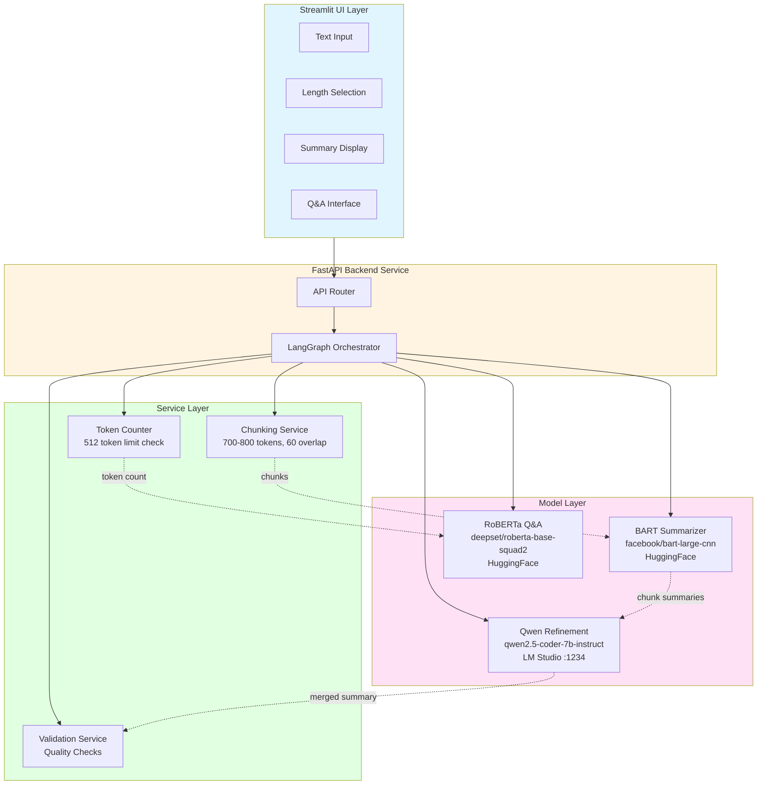
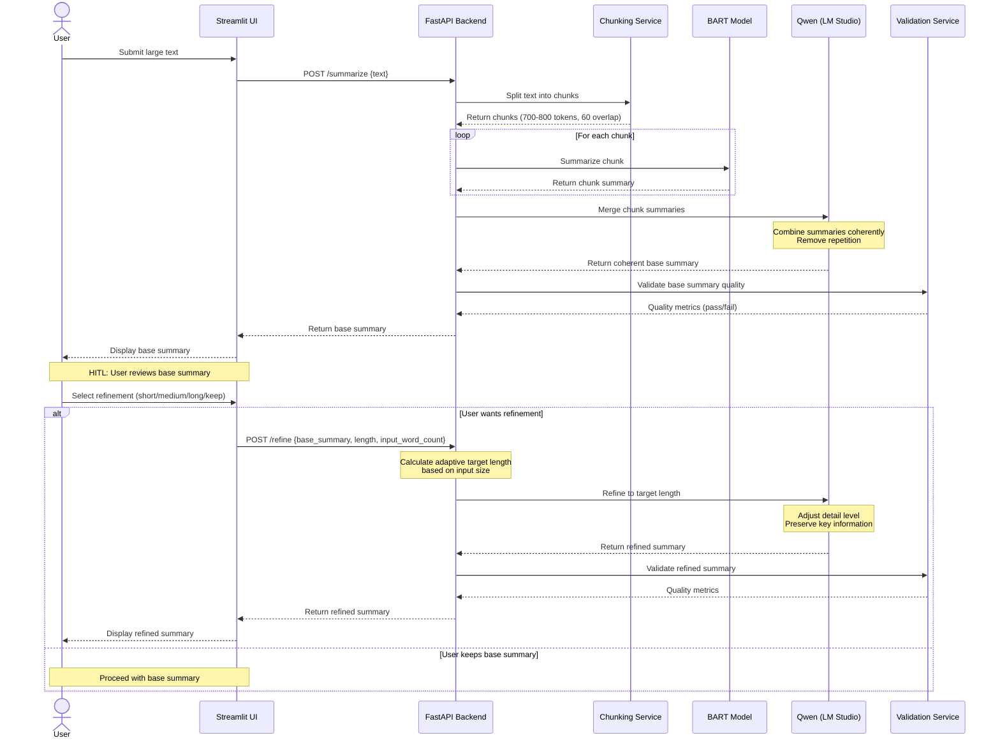
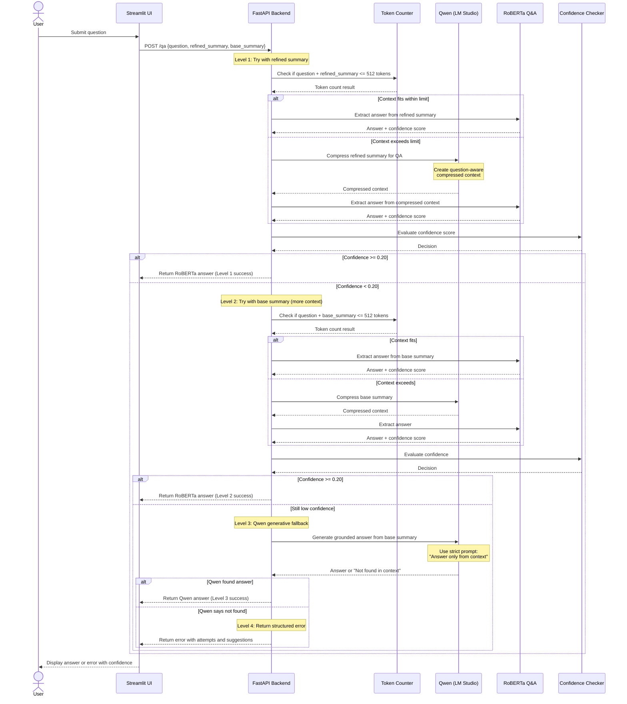

# Tri-Model AI Assistant - Design Document

## 1. Overview

### Abstract
This project implements a local AI assistant that orchestrates three specialized models to provide intelligent text summarization and question answering. The system processes large text inputs through a multi-stage pipeline: BART performs chunk-level summarization, Qwen merges and refines summaries based on user preferences, and RoBERTa handles extractive question answering with adaptive fallback mechanisms.

### User Stories

**US-1: Text Summarization**  
As a user, I want to input large text documents and receive concise summaries in my preferred length (short/medium/long), so that I can quickly understand the main points without reading the entire document.

**US-2: Interactive Question Answering**  
As a user, I want to ask questions about the summarized content and receive accurate answers, so that I can extract specific information without searching through the text manually.

**US-3: Adaptive Quality Assurance**  
As a user, I want the system to automatically handle edge cases (low confidence, context overflow) gracefully, so that I always receive reliable responses even when models face limitations.

### Non-Goals
- NOT supporting real-time streaming, multi-document summarization, cloud-based models, multi-language, document format parsing (PDF/DOCX), user authentication, or summary editing

---

## 2. System Architecture

### Component Diagram



### Sequence Diagram: Summarization Flow (HITL)



### Sequence Diagram: Q&A Flow (3-Level Fallback)



---

## 3. API Specifications

### Core Endpoints

#### POST /api/v1/summarize
Generate base summary from input text (HITL Step 1)

**Request**: `{"text": "string (min 100 chars)"}`  
**Response**: `{"base_summary": "string", "word_count": 245, "input_word_count": 2000, "chunk_count": 5, "processing_time": 12.34, "session_id": "uuid"}`

#### POST /api/v1/refine
Refine base summary to target length (HITL Step 2)

**Request**: `{"base_summary": "string", "length": "short|medium|long", "input_word_count": 2000, "session_id": "uuid"}`  
**Response**: `{"refined_summary": "string", "word_count": 150, "target_range": {"min": 100, "max": 160, "target": 130}, "compression_ratio": 0.075, "processing_time": 3.45, "session_id": "uuid"}`

#### POST /api/v1/qa
Answer questions with 3-level fallback chain

**Request**: `{"question": "string (min 5 chars)", "refined_summary": "string (optional)", "base_summary": "string", "session_id": "uuid"}`  
**Response**: `{"answer": "string", "confidence": 0.85, "model_used": "roberta", "fallback_level": 1, "processing_time": 0.45, "error": null, "suggestion": null, "attempts": null}`

**Error Response (all fallbacks failed)**:
```json
{
  "answer": null,
  "error": "Unable to answer this question from the provided text.",
  "suggestion": "Try rephrasing your question or asking about different aspects of the text.",
  "attempts": [
    {"level": 1, "model": "roberta", "context_type": "refined", "confidence": 0.12, "result": "low_confidence"},
    {"level": 2, "model": "roberta", "context_type": "base", "confidence": 0.15, "result": "low_confidence"},
    {"level": 3, "model": "qwen", "context_type": "base", "result": "not_found"}
  ]
}
```

#### GET /api/v1/health
Check service health and model status

**Response**: `{"status": "healthy", "models": {"bart": "loaded", "qwen": "connected", "roberta": "loaded"}, "uptime": 3600}`

---

## 4. Tech Stack & Setup

### Technology Stack

| Component | Technology | Version |
|:----------|:-----------|:--------|
| Language | Python | 3.12.x |
| UI Framework | Streamlit | 1.32.0+ |
| Backend Framework | FastAPI | 0.110.0+ |
| Orchestration | LangGraph | 0.0.40+ |
| ML Framework | PyTorch | 2.2.0+ |
| Transformers | HuggingFace Transformers | 4.38.0+ |
| Testing | pytest | 8.0.0+ |

### Project Structure

```
exercise-3/
├── src/
│   ├── main.py                    # Streamlit UI
│   ├── api/                       # FastAPI backend
│   ├── models/                    # Model wrappers
│   ├── services/                  # Business logic
│   └── utils/                     # Utilities
├── config/                        # Configuration files
├── tests/                         # Test suite
├── data/                          # Sample documents
└── requirements.txt
```

### Setup Commands

```bash
# Install dependencies
pip install -r requirements.txt

# Start FastAPI backend
uvicorn src.api.app:app --reload --port 8000

# Start Streamlit UI
streamlit run src.main.py --server.port 8501
```

---

## 5. Implementation Details

### Adaptive Summary Length

Summary lengths adapt based on input document size:

| Length | Compression Ratio | Absolute Bounds | Strategy |
|:-------|:------------------|:----------------|:---------|
| **Short** | 5-8% of input | 80-250 words | Core facts only |
| **Medium** | 10-15% of input | 150-500 words | Main points with context |
| **Long** | 20-30% of input | 300-800 words | All important info |

**Examples**:
- 1000 words input → Short: 80 words, Medium: 150 words, Long: 300 words
- 2000 words input → Short: 100-160 words, Medium: 200-300 words, Long: 400-600 words
- 5000 words input → Short: 250 words (capped), Medium: 500 words (capped), Long: 800 words (capped)

### Refinement Strategy Guidelines

**Short**: Keep core facts, key numbers, main conclusions. Remove context, explanations, examples. Telegraphic style.

**Medium**: Keep main points with some context. Remove minor details, redundancy. Balanced paragraphs.

**Long**: Keep all important information with full context. Remove only obvious redundancy. Comprehensive paragraphs.

### 3-Level Q&A Fallback Chain

1. **Level 1**: RoBERTa on refined summary (confidence >= 0.20 → success)
2. **Level 2**: RoBERTa on base summary (more context, confidence >= 0.20 → success)
3. **Level 3**: Qwen generative fallback (answer found → success)
4. **Level 4**: Structured error with suggestions

### Model Configurations

**BART Summarizer**:
- Model: `facebook/bart-large-cnn`
- Max input: 1024 tokens
- Chunking: 700-800 tokens per chunk, 60 token overlap
- Generation: max_length=150, min_length=50, deterministic

**Qwen (LM Studio)**:
- Endpoint: `http://localhost:1234/v1/chat/completions`
- Timeout: 30 seconds
- Retry: 3 attempts with exponential backoff
- Parameters: temperature=0.3, max_tokens=512, top_p=0.9

**RoBERTa Q&A**:
- Model: `deepset/roberta-base-squad2`
- Max context: 512 tokens (question + context combined)
- Confidence threshold: 0.20
- Extraction: Span-based (start/end positions)

### Chunking Algorithm

**Paragraph-First Strategy**:
1. Split text by double newlines (paragraphs)
2. For each paragraph:
   - If fits in max_tokens → add to current chunk
   - If exceeds max_tokens → split by sentences
   - If sentence exceeds max_tokens → split by words (fallback)
3. Add 60-token overlap from previous chunk

### Key Prompt Templates

**Merge Prompt**: Combine chunk summaries coherently, eliminate repetition, maintain logical order, preserve key information.

**Refinement Prompt**: Refine base summary to target length, adjust detail level appropriately, preserve factual accuracy.

**QA Fallback Prompt**: Answer using ONLY provided context. If answer not in context, respond "Not found in context." Keep answers concise and factual.

---

## 6. Performance & Constraints

### Performance Targets

- **Summarization**: < 30 seconds for 5000-word documents
- **Q&A**: < 1 second (RoBERTa), < 3 seconds (Qwen fallback)
- **Memory**: < 3 GB total (BART: ~1.6 GB, RoBERTa: ~500 MB, Qwen: external)

### Error Handling

- **Model loading failures**: Log error, display user-friendly message
- **Qwen API failures**: Retry 3 times with exponential backoff (1s, 2s, 4s)
- **Token limit exceeded**: Automatically trigger compression
- **Low confidence QA**: Progress through 3-level fallback chain
- **Invalid input**: Return 400 error with clear validation message

### Validation Rules

**Summary Quality**:
- Not empty, >= 50 words
- Compression ratio: 0.1-0.5
- Max 3 consecutive repeated words
- Min 2 sentences

**Q&A Quality**:
- Answer not empty, >= 3 words
- Confidence score in range [0.0, 1.0]
- If confidence < 0.20, trigger fallback

---

## 7. Testing & Deployment

### Testing Strategy

**Unit Tests** (70%+ coverage):
- Chunking service (paragraph splitting, overlap, edge cases)
- Validation service (quality checks, compression ratio, repetition)
- Token counter (counting accuracy, combined context)
- Adaptive length calculator

**Integration Tests**:
- Full summarization pipeline (text → base → refined)
- Full Q&A pipeline with all 4 fallback levels
- HITL workflow
- Adaptive length calculation for various input sizes
- Test with 3 sample documents (AI, CSE, ML topics)

**Manual Testing**:
- Generate short/medium/long summaries for each sample
- Ask 5 questions per document
- Verify answer accuracy
- Test edge cases (very short/long text, invalid input)
- Test error handling (disconnect Qwen)

### Deployment Checklist

**Setup**:
1. Install Python 3.12
2. Install dependencies: `pip install -r requirements.txt`
3. Start LM Studio with Qwen model on port 1234
4. Download HuggingFace models (automatic on first run)
5. Start FastAPI backend: `uvicorn src.api.app:app --reload --port 8000`
6. Start Streamlit UI: `streamlit run src.main.py --server.port 8501`
7. Access UI: http://localhost:8501

**Model Caching**:
- BART and RoBERTa download automatically from HuggingFace Hub
- Models cache in `~/.cache/huggingface/`
- First run: 5-10 minutes for downloads
- Subsequent runs: < 30 seconds (load from cache)

**Troubleshooting**:
- Qwen connection fails → Verify LM Studio running on port 1234
- Out of memory → Use CPU instead of GPU, close other applications
- Slow summarization → Use GPU if available, reduce chunk count

---

## 8. Definition of Done

### Summarization Pipeline
- [x] BART model loads successfully
- [x] Text chunking produces 700-800 token chunks with 60 overlap
- [x] BART summarizes each chunk independently
- [x] Qwen merges chunk summaries into coherent base summary
- [x] Base summary displays in UI (HITL Step 1)
- [x] User can select refinement preference
- [x] Adaptive length calculation works for different input sizes
- [x] Qwen refines summary according to strategy guidelines
- [x] Refined summary matches target length range
- [x] Summary validation passes quality checks
- [x] Refined summary displays in UI (HITL Step 2)

### Q&A Pipeline
- [x] RoBERTa model loads successfully
- [x] Token counting identifies when context exceeds 512 tokens
- [x] Qwen compression activates for oversized context
- [x] Level 1-4 fallbacks work correctly
- [x] Confidence threshold (0.20) triggers fallbacks
- [x] Attempt details logged and returned
- [x] Error messages are user-friendly
- [x] Answers display with confidence indicators and fallback level

### Testing & Quality
- [x] Unit tests (70%+ coverage)
- [x] Integration tests for full pipelines
- [x] Manual testing with 3 sample documents
- [x] Code passes black, flake8, isort
- [x] No hardcoded values (use config)
- [x] Logging at all key decision points

### Documentation
- [x] README with setup instructions and usage examples
- [x] API endpoints documented
- [x] Configuration files with inline comments
- [x] Design document complete

---

**Document Version**: 1.1  
**Last Updated**: 2026-04-21  
**Status**: Implementation Complete

**Changelog**:
- v1.1 (2026-04-21): Added HITL workflow, adaptive summary lengths, 3-level Q&A fallback, enhanced error handling
- v1.0 (2026-04-21): Initial version
